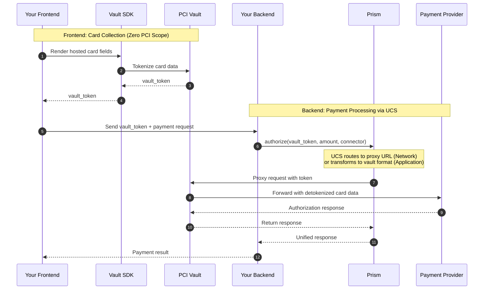
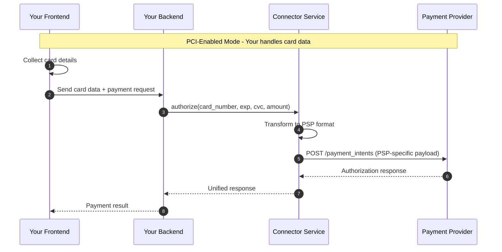

# PCI Compliance

## How Prism handles compliance?
Hyperswitch Prism offers multiple flavors to manage PCI DSS (Payment Card Industry Data Security Standard) compliance. Prism provides flexible PCI compliance options for merchants. Depending on your compliance requirements and infrastructure, you can operate in one of three modes, with each mode is supported by a specific payment client.

- Outsource the PCI data handling to payment processors (example: Stripe, Adyen, Braintree, etc.), so that you don't have to manage compliance
- Outsource the PCI data handling to processor agnostic PCI vaults (example: VGS, Tokenex, Juspay etc.,)
- Self-manage the PCI compliance by handling raw card data

| PCI Mode for Payment Clients | PCI Scope | Description |
|------|-----------|-------------|
| **Tokenized Payment Client** | You do not have to manage PCI compliance | Payment processor vault handles card data |
| **Proxied Payment Client** | You do not have to manage PCI compliance | Third-party vault handles card data |
| **Direct Payment Client** | You will have to self-manage PCI compliance with full SAQ D certification | Your application handles raw card data |

The choice you make here determines your risk profile, operational burden, and agility. It affects:

1. **Security liability** — Handling raw card data makes you responsible for breaches
2. **Compliance cost** — Full SAQ D certification costs $50K–$500K+ annually in audits, infrastructure, and security tools
3. **Time to market** — Achieving PCI certification can take 6–12 months
4. **Operational overhead** — Ongoing security patches, monitoring, and audits


Whether you choose a **PSP-native vault** (Stripe Vault, Adyen Vault), an **independent third-party vault** (VGS, Basis Theory, TokenEx, Juspay), or **self-managed PCI compliance** with your own card vault—**Connector Service has you covered**.

| Scenario | Your Strategy | Connector Service Solves |
|----------|---------------|--------------------------|
| **PSP-Native Vault** | You rely on Stripe/Adyen vault for PCI scope reduction | Abstracts PSP-specific token formats; single API regardless of which PSP vault you use |
| **Independent Third-Party Vault** | You use VGS, Basis Theory, TokenEx, or Hyperswitch Vault as a vault layer | Supports two proxy patterns (Network, Application) with zero to minimal code changes |
| **In-House Vault** | You have your own PCI-certified card vault infrastructure | PCI-Enabled Mode lets you send raw card data through while maintaining full control |

---

## Tokenized Payment Client

In this mode, you will leverage the payment processor's hosted card element to collect and tokenize card data. The processor vault handles card data, significantly reducing your PCI scope.
- Card data is tokenized via processor-hosted elements
- Processor vault handles raw card data
- You only handle the processor token (e.g., `pm_xxx`, `src_xxx`)
- No additional vault subscription needed
- Works with Stripe, Adyen, and other processors that provide hosted card elements

### When to use the Tokenized Payment Client?
- You want zero PCI compliance burden
- You prefer using processor-hosted fields for card collection
- You're starting off with a single payment processor, with future plans to enable more processors

### Flow Diagram

```mermaid
sequenceDiagram
    autonumber
    participant FE as Your Frontend
    participant BE as Your Backend
    participant PSP as Payment Provider (Stripe/Adyen)
    participant Prism as Prism

    Note over FE,PSP: Standard Mode - PSP handles card data

        Note over FE,PSP: Step 1-2: Create Client Authentication Token & Get Session Token
        FE->>BE: Request payment session
        BE->>Prism: createClientAuthenticationToken(amount, currency)
        Prism->>PSP: Create payment session
        PSP-->>Prism: session_token (client_secret)
        Prism-->>BE: session_token
        BE-->>FE: session_token
    end

        Note over FE,PSP: Step 3-5: Tokenize Card via Processor Element
        FE->>FE: Initialize processor card element (Stripe Elements/Adyen Card Component)
        FE->>PSP: Render card input fields
        PSP->>PSP: Tokenize card data securely
        PSP-->>FE: processor_token (payment_method_id)
    end

        Note over FE,PSP: Step 6-10: Authorize with Processor Token
        FE->>BE: Send processor_token + payment request
        BE->>Prism: authorize(processor_token, amount)
        Prism->>Prism: Transform to PSP format
        Prism->>PSP: POST /payments (with processor_token)
        PSP-->>Prism: Authorization response
        Prism-->>BE: Unified response
        BE-->>FE: Payment result
    end
```

---

## Proxied Payment Client

In this mode, a third-party vault handles card data. Your application only handles tokens, significantly reducing PCI scope.

### When to Use the Proxied Payment Client?
- You want to minimize PCI compliance burden
- You prefer not to handle raw card data

**You will have to subscribe to a third-party PCI vault service.** 

In general there are two types of Proxy pattern and Prism supports both:

| Proxy Pattern | You Send | Prism Handles | Popular Vault Providers |
|---------------|----------|-------------|-------------------------|
| **[Network Proxy](./network-proxy.md)** | Token | Routing to proxy URL; proxy detokenizes transparently | **VGS**: URL-based routing (`tntxxx.sandbox.verygoodproxy.com`)<br>**Evervault**: HTTP CONNECT relay with client-side encryption |
| **[Application Proxy](./application-proxy.md)** | Token | Transforming token into vault-specific format (headers, expressions, or wrapped requests) | **Hyperswitch Vault**, **TokenEx**, **Basis Theory** |

### Flow Diagram



### Key Characteristics
- Card data never touches your servers
- Reduced PCI scope (SAQ A or A-EP)
- Vault provider manages security
- Subscription to vault service required

---

## Direct Payment Client

In this mode, your application receives and processes raw card data. You will have to self-manage the PCI DSS compliance.
- Raw card data flows through your infrastructure
- Direct control over payment flow
- No additional vault subscription needed

### When to use the Standard Payment Client?
- You have existing PCI DSS certification
- You need direct control over card data
- You want to minimize third-party dependencies

### Flow Diagram



---

## Which PCI mode to choose for which use case?

| Use Case | Recommended Mode | Rationale |
|----------|------------------|-----------|
| **Early-stage startup, starting with a single PSP** | Standard | Prism gives you the freedom to switch processors in the future when you need it |
| **Early-stage business, moving from single-PSP to multi-PSP** | Proxy mode | Prism can help you scale to multiple processors, without locking all your customer cards with one payment processor |
| **Expanding Multi-PSP strategy without changing your existing vault vendor** | Proxy mode | Prism can help minimize your development effort while scaling to multiple processors |
| **Marketplace/SaaS platform supporting multi-PSP** | Standard | Prism can help connect to multiple PSPs with minimal coding and maintenance effort |
| **Enterprise with existing PCI certification** | Direct | Leverage existing investment into PCI compliance and maintain full control |