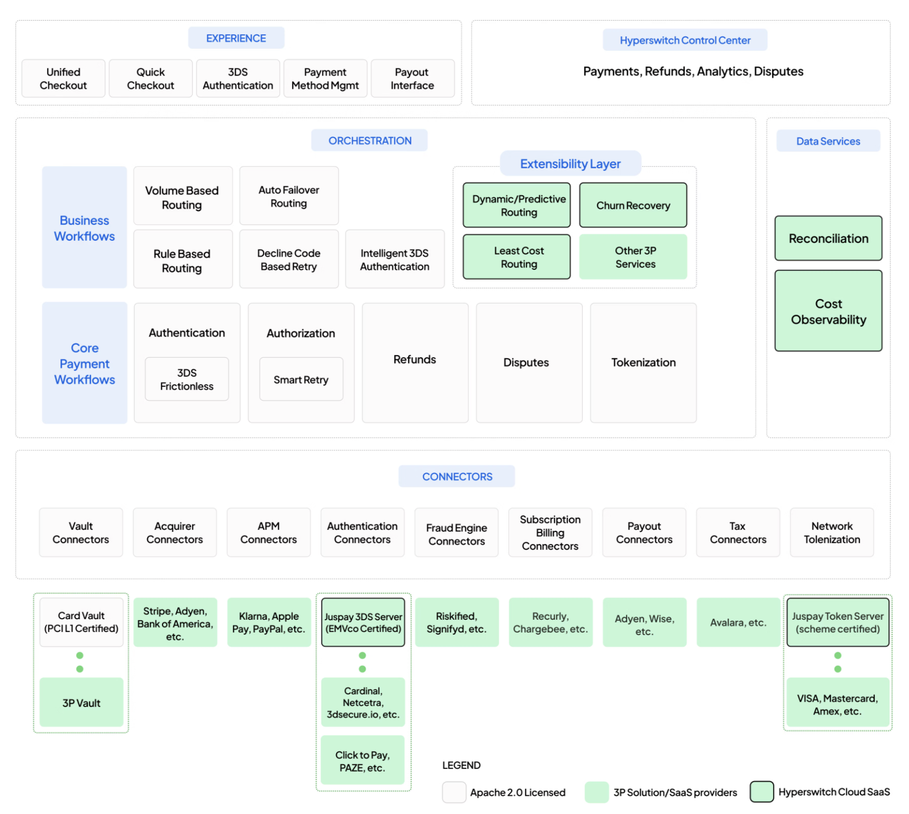

# Cashier Payments Suite

Each row below maps a cashier-payment constraint to the feature that solves it, and to the operational outcome the merchant gets.&#x20;

| Constraint                                  | Feature                                          | Outcome                                                                                                                                                    |
| ------------------------------------------- | ------------------------------------------------ | ---------------------------------------------------------------------------------------------------------------------------------------------------------- |
| **Friction-sensitive deposit conversion**   | 3DS Intelligence Engine + 3DS Cascading          | Challenge applied surgically to fresh cards; COF traffic stays frictionless; processor-side declines retry silently across PSPs                            |
| **High-risk BIN exposure**                  | Card Eligibility Engine                          | BIN, issuer, country, and card-type restrictions enforced at point of entry, before the player ever submits                                                |
| **Credit-card prohibitions (UK / IE / AU)** | Credit-card blocking                             | Single dashboard toggle blocks credit cards, including credit-card-backed wallet tokens                                                                    |
| **Closed-loop withdrawals (AML)**           | Closed-loop validator + Smart Router for Payouts | Eligibility enforced per leg; merchant-controlled split routed via configurable payout rules; retriable failures cascade across connectors                 |
| **Player-name verification (DE / CA)**      | Name-verification workflows                      | Player name relayed to APMs (Klarna Debit Risk, Sofort, Trustly, Rapid Transfer) and Interac; verification status delivered via webhook                    |
| **Withdrawal SR, cost, and speed**          | Smart Router for Payouts + Smart Retries         | Per-rail SR, settlement-time, and cost surfaced in analytics; routing optimized within AML constraints                                                     |
| **Cashier conversion**                      | Customizable Cashier SDK                         | Themed checkout with payment-method ordering, promotion, grouping, and one-click last-used checkout, across Web / iOS / Android / RN / Capacitor / Flutter |
| **Credential storage and reuse**            | PCI-compliant Vault                              | Processor-independent card and bank credential storage; saved-method API powers one-click COF deposits                                                     |
| **Roadmap and stack control**               | Self-hostable, open-source                       | Operator retains existing wallet, fraud, vault, and acquirer relationships; deploys Juspay components selectively in its own VPC                           |

The suite ships with 120+ pre-built connector integrations — including Stripe, Adyen, Worldpay, Checkout.com, Cybersource, Nuvei, Trustly, Skrill, Neteller, PayPal, and iGaming-specific PSPs — so adding or swapping providers is configuration, not engineering work.

A high-level view of how these fit together:

<figure><figcaption></figcaption></figure>

See [Features](../features/) Section for additional details

