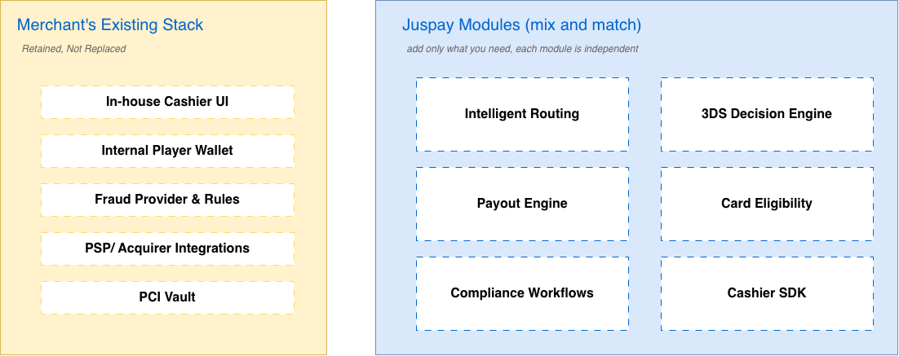

# Modular Integration

Most gaming merchants already operate a substantial in-house payments stack. They’ve built a cashier UI tuned to their players. They have direct contracts with a wallet provider, a chargeback management vendor, a fraud engine, and one or two acquirers they’re not willing to give up. The case for “rip-and-replace payments platforms” rarely survives contact with these realities - and even when it does, it concentrates platform risk in a single vendor.

Juspay is built on the opposite premise. Every module - 3DS, routing, retries, vault, payouts, fraud workflows, authentication, analytics - is independently consumable. Merchants integrate the components they need and leave everything else untouched.

A few common adoption shapes for gaming operators:

* Routing-only: Keep your existing checkout, vault, and PSP relationships. Use Juspay’s Smart Router as a thin orchestration layer to distribute volume, run experiments, or add fallback connectors.
* Authentication Suite only: Adopt Juspay’s standalone 3DS server to centralize authentication across multiple acquirers and get rich authentication data, while continuing to authorize through your existing PSPs.
* Payouts module: Add Juspay’s payout engine for withdrawals without touching the deposit side. Useful for operators happy with their deposit stack but struggling with withdrawal SR or cost.
* Full Gaming Suite: End-to-end deposit, withdrawal, vault, 3DS, FRM workflows, cashier UI, and analytics.

