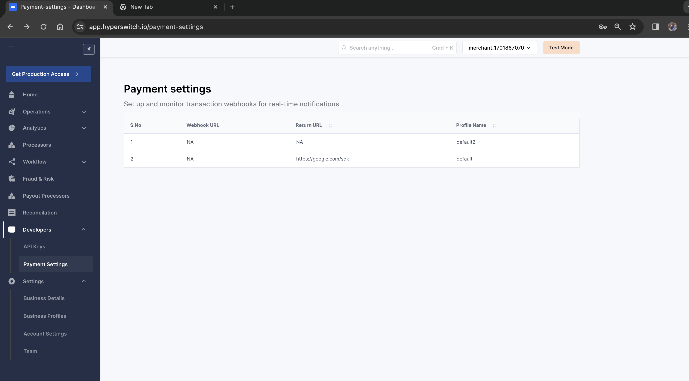
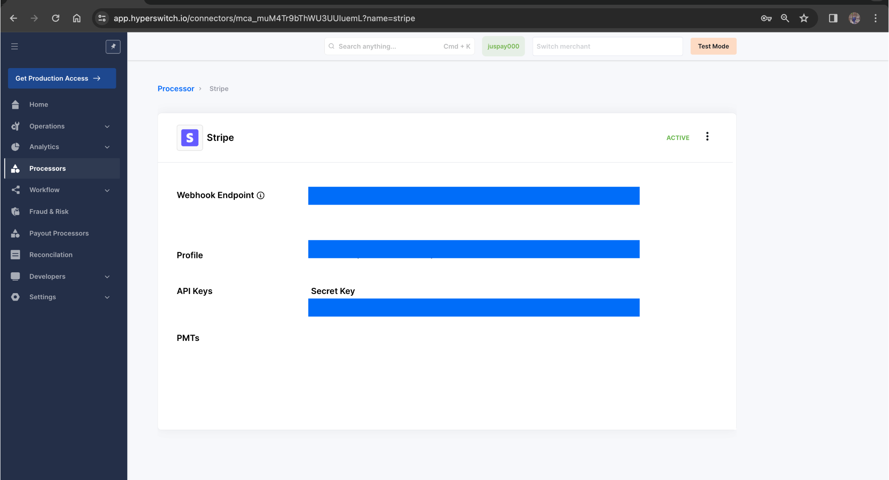

# Stripe


This section gives you an overview of how to make payments via Stripe through Hyperswitch.


Stripe is a suite of APIs powering online payment processing and commerce solutions for internet businesses of all sizes. It allows businesses to accept payments and scale faster. To learn more about payment methods supported by Stripe via Hyperswitch, visit [here](https://hyperswitch.io/pm-list).

### Activating Stripe via Hyperswitch

#### Prerequisites

1. You need to be registered with Stripe in order to proceed. In case you aren't, you can quickly set up your Stripe account [here](https://dashboard.stripe.com/register).
2. You should have a registered Hyperswitch account. You can access your account from the [Hyperswitch control center](https://app.hyperswitch.io/).
3. Enable handling raw card data for your Stripe account by sending a request to Stripe support (visit [here](https://docs.hyperswitch.io/security-and-compliance/pci-compliance#docs-internal-guid-959e0903-7fff-fc13-1542-001b2640a715-1) for more details). This will enable Hyperswitch to securely handle your customer's payment details in a PCI-compliant manner.
4. Enter your Country, Business Label, and Stripe API Key. The Stripe API key can be found in your Stripe dashboard under [Developers -> API keys](https://dashboard.stripe.com/test/apikeys) as **Secret Key**.
   * Note: Ensure you use the Secret Key, which starts with `sk`.
5. Select all the payment methods you wish to use Stripe for. Ensure that these match the ones configured on your Stripe dashboard under **Settings -> Payments -> Payment methods**.
6. Navigate to the webhooks section of your Stripe dashboard (**Developers -> Webhooks**) and create a new webhook by clicking **Add an endpoint**.

### Configuring Webhooks

**Step 1:** Set up your webhook endpoint on the Hyperswitch dashboard under **Settings -> Payment settings -> Click on the profile**.

<figure><figcaption></figcaption></figure>

**Step 2:** Configure Hyperswitch's webhook endpoint on your Stripe dashboard. You can find Hyperswitch's endpoint for your Stripe account by clicking **Processors -> Stripe**.

<figure><figcaption></figcaption></figure>

This will ensure that if your Stripe transaction was sent through Hyperswitch:

* Stripe sends webhooks to the Hyperswitch endpoint configured in Step 2.
* Hyperswitch forwards these webhooks to your endpoint configured in Step 1.

[Steps](https://docs.hyperswitch.io/hyperswitch-cloud/connectors/activate-connector-on-hyperswitch) to activate Stripe on the Hyperswitch control center.
