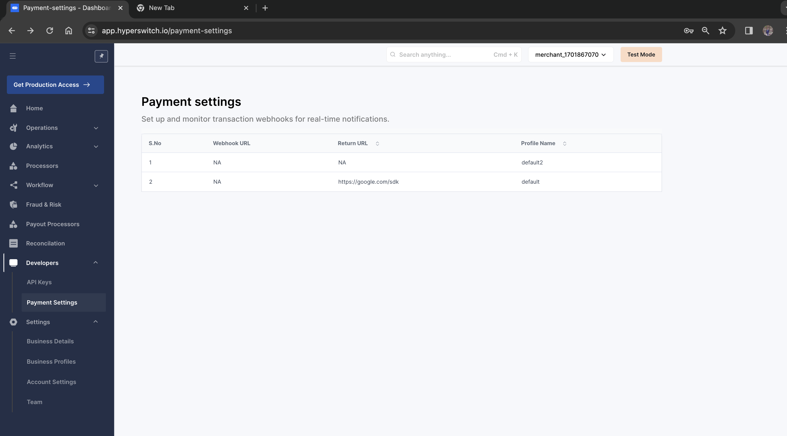
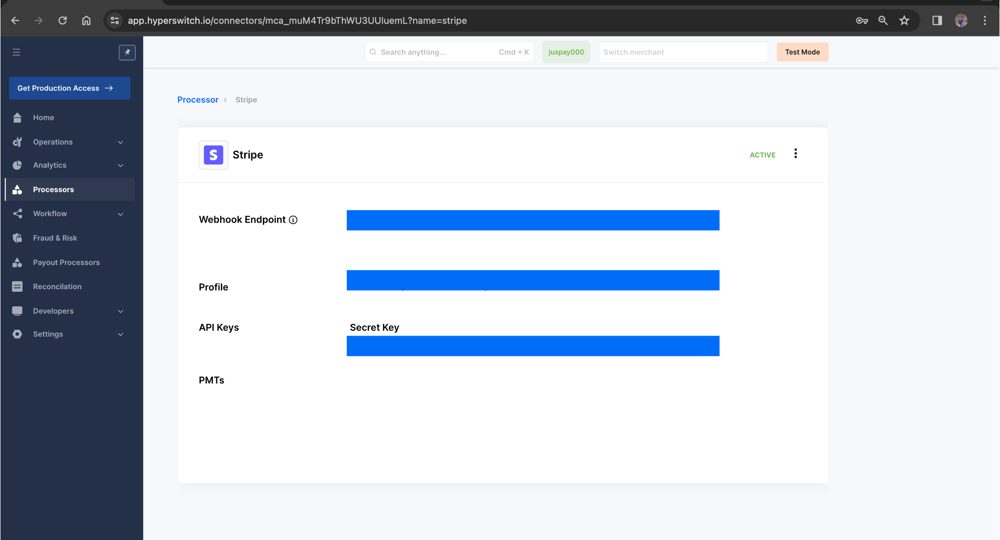

# Stripe

Stripe connects to Hyperswitch as a `PaymentGateway` connector using `HeaderKey` authentication — a single secret key passed as `Authorization: Bearer {secret_key}` on every request. Notably, all requests to Stripe are sent as `application/x-www-form-urlencoded` (not JSON), and Hyperswitch pins a specific Stripe API version in the `Stripe-Version` header to ensure consistent behaviour. Hyperswitch translates its unified payment intent model into Stripe's PaymentIntent and Charge objects, mapping status transitions bidirectionally on every sync and webhook event.

### Status and capabilities

<!-- generated from GET /feature_matrix; hyperswitch fb4c2c8b5fa993fc104102dde8c2387202e0d19f; host http://localhost:8080; fetched 2026-09-02; matrix canonical-json-v1 sha256 27951de892af028b; 138 connectors.
     Do not edit by hand. This block regenerates from the connector's
     SupportedPaymentMethods declaration in code; edit that instead. -->

**Integration status:** live  
**Category:** payment gateway  
**Webhook flows:** disputes, payments, refunds

| Payment method | Type | Mandates | Refunds | Capture methods | 3DS | Card networks | Countries | Currencies |
|---|---|---|---|---|---|---|---|---|
| bank debit | ACH Direct Debit | supported | supported | automatic, sequential automatic | not applicable | - | USA | USD |
| bank debit | BACS Direct Debit | supported | supported | automatic, manual, sequential automatic | not applicable | - | GBR | GBP |
| bank debit | BECS Direct Debit | supported | supported | automatic, manual, sequential automatic | not applicable | - | AUS | AUD |
| bank debit | SEPA Direct Debit | supported | supported | automatic, sequential automatic | not applicable | - | 33 (see pm-list) | EUR |
| bank redirect | Bancontact Card | supported | supported | automatic, sequential automatic | not applicable | - | BEL | EUR |
| bank redirect | BLIK | not supported | supported | automatic, sequential automatic | not applicable | - | POL | PLN |
| bank redirect | EPS | not supported | supported | automatic, sequential automatic | not applicable | - | AUT | EUR |
| bank redirect | Giropay | not supported | not supported | automatic, sequential automatic | not applicable | - | DEU | EUR |
| bank redirect | iDEAL | supported | supported | automatic, sequential automatic | not applicable | - | NLD | EUR |
| bank redirect | Online Banking FPX | not supported | supported | automatic, sequential automatic | not applicable | - | MYS | MYR |
| bank redirect | Przelewy24 | not supported | supported | automatic, sequential automatic | not applicable | - | POL | EUR, PLN |
| bank redirect | Sofort | supported | supported | automatic, sequential automatic | not applicable | - | 30 (see pm-list) | EUR |
| bank transfer | ACH Bank Transfer | not supported | supported | automatic, sequential automatic | not applicable | - | USA | USD |
| bank transfer | BACS Bank Transfer | not supported | supported | automatic, sequential automatic | not applicable | - | GBR | GBP |
| bank transfer | Multibanco | not supported | supported | automatic, sequential automatic | not applicable | - | 32 (see pm-list) | EUR |
| bank transfer | SEPA Bank Transfer | not supported | supported | automatic, sequential automatic | not applicable | - | - | - |
| card | Credit Card | supported | supported | automatic, manual, sequential automatic | supported, optional | American Express, Diners Club, Discover, JCB, Mastercard, UnionPay, Visa | 249 (see pm-list) | 160 (see pm-list) |
| card | Debit Card | supported | supported | automatic, manual, sequential automatic | supported, optional | American Express, Diners Club, Discover, JCB, Mastercard, UnionPay, Visa | 249 (see pm-list) | 160 (see pm-list) |
| pay later | Affirm | not supported | supported | automatic, manual, sequential automatic | not applicable | - | USA | USD |
| pay later | Afterpay Clearpay | not supported | supported | automatic, manual, sequential automatic | not applicable | - | 7 (see pm-list) | AUD, CAD, GBP, NZD, USD |
| pay later | Klarna | not supported | supported | automatic, manual, sequential automatic | not applicable | - | 22 (see pm-list) | 12 (see pm-list) |
| wallet | Alipay | not supported | supported | automatic, manual, sequential automatic | not applicable | - | CHN | 11 (see pm-list) |
| wallet | Amazon Pay | supported | supported | automatic, manual, sequential automatic | not applicable | - | 249 (see pm-list) | 12 (see pm-list) |
| wallet | Apple Pay | supported | supported | automatic, manual, sequential automatic | not applicable | - | 43 (see pm-list) | - |
| wallet | Cash App | supported | supported | automatic, manual, sequential automatic | not applicable | - | USA | USD |
| wallet | Google Pay | supported | supported | automatic, manual, sequential automatic | not applicable | - | 53 (see pm-list) | - |
| wallet | RevolutPay | supported | supported | automatic, manual, sequential automatic | not applicable | - | - | EUR, GBP |
| wallet | WeChat Pay | not supported | supported | automatic, sequential automatic | not applicable | - | CHN | 13 (see pm-list) |

### Connector-Specific Notes

* **Stripe is the only connector in Hyperswitch** that supports incremental authorization alongside a full dispute evidence upload flow (file upload via Stripe's Files API, then evidence submission via the dispute ID) — both are part of the same connector implementation.
* **Mandates and recurring payments:** When Hyperswitch sets up a mandate via Stripe, Stripe returns a `payment_method` ID linked to a Customer object. Hyperswitch stores this ID and passes it on subsequent merchant-initiated transactions (MIT). The cardholder is never involved in subsequent charges.
* **Webhook verification:** Stripe sends a `Stripe-Signature` header with each event, formatted as `t={timestamp},v1={signature}`. Hyperswitch verifies this using HMAC-SHA256 where the message is `{timestamp}.{raw_request_body}`. The signing secret is found in Stripe under **Developers → Webhooks → your endpoint → Signing secret** — this is different from the API key and must be stored separately in Hyperswitch.
* **Webhook events processed:** `payment_intent.payment_failed`, `payment_intent.succeeded`, `payment_intent.canceled`, `payment_intent.amount_capturable_updated`, `charge.succeeded`, `charge.refund.updated`, `source.chargeable`, `dispute.created`, `dispute.closed`.

***

### Activating Stripe via Hyperswitch

#### Prerequisites

1. You need to be registered with Stripe. Sign up at [dashboard.stripe.com/register](https://dashboard.stripe.com/register).
2. You should have a registered Hyperswitch account, accessible from the [Hyperswitch control center](https://app.hyperswitch.io/).
3. Request Stripe support to enable raw card data handling for your Stripe account (see [PCI compliance details](https://docs.hyperswitch.io/security-and-compliance/pci-compliance#docs-internal-guid-959e0903-7fff-fc13-1542-001b2640a715-1)). Without this, Hyperswitch cannot pass card data to Stripe directly — all card payments will fail at the Stripe API level before authorization.
4. Enter your Country, Business Label, and Stripe Secret Key in the Hyperswitch control center. The secret key is found in your Stripe dashboard under **Developers → API keys**. Use the **Secret Key**, which starts with `sk_`. Do not use the publishable key (`pk_`).
5. Select the payment methods you want to use with Stripe. These must match the methods enabled in your Stripe dashboard under **Settings → Payments → Payment methods**.
6. Navigate to **Developers → Webhooks** in your Stripe dashboard and create a new webhook endpoint.

[Steps to activate Stripe on the Hyperswitch control center](https://docs.hyperswitch.io/hyperswitch-cloud/connectors/activate-connector-on-hyperswitch)

***

### Configuring Webhooks

Webhook delivery works as a two-hop chain: Stripe delivers events to Hyperswitch, and Hyperswitch forwards them to your endpoint.

**Step 1:** Set up your webhook endpoint on the Hyperswitch dashboard under **Settings → Payment settings → Click on the profile**.

<figure><figcaption></figcaption></figure>

**Step 2:** Configure Hyperswitch's webhook endpoint on your Stripe dashboard. Find Hyperswitch's endpoint for your Stripe account by clicking **Processors → Stripe**.

<figure><figcaption></figcaption></figure>

***

### Responsibility Boundaries

**Hyperswitch owns:** routing decisions, mandate record storage, retry scheduling, webhook fan-out to your endpoint, and unified error code mapping. **Stripe owns:** charge execution, fraud evaluation (Radar), payment method storage as Customer + PaymentMethod objects, and webhook delivery to Hyperswitch's endpoint. Stripe has no visibility into Hyperswitch's routing layer.

**Hyperswitch owns:** forwarding webhook events to your configured endpoint. **Stripe owns:** delivering webhook events to Hyperswitch's registered endpoint. If Stripe's delivery fails (wrong endpoint configured, network error), Hyperswitch has no record of the event and cannot forward it — use the Hyperswitch sync API to reconcile payment status in this case.

***

### Common Failure Modes

**Raw card data not enabled on Stripe account** Symptom: Card payments are declined at Stripe before authorization. Fix: Contact Stripe support to enable raw card data handling for your account before going live.

**Publishable key used instead of secret key** Symptom: All API calls return HTTP 401 from Stripe. Fix: Replace with the secret key (`sk_live_...` or `sk_test_...`). The publishable key (`pk_...`) cannot authorize server-side payment operations.

**Webhook signing secret mismatch** Symptom: Stripe webhooks arrive at Hyperswitch but are rejected — payment and refund statuses do not update. Fix: The signing secret in Hyperswitch must match **Developers → Webhooks → your endpoint → Signing secret** in Stripe. This rotates independently of the API key.

**Payment method enabled in Hyperswitch but not active in Stripe** Symptom: Payments fail with `payment_method_not_available` from Stripe. Fix: Cross-check methods selected in the Hyperswitch connector configuration against **Settings → Payments → Payment methods** in your Stripe dashboard.

**Incremental authorization attempted with automatic capture** Symptom: Incremental authorization call fails. Fix: Incremental authorization requires `capture_method: manual` on the original payment. Stripe does not support incremental authorization on automatically-captured payments.

***

Connector implementation: `crates/hyperswitch_connectors/src/connectors/stripe.rs`. Webhook signature verification, Stripe Connect header handling, and the full payment method matrix are defined in the same file and its `transformers/` submodule.
