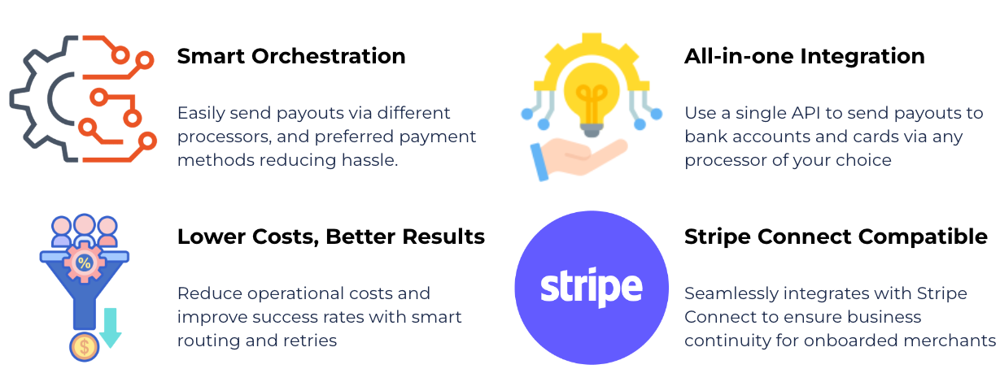

# Payout Processors

### Overview

The Juspay Hyperswitch Payouts infrastructure allows you to programmatically distribute funds to third parties, including affiliates, contractors, and merchants, across a variety of payment methods. By integrating with global processors, Hyperswitch helps you manage the entire payout lifecycle from a single point of control.

* **Automate at scale:** Orchestrate high-volume bulk payouts or schedule recurring distributions.
* **Optimize reliability:** Use [smart retries](https://docs.hyperswitch.io/explore-hyperswitch/connectors/payouts/smart-retries-in-payout) and routing to minimize failed transfers.
* **Maintain compliance:** Reduce your PCI burden with secure, [processor-agnostic tokenization](https://docs.hyperswitch.io/explore-hyperswitch/payment-orchestration/quickstart/tokenization-and-saved-cards/network-tokenisation).
* **Unified visibility:** Track every payout across different regions and connectors in one dashboard.

<figure><figcaption></figcaption></figure>

### Key Features

#### High-velocity distribution

Move funds to bank accounts, cards, or digital wallets through your preferred connectors. Whether you are using funds collected through Hyperswitch or external sources, our API ensures a seamless transfer experience.

#### Intelligence and routing

Maximize payout success with [Smart Retries](https://docs.hyperswitch.io/explore-hyperswitch/connectors/payouts/smart-retries-in-payout). If a payout fails due to a temporary connector error, Hyperswitch automatically retries the transaction through the most viable path, ensuring your partners get paid on time without manual intervention.

#### Flexible data handling

* **Independent Tokenization:** Securely store card and bank data using our processor-independent vault. This gives you the flexibility to switch payout partners without losing your users' payment credentials.
* **Bulk Operations:** Effortlessly manage large-scale disbursements by uploading `.xlsx` or `.csv` files directly via the dashboard.
* **Account Verification:** Ensure the validity of recipient bank accounts through Stripe or other supported verification providers.

### Supported Connectors and Methods

Hyperswitch currently supports payouts through 21 connectors. The table below reflects the payout methods and rails each connector implements in the [Hyperswitch codebase](https://github.com/juspay/hyperswitch/tree/main/crates/hyperswitch_connectors/src/connectors).

| Connector           | Regions      | Cards                                                                 | Bank Rails              | Wallets                |
| ------------------- | ------------ | ---------------------------------------------------------------------| ------------------------| ---------------------- |
| **Adyen**           | Global       | —                                                                     | SEPA                    | PayPal                 |
| **Adyen Platform**  | Global       | Visa, Mastercard                                                      | SEPA                     | —                      |
| **Cybersource**     | Global       | Major Networks                                                        | —                       | —                      |
| **Deutsche Bank**   | Europe       | —                                                                     | SEPA                    | —                      |
| **Ebanx**           | Brazil       | —                                                                     | Pix (Key)\*             | —                      |
| **Envoy**           | UK, EU & US  | —                                                                     | SEPA, BACS, ACH         | —                      |
| **Gigadat**         | Canada       | —                                                                     | Interac                 | —                      |
| **GotymeSanlam**    | South Africa | —                                                                     | PayShap, PayShap Proxy  | —                      |
| **Itaubank**        | Brazil       | —                                                                     | Pix, Pix Key, Pix EMV   | —                      |
| **Loonio**          | Canada       | —                                                                     | Interac                 | —                      |
| **Nomupay**         | Europe       | —                                                                     | SEPA                    | —                      |
| **Nuvei**           | Global       | Visa, Mastercard, Amex, Discover, Diners Club, JCB, UnionPay, Interac | —                       | —                      |
| **Payone**          | Europe       | Major Networks                                                        | —                       | —                      |
| **PayPal**          | Global       | —                                                                     | —                       | PayPal, Venmo\*\*      |
| **Santander**       | Brazil       | —                                                                     | Pix, Pix Key, Pix EMV   | —                      |
| **Stripe**          | Global       | Debit Cards                                                           | ACH                     | —                      |
| **Truelayer**       | UK & Europe  | —                                                                     | Open Banking            | —                      |
| **Trustly**         | Europe       | —                                                                     | Trustly (A2A)           | —                      |
| **Wise**            | Global       | —                                                                     | ACH, BACS, SEPA         | —                      |
| **Worldpay**        | Global       | —                                                                     | —                       | Apple Pay              |
| **Worldpay XML**    | Global       | Visa, Mastercard                                                      | —                       | Apple Pay, Google Pay  |


Methods marked with `*` are partially supported — Ebanx currently supports Pix payouts via Pix Key only; generic Pix and Pix EMV are not yet supported.

Methods marked with `**` are region-restricted — Venmo payouts via PayPal are limited to US recipients.


### FAQ

**Can I use Hyperswitch solely for payouts without payments?**

Yes. Hyperswitch is modular. You can use our infrastructure to handle payouts independently of your payment collection. You can initiate payouts via direct payment info or by using an existing Token ID.

**What is the benefit of independent tokenization?**

It prevents vendor lock-in. By tokenizing sensitive data independently of the underlying processor, you retain ownership of your data and can route payouts to any supported connector without asking your users to re-enter their information.
