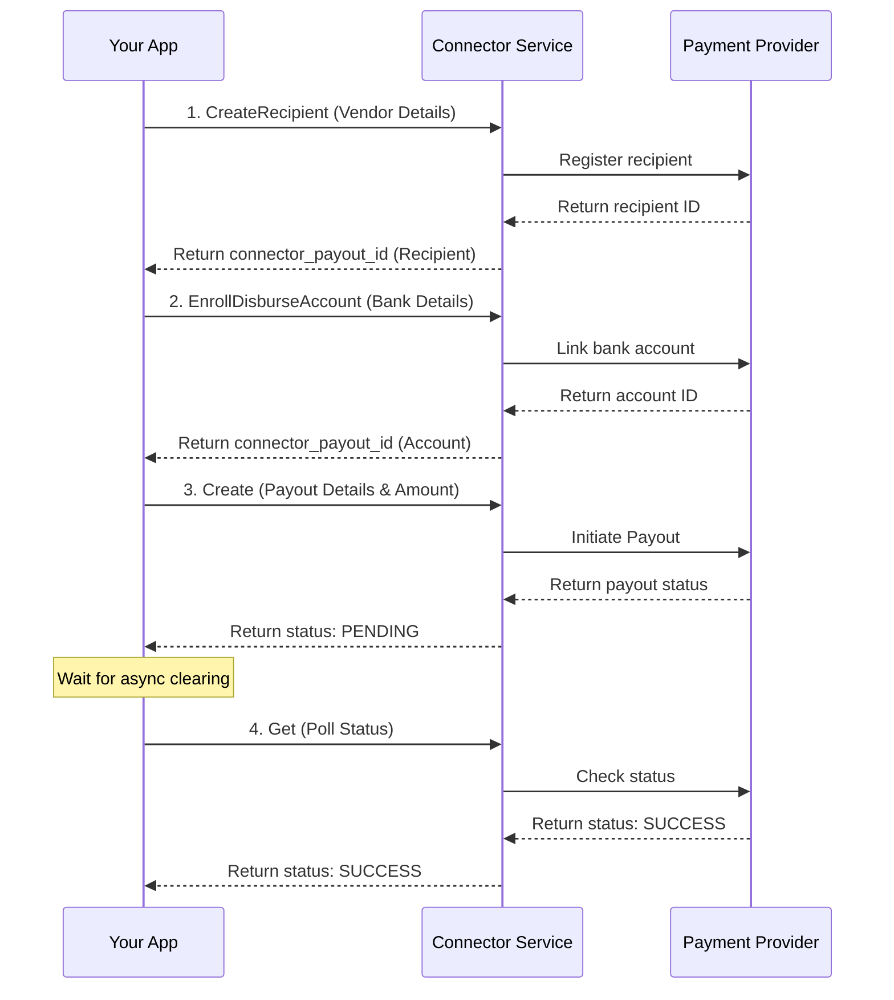

# Payout Service

<!--
---
title: Payout Service
description: Complete payout lifecycle management - create, transfer, and manage disbursements across multiple connectors
last_updated: 2026-05-13
generated_from: crates/types-traits/grpc-api-types/proto/services.proto
auto_generated: false
reviewed_by: engineering
reviewed_at: 2026-05-13
approved: true
---
-->

> [!WARNING]
> This directory is usually auto-generated from source proto definitions. Any manual edits here will be overwritten by the documentation generation script. To add permanent documentation for the Payout Service, please update the corresponding protobuf definitions and `docs/rules/rules.md`.

## Overview

The Payout Service provides comprehensive payout lifecycle management for digital businesses. It enables you to send funds from your merchant account to customers, vendors, and third parties across multiple connectors through a unified gRPC API.

**Business Use Cases:**
- **Marketplace platforms** - Release funds to sellers upon fulfillment of an order.
- **Gig-economy platforms** - Disburse earnings to drivers, riders, or freelancers.
- **Insurance claims** - Send approved claim amounts directly to the claimant's bank account.
- **E-commerce returns** - Refund a customer via an alternative method when the original payment method is unavailable.

The service supports various payout flows including synchronous transfers, staged payouts, recipient onboarding, and hosted payout links.

## Operations

| Operation | Description | Use When |
|-----------|-------------|----------|
| [`Create`](./create.md) | Initiate a new payout to transfer funds. Sets up the payout context and can sometimes execute the transfer immediately depending on the connector. | Starting a new disbursement to a vendor or user |
| [`Transfer`](./transfer.md) | Execute the actual fund transfer for an existing payout. Moves funds to the destination payout method. | Confirming or executing a staged payout |
| [`Get`](./get.md) | Retrieve current payout status from the processor. Enables synchronization between your system and the processor. | Polling for status updates on asynchronous payouts |
| [`Void`](./void.md) | Cancel a pending payout. Stops the funds from leaving the merchant account if the payout hasn't been completed. | Cancelling an incorrect or unauthorized disbursement |
| [`Stage`](./stage.md) | Prepare a payout for processing without executing it immediately. Allows for review and batching. | Reviewing payouts before final execution |
| [`CreateLink`](./create-link.md) | Generate a secure URL for the recipient to provide their own payout method details to claim funds. | Sending funds via email without knowing bank details |
| [`CreateRecipient`](./create-recipient.md) | Register a new recipient entity (individual or business) with the payment processor. | Onboarding a new seller or contractor |
| [`EnrollDisburseAccount`](./enroll-disburse-account.md) | Register and verify a destination account (like a bank account) to receive disbursements. | Linking a vendor's bank account for future payouts |

## Common Patterns

### Standard Disbursement Flow

Register the recipient, link their bank account, and transfer funds.

**Flow Explanation:**

1. **CreateRecipient** - Before sending funds, register the vendor or user with the payment processor. The processor returns a unique identifier for the recipient.
2. **EnrollDisburseAccount** - Securely link the recipient's bank account or digital wallet to their profile. This step ensures the destination is valid.
3. **Create** - Initiate the actual payout by specifying the amount and the enrolled payout method. The transaction often enters a `PENDING` state while it clears the banking network.
4. **Get** - Poll the status (or rely on webhooks) to verify when the funds have successfully settled into the recipient's account.

## Next Steps

- [Payment Service](../payment-service/README.md) - Accept payments from customers
- [Refund Service](../refund-service/README.md) - Process refunds against original payments
