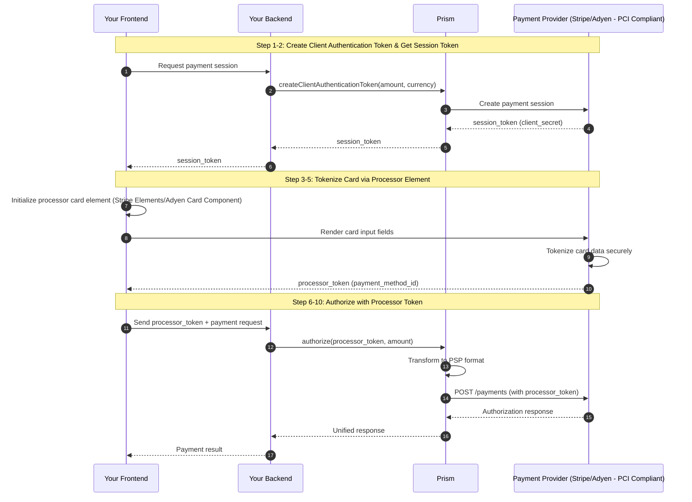
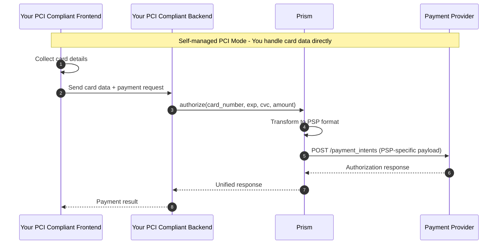

# PCI Compliance

## How Prism Handles Compliance
Prism offers multiple flavors to manage PCI DSS (Payment Card Industry Data Security Standard) compliance. Prism provides flexible PCI compliance options for merchants. Depending on your compliance requirements and infrastructure you may choose one of the strategies.

- Outsource the PCI data handling to payment processors (example: Stripe, Adyen, Braintree, etc.), so that you don't have to manage compliance, or
- Self-manage the PCI compliance by handling raw card data.

You can operate in one of two modes below.

| PCI Mode | PCI Scope | Description |
|------|-----------|-------------|
| **Payment Processor Tokenization mode** | You do not have to manage PCI compliance | PSP-native vault handles card data. E.g., Stripe/Adyen vaults handles the card data |
| **Self Managed PCI mode** | You will have to self-manage PCI compliance with full SAQ D certification | Your application handles raw card data leveraging your in-house card vault |

The choice you make here determines your risk profile, operational burden, and agility. It affects:

1. **Security liability** — Handling raw card data makes you responsible for breaches
2. **Compliance cost** — Full SAQ D certification costs $50K–$500K+ annually in audits, infrastructure, and security tools
3. **Time to market** — Achieving PCI certification can take 6–12 months
4. **Operational overhead** — Ongoing security patches, monitoring, and audits

Whether you choose a **PSP-native vault** (Stripe Vault, Adyen Vault) or an **in-house card vault** (self-managed PCI compliance), **Prism has you covered**.

---

## Payment Processor Tokenization Mode

In this mode, you will leverage the payment processor's hosted card element to collect and tokenize card data. The processor vault handles card data, significantly reducing your PCI scope.
- Card data is tokenized via processor-hosted elements
- Processor vault handles raw card data
- You only handle the processor token (e.g., `pm_xxx`, `src_xxx`)
- No additional vault subscription needed
- Works with Stripe, Adyen, and other processors that provide hosted card elements

You can use this mode if,
- You want zero PCI compliance burden
- You prefer using processor-hosted fields for card collection
- You're starting off with a single payment processor, with future plans to enable more processors

### Flow Diagram

---

## Self Managed PCI Mode

In this mode, your application receives and processes raw card data. You will have to self-manage the PCI DSS compliance. You can use this if,
- You have existing PCI DSS certification
- You need direct control over card data
- You want to minimize third-party dependencies

### Flow Diagram

---

## Which PCI mode to choose for which use case?

| Use Case | Recommended Mode | Rationale |
|----------|------------------|-----------|
| **Early-stage startup, starting with a single PSP** | Payment Processor Tokenization mode | Prism gives you the freedom to switch processors in the future when you need it |
| **Marketplace/SaaS platform supporting multi-PSP** | Payment Processor Tokenization mode | Prism can help connect to multiple PSPs with minimal coding and maintenance effort |
| **Enterprise with existing PCI certification** | Self-managed PCI mode | Leverage existing investment into PCI compliance and maintain full control |