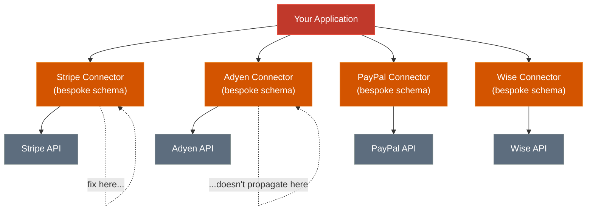
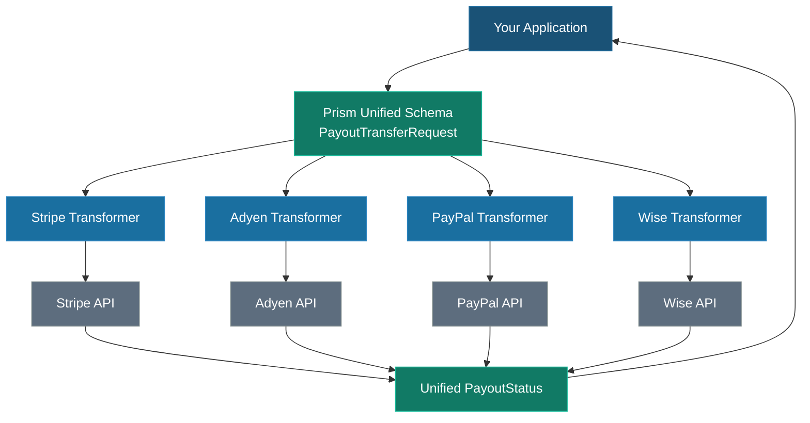

# Payouts Are an Engineering Nightmare. Here's Why and What Hyperswitch Prism Does About It.

**TL;DR**
- **The challenge:** Every payout processor handles APIs a bit differently, and those nuances can be tricky to manage.
- **Typical approach:** Writing a custom integration for each provider and maintaining them separately as things evolve.
- **The Prism approach:** We use a unified schema backed by a stateless Rust core. This lets you write your logic once and access it anywhere via UniFFI or Protobuf. Adding a new processor is as simple as adding a new transformer.

---

## The Problem Is Not Payouts. It's the N-th Integration.

Integrating your first payout processor is annoying but manageable. You read the docs, map the fields, handle the auth, wire up the webhooks. A few focused weeks of work.

Integrating the second one is where the architecture starts to hurt.

Your existing business logic like retry heuristics, error classification, reconciliation pipelines, and customer data models is encoded around the first processor's conventions. The second processor has different field names for the same concepts, different HTTP status semantics, a different auth model. You are not *extending* your payout system. You are building a parallel one alongside it.

By the third or fourth processor, the problem has changed shape. You are maintaining N implementations of the same conceptual operation: "move money from A to B, return a status." Each drifts independently. A fix to currency rounding in your Stripe connector does not propagate to Adyen. A new customer model field requires updates in each connector separately, tested in isolation.


*N processors means N independent codepaths. A fix in one does not propagate.*

---

## What "Schema Chaos" Actually Costs

The fragmentation has compounding costs that are rarely visible until they are expensive to reverse.

**Integration time is not flat.** A Stripe payout integration can be functional in days. Wise takes a week or two. Adyen marketplace payouts (which involve multiple onboarding steps, balance account management, and strict reconciliation requirements) can take months. Banking rail integrations involving treasury setup, compliance workflows, and multi-region production setups are measured in quarters. The real cost is not any individual integration. It is the cumulative maintenance burden of N of them as each processor's API evolves independently.

**Reconciliation drift.** Every connector returns status representations that are superficially similar and semantically different. One returns `"PROCESSING"`. Another returns HTTP 200 with an empty body and posts a webhook three hours later. Finance teams working against multi-processor payout stacks routinely spend extra days per month resolving mismatches that are schema problems, not money problems.

**Type errors at the worst moment.** An amount as a float instead of minor units. A currency as `"usd"` instead of the required enum. A field named `bank_account_number` when the processor expects `accountNumber`. These surface in production batch runs, against processors whose sandboxes silently accepted the malformed value.

**Integration lock-in.** The more connector-specific logic accumulates, the more expensive it becomes to add or switch processors. Each connector embeds the operational knowledge of every edge case your team discovered running it in production. That knowledge is not transferable.

---

## What Hyperswitch Prism Actually Solves (and What It Doesn't)

Prism is a stateless, open-source unified connector library, extracted from production integrations built by Juspay inside [Hyperswitch](https://github.com/juspay/hyperswitch). Its job is to be the translation layer between a single normalised schema and the APIs of 80+ payout processors.

> **What it actually does:** Prism normalises the API layer, not the banking system. It does not sign your processor contracts, pre-fund treasury wallets, or satisfy underwriting requirements. Your legal and compliance teams still do their work. What Prism changes is what happens *after* they give the green light. Instead of rebuilding integration infrastructure from scratch, your team writes one connector transformer.

The unified domain model:

```
PayoutMethodData
├── Card(CardPayout)           // Card-push: Visa Direct, Mastercard Send
├── Bank(Bank)
│   ├── Ach(AchBankTransfer)   // USA: account number + routing number
│   ├── Bacs(BacsBankTransfer) // UK: account number + sort code
│   ├── Sepa(SepaBankTransfer) // Eurozone: IBAN + optional BIC
│   ├── Pix(PixBankTransfer)   // Brazil: full account + ISPB routing
│   ├── PixKey                 // Brazil: alias key (CPF, phone, email)
│   └── PixEmv                 // Brazil: QR/EMV code transfer
├── Wallet(Wallet)             // PayPal, Venmo, Apple Pay Decrypt
├── BankRedirect(BankRedirect) // Interac (CA), OpenBanking UK
└── Passthrough(Passthrough)   // PSP-tokenised method reuse
```

Every payout operation like Create, Transfer, Get, Void, Stage, CreateLink, CreateRecipient, and EnrollDisburseAccount maps to this schema. The same `PayoutTransferRequest` carries `source_currency`, `destination_currency`, `amount` in minor units, and `payout_method_data` regardless of which processor sits below.


*One schema at the top, N thin transformers at the bottom. Business logic and contracts are written once.*

---

## The Polyglot Problem: UniFFI and Protobuf

The unified schema solves processor fragmentation. Two more fragmentation axes remain: language boundaries within an org, and network boundaries between services.

**UniFFI: one implementation across languages.** The connector logic is written in Rust. The benefits here are specific: strong typing, exhaustive enum matching that turns an unhandled `PayoutStatus` case into a compile error, and a shared implementation across all language targets. [Mozilla's UniFFI](https://github.com/mozilla/uniffi-rs) generates SDK bindings for Python, Node.js, Java/Kotlin, and Swift from the same Rust interface definition.

The operational benefit is not that a fix magically propagates everywhere. It is that there is no separate Python implementation of the Itaubank connector that can go out of sync with the Java implementation. The validation logic, field mapping, and request construction live in one place. When it is updated, every SDK wrapper picks up that update on the next version bump because they all call the same compiled core.

```python
# Python: types generated from the same Rust definition
from hyperswitch_prism import PayoutClient, types

client = PayoutClient(config)
response = client.payout_transfer(
    types.PayoutTransferRequest(
        amount=types.MinorUnit(value=50000),      # £500.00
        source_currency=types.Currency.GBP,
        destination_currency=types.Currency.GBP,
        payout_method_data=types.PayoutMethodData.bank(
            types.Bank.bacs(types.BacsBankTransfer(
                bank_account_number="12345678",
                bank_sort_code="040004",
            ))
        ),
    )
)
```

The same structure (same types, same enum variants, same error surface) works in Node.js and Java.

**Protobuf: typed contracts across service boundaries.** For distributed setups where the connector runs as a gRPC service, Protobuf enforces the schema at every call site. Every field is strictly typed. New optional fields can be added without breaking existing callers, enabling additive schema evolution without forced upgrades. Each consumer generates its own type-safe client stubs from the same `.proto` definition.

The business value: field numbers, not field names, identify data on the wire, so you can extend the schema for a new PIX variant or a new compliance field without a coordinated rollout across every service that calls the payout endpoint.

---

## Why Stateless Matters

Prism's statelessness makes a real operational difference.

Because Prism stores nothing (no credentials, no PII, no request history), it scales horizontally with no coordination overhead. Every instance is identical. A request that fails on one pod can be retried on any other without session affinity. Updates are a binary swap; there is no migration.

It also keeps PCI scope narrow. Credentials and sensitive fields exist only within the lifetime of a request. Nothing is logged or cached by the library. Whether Prism processes one payout a day or a million, its operational profile does not change.

---

## Where the Abstraction Leaks

No payout schema maps cleanly across processors without leaking provider-specific semantics. There are already abstraction layers in the industry like ISO 20022, open banking initiatives, and internal payout schemas at every mature fintech. They all hit the same wall: processors expose incompatible semantics, and abstractions fail under edge cases.

Prism normalises the schema and transport layer. It does not normalise the hardest problems. They are worth naming.

**Payout finality is not uniform.** `PROCESSING` in one processor means funds are in-flight and will settle. In another it means the request is queued for manual review. In a third it means it has been irrevocably submitted to the scheme and cannot be cancelled. A unified `PayoutStatus` enum represents these states consistently, but your retry logic, reconciliation pipeline, and customer notifications need to understand which semantics apply to each connector.

**Reversibility varies by processor and timing.** Prism exposes a `PayoutVoid` flow. Whether it succeeds depends entirely on the processor. Some allow cancellation post-submission. Others do not. The library provides this capability consistently; it does not make reversibility universally available.

**FX quote locking is connector-specific.** Wise and Adyen support locking an exchange rate before a payout is submitted. Stripe does not. Prism's `PayoutStage` flow covers quoting, but whether a quote is bindable before transfer depends on the underlying connector.

**Webhook timing is not guaranteed.** Settlement notifications arrive in seconds on some rails, hours on others, occasionally not at all. Reconciliation systems need to be designed for this reality.

| Capability | Stripe | Adyen | Wise | Prism abstraction |
|---|---|---|---|---|
| Idempotency keys | Yes | Yes | Yes | Unified via `merchant_payout_id` |
| Async settlement signals | Partial | Yes | Yes | Normalised `PayoutStatus` enum |
| FX quote locking | No | Yes | Yes | Provider extension (connector-specific) |
| Payout reversibility | Limited | Yes | Partial | `PayoutVoid` (success is connector-dependent) |
| mTLS auth | No | Optional | No | Connector-managed |
| Webhook timing guarantees | None | None | None | Not normalised (design for idempotency) |

In summary: Prism removes the low-level integration tax. It does not make all processors equivalent.

---

## Idempotency and Async Flows

Payout systems fail in ways that payments do not. A network timeout on an authorization tells you the payment probably did not go through. A network timeout on a payout tells you nothing since the instruction may have been received and acted upon before the connection dropped.

This is why every payout request in Prism carries a `merchant_payout_id`. It is the caller's idempotency key. Submit the same ID twice, and the second call is treated as a status query, not a duplicate transfer. The same key threads through status polling (`PayoutGet`) and reconciliation.

Payout systems are also fundamentally asynchronous. The request/response cycle tells you the instruction was accepted. Settlement is a separate event, often delivered via webhook. Building payout infrastructure without accounting for that gap (where "accepted" and "settled" are different states with different timing) is one of the most common sources of reconciliation debt.

---

## Why Not Just Build This In-House?

Every fintech staff engineer reading this is asking that question. You can. Most mature fintechs do, at some scale. The real breakdown:

**You implement the connectors.** Prism's 80+ connectors represent years of accumulated production fixes like auth edge cases, undocumented error codes, processor API quirks, and sandbox-vs-production behavioral differences. You can replicate that coverage, but you start from zero.

**You maintain them.** Each connector has an ongoing changelog. Deprecations, new required fields, auth scheme changes, TLS certificate rotations, new webhook schemas. That is real engineering time, indefinitely, for every connector you support.

**You own the schema.** Your internal payout abstraction will end up resembling Prism's domain model, because the problem space is the same. The question is whether you want to maintain it or use one that is already maintained and tested against real production traffic.

**You get no cross-org bug fixes.** When Prism connectors run across many production deployments, bugs are found and fixed by the community. Your internal abstraction gets only your team's traffic volume.

Prism is open source under Apache 2.0. You can audit every line, fork it, extend it, replace connectors. If your requirements diverge significantly, you build on top of it. What you get is not a SaaS dependency, but a library with a head start measured in years of production usage.

---

## What Adding a Second Connector Actually Looks Like

A team running Adyen for EUR payouts that needs to add Wise for GBP typically implements:

- Wise connector auth config (API key, OAuth if required)
- Wise-specific field mapping (IBAN format constraints, reference field limits)
- Wise webhook endpoint registration (confirmation and settlement events)

They reuse without modification:

- Payout retry logic
- Reconciliation pipelines
- Ledger integration
- Observability and alerting
- SDK contracts across all language targets
- Idempotency handling

The connector transformer is a bounded surface. Everything above it does not move.

---

## Transfer Type Abstraction

Brazil's PIX system is a useful stress test for any abstraction. It is not a single transfer type, but three structurally different ones:

| Mode | Required fields |
|---|---|
| Full bank account | Account number, branch, ISPB routing code, tax ID (CPF/CNPJ) |
| PIX Key | A single alias: CPF, phone number, email, or random UUID |
| PIX EMV | An EMV/QR-code payload |

The Itaubank connector has its own Portuguese-language API fields, its own OAuth flow, and an mTLS certificate requirement. None of this is visible to the caller.

In Prism, the three modes are typed variants:

```rust
pub enum Bank {
    Pix(PixBankTransfer),       // Full account: number, branch, ISPB, tax_id
    PixKey(PixKeyBankTransfer),  // Single alias key
    PixEmv(PixEmvBankTransfer),  // EMV/QR-code payload
}
```

The application picks the variant, sets the fields. Prism handles field mapping, mTLS attachment, token refresh, and response normalisation. When a second PIX connector is added, the domain model does not change. Only a new transformer is registered.

---

## Try It in Two Minutes

**1. Install the SDK**

You can get started in seconds by adding the SDK directly to your project:

```bash
npm install hyperswitch-prism
```

**2. Fire a payout transfer**

```javascript
const { PayoutClient } = require('hyperswitch-prism');

const client = new PayoutClient({
    connector: 'adyen', // ↓ THE ENTIRE POINT: change this one field to switch processors.
    apiKey: 'YOUR_SANDBOX_API_KEY',
    merchantId: 'YOUR_MERCHANT_ACCOUNT',
    environment: 'SANDBOX'
});

const response = await client.payoutTransfer({
    merchantPayoutId: 'test_payout_001',
    amount: { minorAmount: 50000, currency: 'GBP' },
    destinationCurrency: 'GBP',
    payoutMethodData: {
        bank: {
            bacs: {
                bankAccountNumber: { value: '12345678' },
                bankSortCode: { value: '040004' }
            }
        }
    }
});

console.log(response.status);
```

Replace `adyen` with `stripe`, `paypal`, or `wise`. Nothing else changes.

---

**Source, docs, and full connector catalogue: [github.com/juspay/hyperswitch-prism](https://github.com/juspay/hyperswitch-prism)**
Questions: [Hyperswitch Slack community](https://join.slack.com/t/hyperswitch-io/shared_invite/zt-362xmn7hg-ujdw8Wvx_~BgNTLrCcdCPw)

*Open source under Apache 2.0, maintained by the team at [Juspay](https://juspay.in).*
