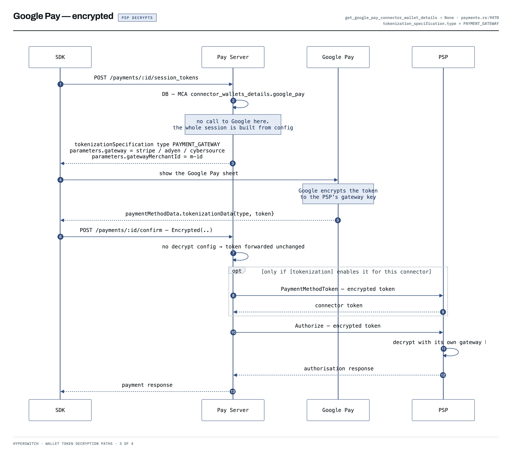
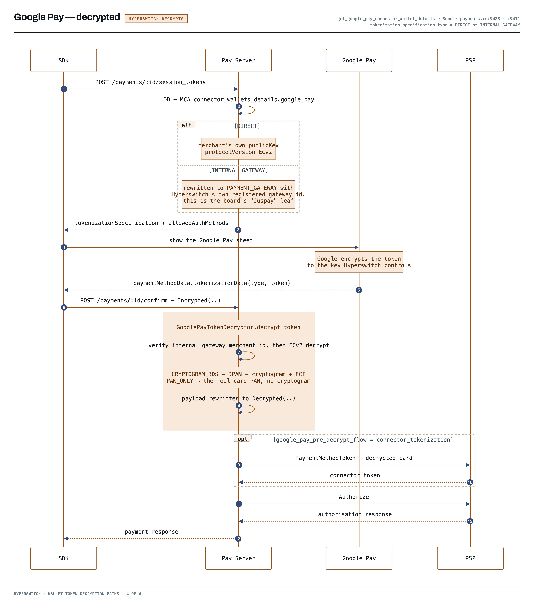

# Google Pay

Wallet payment using a tokenized card stored in the customer's Google account. The encrypted payment token is obtained from the Google Pay JS API on the client side — it is never constructed manually.

> **Before you send this request:** Initialize the Google Pay API in the browser, call `loadPaymentData()`, and extract the `paymentMethodData.tokenizationData.token` from the response. Pass that token as `tokenization_data.encrypted_data.token` below.




```typescript
const paymentClient = new PaymentClient(config);

// googlePayToken: the JSON string from paymentMethodData.tokenizationData.token
const response = await paymentClient.authorize({
    merchantTransactionId: "txn_001",
    amount: { minorAmount: 1000, currency: Currency.USD },
    paymentMethod: {
        googlePay: {
            type: "CARD",
            description: "Visa 1111",
            info: {
                cardNetwork: "VISA",
                cardDetails: "1111",
            },
            tokenizationData: {
                encryptedData: {
                    tokenType: "PAYMENT_GATEWAY",
                    token: googlePayToken,
                },
            },
        },
    },
    captureMethod: CaptureMethod.AUTOMATIC,
    address: { billingAddress: {} },
    authType: AuthenticationType.NO_THREE_DS,
    returnUrl: "https://example.com/return",
});
```



```python
from payments import (
    PaymentClient, PaymentServiceAuthorizeRequest, Money, Currency,
    CaptureMethod, AuthenticationType, PaymentAddress, Address,
    PaymentMethod, GoogleWallet, GooglePayEncryptedTokenizationData,
)

# google_pay_token: JSON string from paymentMethodData.tokenizationData.token
response = await payment_client.authorize(
    PaymentServiceAuthorizeRequest(
        merchant_transaction_id="txn_001",
        amount=Money(minor_amount=1000, currency=Currency.USD),
        payment_method=PaymentMethod(
            google_pay=GoogleWallet(
                type="CARD",
                description="Visa 1111",
                info=GoogleWallet.PaymentMethodInfo(
                    card_network="VISA",
                    card_details="1111",
                ),
                tokenization_data=GoogleWallet.TokenizationData(
                    encrypted_data=GooglePayEncryptedTokenizationData(
                        token_type="PAYMENT_GATEWAY",
                        token=google_pay_token,
                    )
                ),
            )
        ),
        capture_method=CaptureMethod.AUTOMATIC,
        address=PaymentAddress(billing_address=Address()),
        auth_type=AuthenticationType.NO_THREE_DS,
        return_url="https://example.com/return",
    )
)
```



```kotlin
val client = PaymentClient(config)

// googlePayToken: JSON string from paymentMethodData.tokenizationData.token
val request = PaymentServiceAuthorizeRequest.newBuilder().apply {
    merchantTransactionId = "txn_001"
    amountBuilder.apply {
        minorAmount = 1000L
        currency = Currency.USD
    }
    paymentMethodBuilder.googlePayBuilder.apply {
        type = "CARD"
        description = "Visa 1111"
        infoBuilder.apply {
            cardNetwork = "VISA"
            cardDetails = "1111"
        }
        tokenizationDataBuilder.encryptedDataBuilder.apply {
            tokenType = "PAYMENT_GATEWAY"
            token = googlePayToken
        }
    }
    captureMethod = CaptureMethod.AUTOMATIC
    addressBuilder.billingAddressBuilder.apply {}
    authType = AuthenticationType.NO_THREE_DS
    returnUrl = "https://example.com/return"
}.build()

val response = client.authorize(request)
```




## Token decryption paths

Google encrypts the token to whichever key the session asked it to, so `tokenizationSpecification.type` in the session token decides who can decrypt it — and therefore which payload the processor receives.

### PSP decrypts — `PAYMENT_GATEWAY`

The token is encrypted to the processor's gateway key and forwarded unchanged. No call to Google is made while building the session; the whole session is assembled from the stored connector wallet details.



### Hyperswitch decrypts — `DIRECT` or `INTERNAL_GATEWAY`

The token is encrypted to a key Hyperswitch controls. The ECv2 payload is verified and decrypted before authorization: `CRYPTOGRAM_3DS` yields a DPAN with cryptogram and ECI, `PAN_ONLY` yields the real card PAN and no cryptogram.


