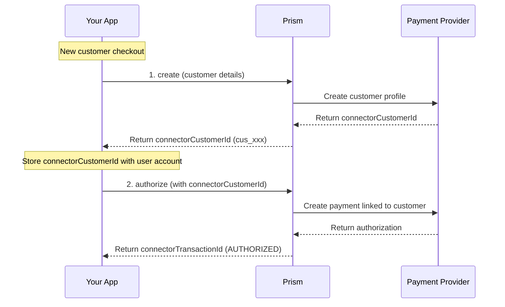

# Customer Service

<!--
---
title: Customer Service (Node SDK)
description: Create and manage customer profiles using the Node.js SDK
last_updated: 2026-03-21
generated_from: backend/grpc-api-types/proto/services.proto
auto_generated: true
reviewed_by: ''
reviewed_at: ''
approved: false
sdk_language: node
---
-->

## Overview

The Customer Service enables you to create and manage customer profiles at payment processors using the Node.js SDK. Storing customer details with connectors streamlines future transactions and improves authorization rates.

**Business Use Cases:**
- **E-commerce accounts** - Save customer profiles for faster checkout on return visits
- **SaaS platforms** - Associate customers with subscription payments and billing histories
- **Recurring billing** - Link customers to stored payment methods for automated billing
- **Fraud prevention** - Consistent customer identity improves risk scoring accuracy

## Operations

| Operation | Description | Use When |
|-----------|-------------|----------|
| [`create`](./create.md) | Create customer record in the payment processor system. Stores customer details for future payment operations without re-sending personal information. | First-time customer checkout, account registration, subscription signup |

## SDK Setup

```javascript
const { CustomerClient } = require('hyperswitch-prism');

const customerClient = new CustomerClient({
    connector: 'stripe',
    apiKey: 'YOUR_API_KEY',
    environment: 'SANDBOX'
});
```

## Common Patterns

### New Customer Checkout Flow

Create a customer profile during first-time checkout.



**Flow Explanation:**

1. **Create customer** - Send customer details to the Customer Service. The connector creates a profile at the payment processor and returns a `connectorCustomerId`.

2. **Authorize payment** - When the customer makes a payment, call the Payment Service's `authorize` method with the `connectorCustomerId`.

## Next Steps

- [Payment Service](../payment-service/README.md) - Process payments linked to customers
- [Payment Method Service](../payment-method-service/README.md) - Store and manage customer payment methods
- [Recurring Payment Service](../recurring-payment-service/README.md) - Set up recurring billing for customers
