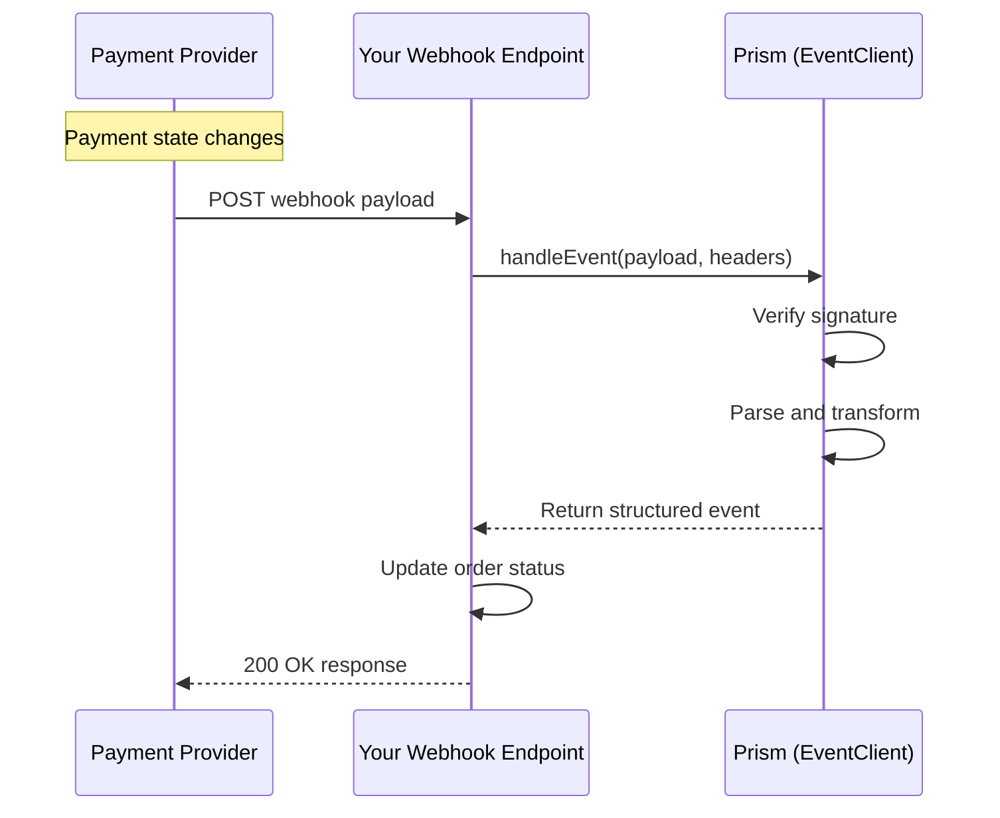

# Event Service

<!--
---
title: Event Service (Node.js SDK)
description: Process asynchronous webhook events from payment processors using the Node.js SDK
last_updated: 2026-03-21
generated_from: backend/grpc-api-types/proto/services.proto
auto_generated: true
reviewed_by: ''
reviewed_at: ''
approved: false
sdk_language: node
---
-->

## Overview

The Event Service processes inbound webhook notifications from payment processors using the Node.js SDK. Instead of polling for status updates, webhooks deliver real-time notifications when payment states change.

**Business Use Cases:**
- **Payment completion** - Receive instant notification when payments succeed
- **Failed payment handling** - Get notified of declines for retry logic
- **Refund tracking** - Update systems when refunds complete
- **Dispute alerts** - Immediate notification of new chargebacks

## Operations

| Operation | Description | Use When |
|-----------|-------------|----------|
| [`handleEvent`](./handle-event.md) | Process webhook from payment processor. Verifies and parses incoming connector notifications. | Receiving webhook POST from Stripe, Adyen, etc. |

## SDK Setup

```javascript
const { EventClient } = require('hyperswitch-prism');

const eventClient = new EventClient({
    connector: 'stripe',
    apiKey: 'YOUR_API_KEY',
    environment: 'SANDBOX'
});
```

## Common Patterns

### Webhook Processing Flow



**Flow Explanation:**

1. **Provider sends** - When a payment updates, the provider sends a webhook to your endpoint.

2. **Verify and parse** - Pass the raw payload to `handleEvent` for verification and transformation.

3. **Process event** - Receive a structured event object with unified format.

4. **Update systems** - Update your database, fulfill orders, or trigger notifications.

## Webhook Security Example

```javascript
const express = require('express');
const { EventClient } = require('hyperswitch-prism');

const app = express();
const eventClient = new EventClient({
    connector: 'stripe',
    apiKey: 'YOUR_API_KEY'
});

app.post('/webhooks/payments', express.raw({ type: 'application/json' }), async (req, res) => {
    try {
        const event = await eventClient.handleEvent({
            payload: req.body,
            headers: req.headers,
            webhookSecret: 'whsec_xxx'
        });

        if (event.type === 'payment.captured') {
            await fulfillOrder(event.data.merchantTransactionId);
        }

        res.json({ received: true });
    } catch (err) {
        res.status(400).json({ error: err.message });
    }
});
```

## Next Steps

- [Payment Service](../payment-service/README.md) - Handle payment webhooks
- [Refund Service](../refund-service/README.md) - Process refund notifications
- [Dispute Service](../dispute-service/README.md) - Handle dispute alerts
