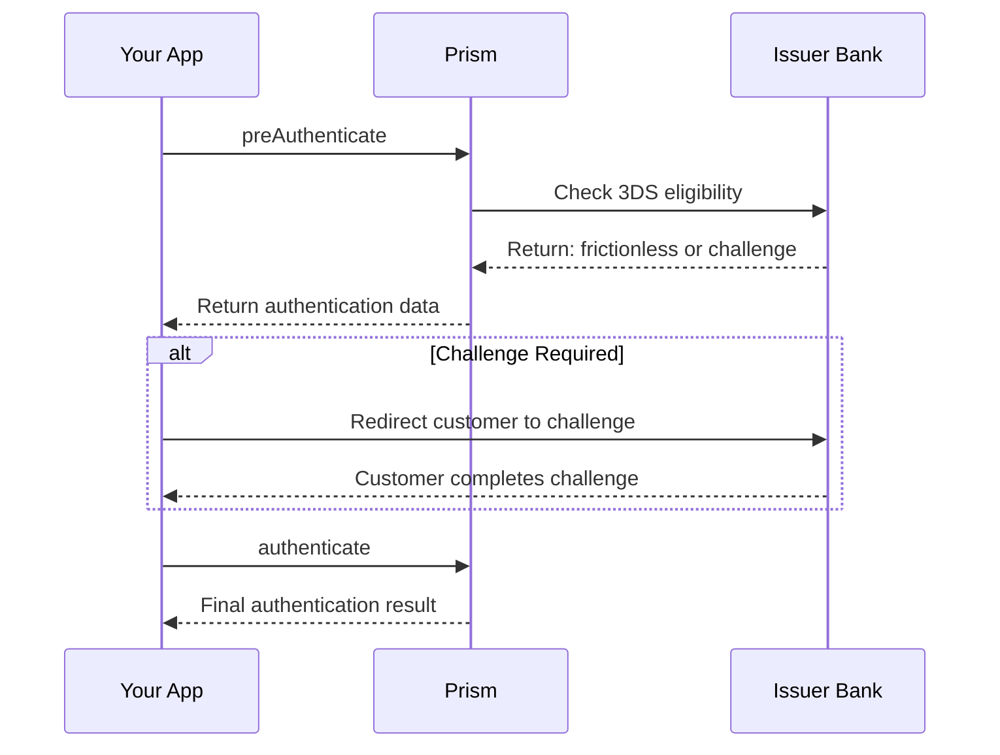

# preAuthenticate Method

<!--
---
title: preAuthenticate (Node.js SDK)
description: Initiate 3D Secure flow before payment authorization using the Node.js SDK
last_updated: 2026-03-21
generated_from: backend/grpc-api-types/proto/services.proto
auto_generated: true
reviewed_by: ''
reviewed_at: ''
approved: false
sdk_language: node
---
-->

## Overview

The `preAuthenticate` method initiates the 3D Secure authentication flow. It collects device data and prepares the authentication context, determining whether frictionless or challenge-based verification is needed.

**Business Use Case:** Before processing a high-value transaction, initiate 3DS to reduce fraud liability and comply with Strong Customer Authentication (SCA) requirements.

## Purpose

| Scenario | Benefit |
|----------|---------|
| Fraud prevention | Shift liability to card issuer |
| SCA compliance | Meet European regulatory requirements |
| Risk-based auth | Frictionless flow for low-risk transactions |

## Request Fields

| Field | Type | Required | Description |
|-------|------|----------|-------------|
| `merchantOrderId` | string | Yes | Your unique order reference |
| `amount` | Money | Yes | Transaction amount |
| `paymentMethod` | PaymentMethod | Yes | Card details |
| `customer` | Customer | No | Customer information |
| `returnUrl` | string | Yes | URL to redirect after 3DS |

## Response Fields

| Field | Type | Description |
|-------|------|-------------|
| `connectorTransactionId` | string | Connector's 3DS transaction ID |
| `status` | string | AUTHENTICATION_REQUIRED, FRICTIONLESS |
| `authenticationData` | object | Device data for next step |
| `redirectionData` | object | Challenge URL if required |
| `statusCode` | number | HTTP status code |

## Example

### SDK Setup

```javascript
const { PaymentMethodAuthenticationClient } = require('hyperswitch-prism');

const authClient = new PaymentMethodAuthenticationClient({
    connector: 'stripe',
    apiKey: 'YOUR_API_KEY',
    environment: 'SANDBOX'
});
```

### Request

```javascript
const request = {
    merchantOrderId: "order_001",
    amount: {
        minorAmount: 10000,
        currency: "USD"
    },
    paymentMethod: {
        card: {
            cardNumber: { value: "4242424242424242" },
            cardExpMonth: { value: "12" },
            cardExpYear: { value: "2027" }
        }
    },
    returnUrl: "https://your-app.com/3ds/return"
};

const response = await authClient.preAuthenticate(request);
```

### Response - Frictionless

```javascript
{
    connectorTransactionId: "pi_3Oxxx...",
    status: "FRICTIONLESS",
    authenticationData: {
        eci: "05",
        cavv: "AAABBIIFmA=="
    },
    statusCode: 200
}
```

### Response - Challenge Required

```javascript
{
    connectorTransactionId: "pi_3Oxxx...",
    status: "AUTHENTICATION_REQUIRED",
    redirectionData: {
        url: "https://acs.bank.com/3ds/challenge",
        method: "POST"
    },
    statusCode: 200
}
```

## 3DS Flow



## Next Steps

- [authenticate](./authenticate.md) - Complete the 3DS flow
- [authorize](../payment-service/authorize.md) - Process payment with 3DS data
