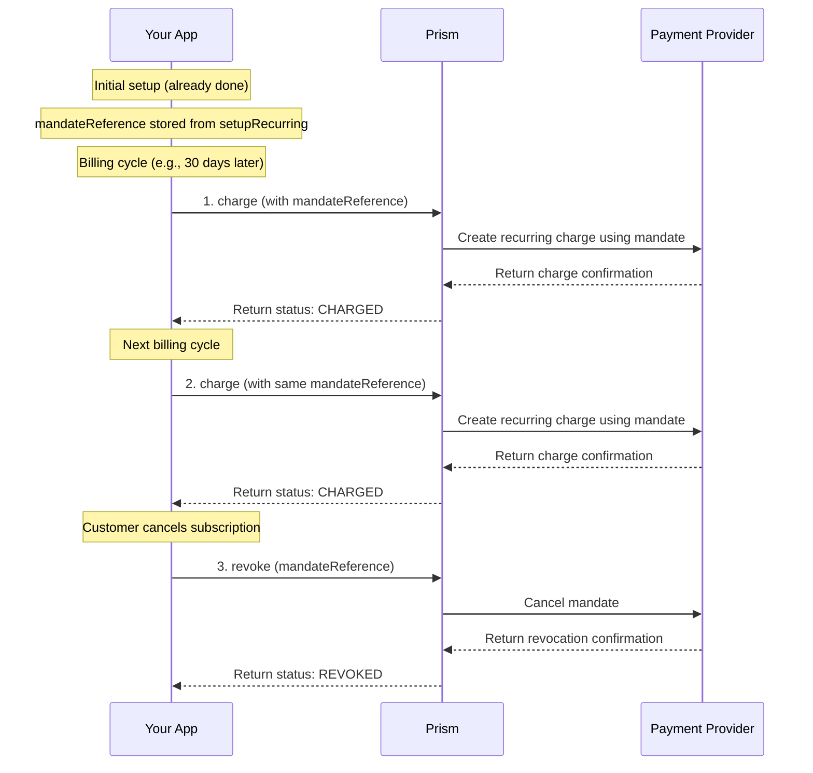

# Recurring Payment Service

<!--
---
title: Recurring Payment Service (Node SDK)
description: Process subscription billing and manage recurring payment mandates using the Node.js SDK
last_updated: 2026-03-21
generated_from: backend/grpc-api-types/proto/services.proto
auto_generated: true
reviewed_by: ''
reviewed_at: ''
approved: false
sdk_language: node
---
-->

## Overview

The Recurring Payment Service enables you to process subscription billing and manage recurring payment mandates using the Node.js SDK. Once a customer has set up a mandate (through the Payment Service's `setupRecurring`), this service handles subsequent charges without requiring customer interaction.

**Business Use Cases:**
- **SaaS subscriptions** - Charge customers monthly/yearly for software subscriptions
- **Membership fees** - Process recurring membership dues for clubs and organizations
- **Utility billing** - Automate monthly utility and service bill payments
- **Installment payments** - Collect scheduled payments for large purchases over time
- **Donation subscriptions** - Process recurring charitable donations

## Operations

| Operation | Description | Use When |
|-----------|-------------|----------|
| [`charge`](./charge.md) | Process a recurring payment using an existing mandate. Charges customer's stored payment method for subscription renewal without requiring their presence. | Subscription renewal, recurring billing cycle, automated payment collection |
| [`revoke`](./revoke.md) | Cancel an existing recurring payment mandate. Stops future automatic charges when customers end their subscription or cancel service. | Subscription cancellation, customer churn, mandate revocation |

## SDK Setup

```javascript
const { RecurringPaymentClient } = require('hyperswitch-prism');

const recurringClient = new RecurringPaymentClient({
    connector: 'stripe',
    apiKey: 'YOUR_API_KEY',
    environment: 'SANDBOX'
});
```

## Common Patterns

### SaaS Subscription Billing Cycle

Process monthly subscription renewals using stored mandates.



**Flow Explanation:**

1. **charge (recurring)** - When a subscription billing cycle triggers, call the `charge` method with the stored `mandateReference` from the initial `setupRecurring`.

2. **Subsequent charges** - For each subsequent billing cycle, repeat the `charge` method call with the same `mandateReference`.

3. **revoke on cancellation** - When a customer cancels their subscription, call the `revoke` method with the `mandateReference` to cancel the mandate.

## Next Steps

- [Payment Service](../payment-service/README.md) - Set up initial mandates with setupRecurring
- [Payment Method Service](../payment-method-service/README.md) - Store payment methods for recurring use
- [Customer Service](../customer-service/README.md) - Manage customer profiles for subscriptions
