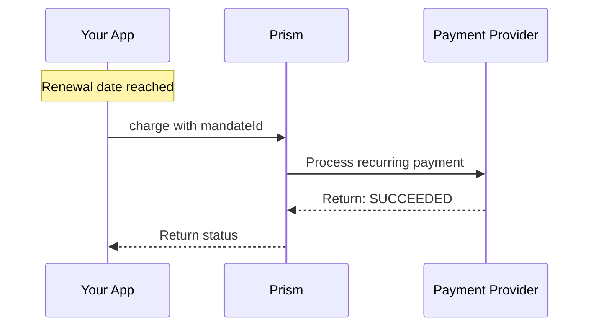

# charge Method

<!--
---
title: charge (Node.js SDK)
description: Process a recurring payment using an existing mandate using the Node.js SDK
last_updated: 2026-03-21
generated_from: backend/grpc-api-types/proto/services.proto
auto_generated: true
reviewed_by: ''
reviewed_at: ''
approved: false
sdk_language: node
---
-->

## Overview

The `charge` method processes a recurring payment using an existing mandate. Once a customer has authorized recurring billing, use this to charge their stored payment method without requiring their interaction.

**Business Use Case:** Your SaaS subscription renews monthly. The customer already authorized recurring payments during signup. On the renewal date, you call `charge` to process their subscription payment.

## Purpose

| Scenario | Benefit |
|----------|---------|
| Subscription billing | Automate monthly/yearly charges |
| Membership dues | Process club/organization fees |
| Installment plans | Collect scheduled payments automatically |

## Request Fields

| Field | Type | Required | Description |
|-------|------|----------|-------------|
| `merchantTransactionId` | string | Yes | Your unique transaction reference |
| `amount` | Money | Yes | Amount to charge (minor units) |
| `mandateId` | string | Yes | The mandate ID from setupRecurring |
| `description` | string | No | Description on customer's statement |
| `metadata` | object | No | Additional data (max 20 keys) |

## Response Fields

| Field | Type | Description |
|-------|------|-------------|
| `merchantTransactionId` | string | Your transaction reference |
| `connectorTransactionId` | string | Connector's transaction ID |
| `status` | PaymentStatus | SUCCEEDED, PENDING, FAILED |
| `error` | ErrorInfo | Error details if failed |
| `statusCode` | number | HTTP status code |

## Example

### SDK Setup

```javascript
const { RecurringPaymentClient } = require('hyperswitch-prism');

const recurringClient = new RecurringPaymentClient({
    connector: 'stripe',
    apiKey: 'YOUR_API_KEY',
    environment: 'SANDBOX'
});
```

### Request

```javascript
const request = {
    merchantTransactionId: "txn_sub_monthly_001",
    amount: {
        minorAmount: 2900,
        currency: "USD"
    },
    mandateId: "mandate_xxx",
    description: "Monthly Pro Plan Subscription"
};

const response = await recurringClient.charge(request);
```

### Response

```javascript
{
    merchantTransactionId: "txn_sub_monthly_001",
    connectorTransactionId: "pi_3Oxxx...",
    status: "SUCCEEDED",
    statusCode: 200
}
```

## Subscription Renewal Flow



## Error Handling

| Error Code | Meaning | Action |
|------------|---------|--------|
| `402` | Payment failed | Insufficient funds, expired card |
| `404` | Mandate not found | Verify mandateId |
| `409` | Duplicate | Use unique merchantTransactionId |

## Next Steps

- [setupRecurring](../payment-service/setup-recurring.md) - Create initial mandate
- [revoke](./revoke.md) - Cancel recurring payments
