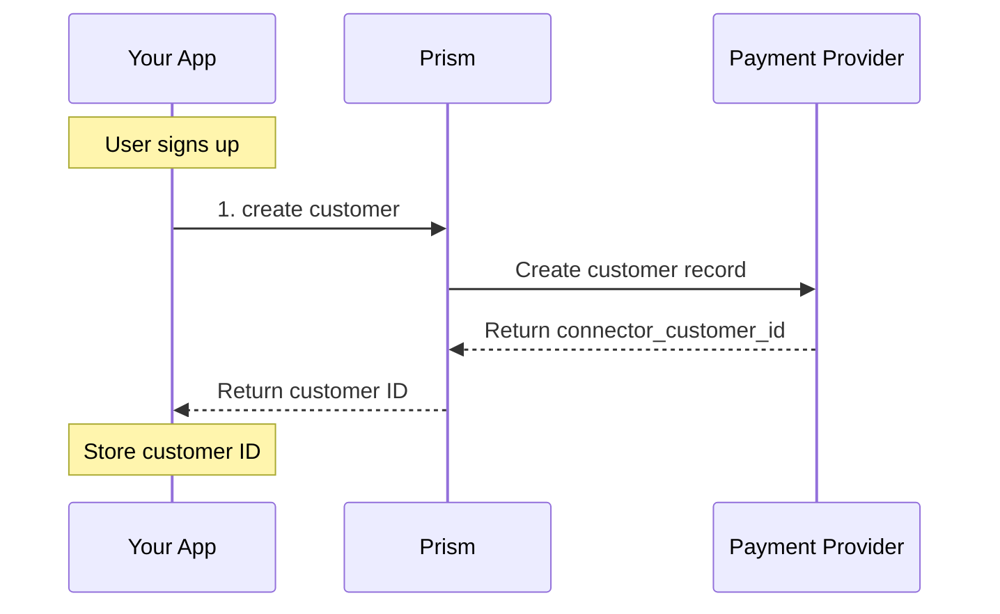

# create Method

<!--
---
title: create (Python SDK)
description: Create a customer record using the Python SDK
last_updated: 2026-03-21
generated_from: backend/grpc-api-types/proto/services.proto
auto_generated: true
reviewed_by: ''
reviewed_at: ''
approved: false
sdk_language: python
---
-->

## Overview

The `create` method creates a customer record in the payment processor system. Storing customer details streamlines future transactions and can improve authorization rates by establishing a payment history.

**Business Use Case:** A new user signs up for your e-commerce platform. Create their customer profile to enable faster checkout on future purchases and to organize their payment history.

## Purpose

**Why create customer records?**

| Scenario | Benefit |
|----------|---------|
| **Faster checkout** | Returning customers skip entering details |
| **Payment history** | Track all payments by customer |
| **Fraud scoring** | Established customers have better risk profiles |
| **Subscriptions** | Required for recurring billing setup |

**Key outcomes:**
- Customer ID for future transactions
- Stored customer profile at processor
- Foundation for payment method storage

## Request Fields

| Field | Type | Required | Description |
|-------|------|----------|-------------|
| `merchant_customer_id` | string | Yes | Your unique customer reference |
| `email` | string | No | Customer email address |
| `name` | string | No | Customer full name |
| `phone` | string | No | Customer phone number |
| `description` | string | No | Internal description |
| `metadata` | dict | No | Additional data (max 20 keys) |

## Response Fields

| Field | Type | Description |
|-------|------|-------------|
| `merchant_customer_id` | string | Your customer reference (echoed back) |
| `connector_customer_id` | string | Connector's customer ID (e.g., Stripe's cus_xxx) |
| `status` | CustomerStatus | Current status: ACTIVE |
| `status_code` | int | HTTP-style status code (200, 422, etc.) |

## Example

### SDK Setup

```python
from hyperswitch_prism import CustomerClient

customer_client = CustomerClient(
    connector='stripe',
    api_key='YOUR_API_KEY',
    environment='SANDBOX'
)
```

### Request

```python
request = {
    "merchant_customer_id": "cust_user_12345",
    "email": "john.doe@example.com",
    "name": "John Doe",
    "phone": "+1-555-123-4567",
    "description": "Premium plan subscriber"
}

response = await customer_client.create(request)
```

### Response

```python
{
    "merchant_customer_id": "cust_user_12345",
    "connector_customer_id": "cus_xxx",
    "status": "ACTIVE",
    "status_code": 200
}
```

## Common Patterns

### Customer Onboarding Flow



**Flow Explanation:**

1. **Create customer** - When a user creates an account, call `create` with their profile information.

2. **Store IDs** - Save both `merchant_customer_id` and `connector_customer_id` in your database.

3. **Use for payments** - Reference this customer in future payment operations.

## Best Practices

- Create customers at account signup, not first purchase
- Use consistent `merchant_customer_id` format
- Store `connector_customer_id` for future reference
- Include email to enable customer communications from processor

## Error Handling

| Error Code | Meaning | Action |
|------------|---------|--------|
| `409` | Customer exists | Use existing customer or update instead |
| `422` | Invalid data | Check email format, name length, etc. |

## Next Steps

- [Payment Method Service](../payment-method-service/README.md) - Store payment methods for customer
- [Payment Service](../payment-service/README.md) - Process payments with customer ID
- [Recurring Payment Service](../recurring-payment-service/README.md) - Set up subscriptions for customer
