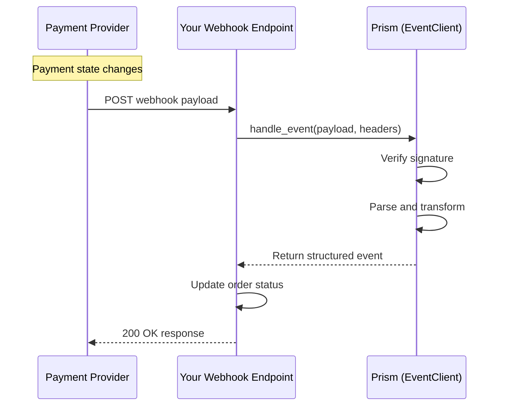

# Event Service

<!--
---
title: Event Service (Python SDK)
description: Process asynchronous webhook events from payment processors using the Python SDK
last_updated: 2026-03-21
generated_from: backend/grpc-api-types/proto/services.proto
auto_generated: true
reviewed_by: ''
reviewed_at: ''
approved: false
sdk_language: python
---
-->

## Overview

The Event Service processes inbound webhook notifications from payment processors using the Python SDK. Instead of polling for status updates, webhooks deliver real-time notifications when payment states change.

**Business Use Cases:**
- **Payment completion** - Receive instant notification when payments succeed
- **Failed payment handling** - Get notified of declines for retry logic
- **Refund tracking** - Update systems when refunds complete
- **Dispute alerts** - Immediate notification of new chargebacks

## Operations

| Operation | Description | Use When |
|-----------|-------------|----------|
| [`handle_event`](./handle-event.md) | Process webhook from payment processor. Verifies and parses incoming connector notifications. | Receiving webhook POST from Stripe, Adyen, etc. |

## SDK Setup

```python
from hyperswitch_prism import EventClient

event_client = EventClient(
    connector='stripe',
    api_key='YOUR_API_KEY',
    environment='SANDBOX'
)
```

## Common Patterns

### Webhook Processing Flow



**Flow Explanation:**

1. **Provider sends** - When a payment updates, the provider sends a webhook to your endpoint.

2. **Verify and parse** - Pass the raw payload to `handle_event` for verification and transformation.

3. **Process event** - Receive a structured event object with unified format.

4. **Update systems** - Update your database, fulfill orders, or trigger notifications.

## Webhook Security

Always verify webhooks before processing:

```python
# Flask example
from flask import Flask, request

@app.route('/webhooks/payments', methods=['POST'])
async def handle_webhook():
    payload = request.get_data()
    headers = dict(request.headers)

    event = await event_client.handle_event({
        "payload": payload,
        "headers": headers,
        "webhook_secret": "whsec_xxx"
    })

    if event["type"] == "payment.captured":
        # Fulfill order
        await fulfill_order(event["data"]["merchant_transaction_id"])

    return "OK", 200
```

## Next Steps

- [Payment Service](../payment-service/README.md) - Handle payment webhooks
- [Refund Service](../refund-service/README.md) - Process refund notifications
- [Dispute Service](../dispute-service/README.md) - Handle dispute alerts
