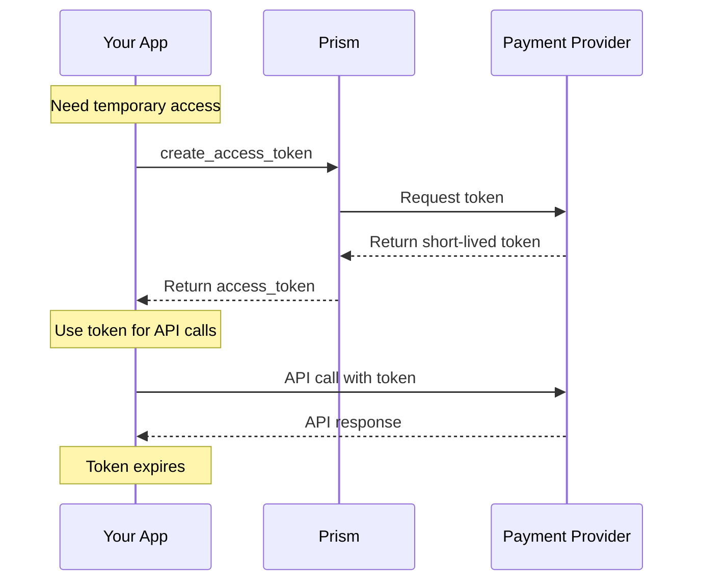

# Merchant Authentication Service

<!--
---
title: Merchant Authentication Service (Python SDK)
description: Generate access tokens and session credentials using the Python SDK
last_updated: 2026-03-21
generated_from: backend/grpc-api-types/proto/services.proto
auto_generated: true
reviewed_by: ''
reviewed_at: ''
approved: false
sdk_language: python
---
-->

## Overview

The Merchant Authentication Service generates secure credentials for accessing payment processor APIs using the Python SDK. These short-lived tokens provide secure access without storing secrets client-side.

**Business Use Cases:**
- **Frontend SDKs** - Generate tokens for client-side payment flows
- **Wallet payments** - Initialize Apple Pay, Google Pay sessions
- **Session management** - Maintain secure state across payment operations
- **Multi-party payments** - Secure delegated access

## Operations

| Operation | Description | Use When |
|-----------|-------------|----------|
| [`create_access_token`](./create-access-token.md) | Generate short-lived connector authentication token. Provides secure API access credentials. | Need temporary API access token |
| [`create_session_token`](./create-session-token.md) | Create session token for payment processing. Maintains session state across operations. | Starting a multi-step payment flow |
| [`create_sdk_session_token`](./create-sdk-session-token.md) | Initialize wallet payment sessions. Sets up Apple Pay, Google Pay context. | Enabling wallet payments |

## SDK Setup

```python
from hyperswitch_prism import MerchantAuthenticationClient

auth_client = MerchantAuthenticationClient(
    connector='stripe',
    api_key='YOUR_API_KEY',
    environment='SANDBOX'
)
```

## Common Patterns

### Token Lifecycle



**Flow Explanation:**

1. **Request token** - Call `create_access_token` when you need temporary access.

2. **Use token** - Include the token in API calls to the connector.

3. **Token expires** - Tokens are short-lived; request new ones as needed.

## Security Best Practices

- Never store tokens long-term
- Use tokens immediately after creation
- Handle token expiration gracefully
- Use HTTPS for all token transmissions

## Next Steps

- [Payment Service](../payment-service/README.md) - Use tokens for payment operations
- [Payment Method Authentication Service](../payment-method-authentication-service/README.md) - 3D Secure authentication
