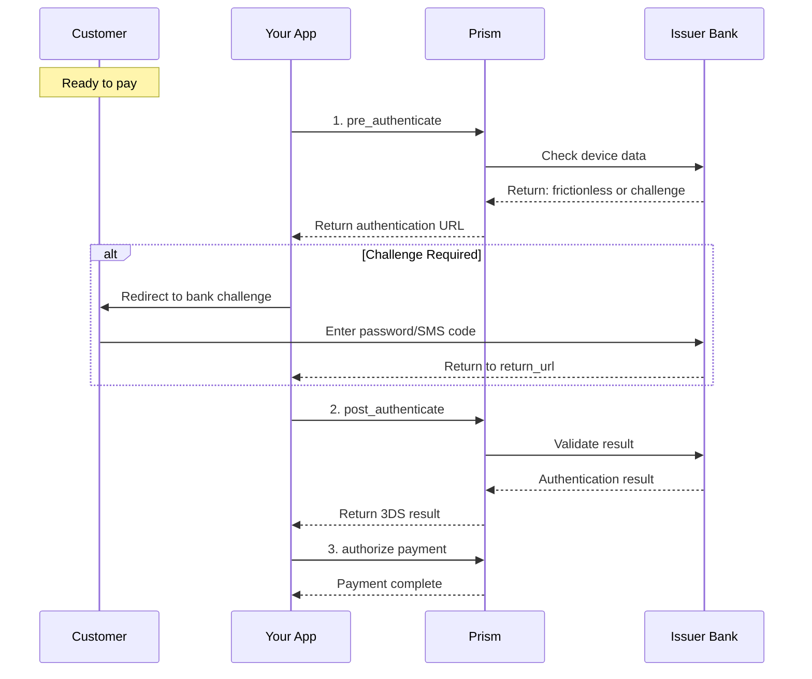

# Payment Method Authentication Service

<!--
---
title: Payment Method Authentication Service (Python SDK)
description: Execute 3D Secure authentication flows using the Python SDK
last_updated: 2026-03-21
generated_from: backend/grpc-api-types/proto/services.proto
auto_generated: true
reviewed_by: ''
reviewed_at: ''
approved: false
sdk_language: python
---
-->

## Overview

The Payment Method Authentication Service manages 3D Secure (3DS) authentication flows using the Python SDK. 3DS adds an extra layer of security for online card payments by verifying the cardholder's identity with their bank.

**Business Use Cases:**
- **Fraud prevention** - Shift liability to issuers for authenticated transactions
- **Regulatory compliance** - Meet Strong Customer Authentication (SCA) requirements
- **Risk-based** - Request 3DS for high-risk transactions
- **Global payments** - Required for many European and international transactions

## Operations

| Operation | Description | Use When |
|-----------|-------------|----------|
| [`pre_authenticate`](./pre-authenticate.md) | Initiate 3DS flow before payment. Collects device data for authentication. | Starting 3D Secure flow |
| [`authenticate`](./authenticate.md) | Execute 3DS challenge or frictionless verification. Performs bank authentication. | After pre_authenticate, complete the 3DS flow |
| [`post_authenticate`](./post-authenticate.md) | Validate authentication results with issuer. Confirms authentication decision. | After customer completes 3DS challenge |

## SDK Setup

```python
from hyperswitch_prism import PaymentMethodAuthenticationClient

auth_client = PaymentMethodAuthenticationClient(
    connector='stripe',
    api_key='YOUR_API_KEY',
    environment='SANDBOX'
)
```

## Common Patterns

### 3DS Flow



**Flow Explanation:**

1. **Pre-authenticate** - Start 3DS flow, collect device data, determine frictionless vs challenge.

2. **Challenge (if needed)** - Customer completes bank challenge (password, SMS, etc.).

3. **Post-authenticate** - Validate the authentication result with the bank.

4. **Authorize** - Proceed with payment authorization using 3DS data.

## Frictionless vs Challenge

| Flow | User Experience | When It Happens |
|------|-----------------|-----------------|
| **Frictionless** | No interruption | Low risk, returning customer, device recognized |
| **Challenge** | Customer enters code | High risk, new device, large amount |

## Next Steps

- [Payment Service](../payment-service/README.md) - Complete payment after 3DS
- [authorize](../payment-service/authorize.md) - Use 3DS result for authorization

## Additional Resources

- Understanding 3D Secure 2.0
- SCA compliance guide
- Risk-based authentication
