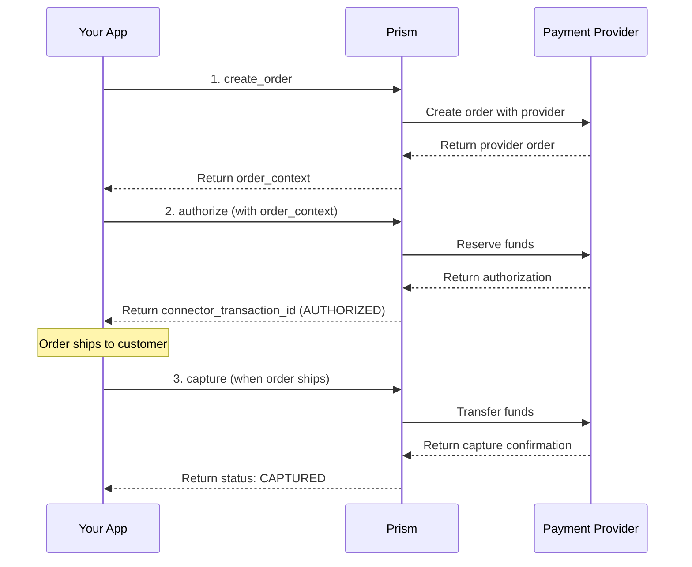

# Payment Service

<!--
---
title: Payment Service (Python SDK)
description: Complete payment lifecycle management using the Python SDK - authorize, capture, refund, and void payments
last_updated: 2026-03-21
generated_from: backend/grpc-api-types/proto/services.proto
auto_generated: true
reviewed_by: ''
reviewed_at: ''
approved: false
sdk_language: python
---
-->

## Overview

The Payment Service provides comprehensive payment lifecycle management for digital businesses using the Python SDK. It enables you to process payments across 100+ connectors through a unified SDK.

**Business Use Cases:**
- **E-commerce checkout** - Authorize funds at purchase, capture when items ship
- **SaaS subscriptions** - Set up recurring payments with mandate management
- **Marketplace platforms** - Hold funds from buyers, release to sellers on fulfillment
- **Hotel/travel bookings** - Pre-authorize for incidentals, capture adjusted amounts
- **Digital goods delivery** - Immediate capture for instant-access products

## Operations

| Operation | Description | Use When |
|-----------|-------------|----------|
| [`authorize`](./authorize.md) | Authorize a payment amount on a payment method. This reserves funds without capturing them, essential for verifying availability before finalizing. | Two-step payment flow, verify funds before shipping |
| [`capture`](./capture.md) | Finalize an authorized payment transaction. Transfers reserved funds from customer to merchant account, completing the payment lifecycle. | Order shipped/service delivered, ready to charge |
| [`get`](./get.md) | Retrieve current payment status from the payment processor. Enables synchronization between your system and payment processors for accurate state tracking. | Check payment status, webhook recovery, pre-fulfillment verification |
| [`void`](./void.md) | Cancel an authorized payment before capture. Releases held funds back to customer, typically used when orders are cancelled or abandoned. | Order cancelled before shipping, customer request |
| [`reverse`](./reverse.md) | Reverse a captured payment before settlement. Recovers funds after capture but before bank settlement, used for corrections or cancellations. | Same-day cancellation, processing error correction |
| [`refund`](./refund.md) | Initiate a refund to customer's payment method. Returns funds for returns, cancellations, or service adjustments after original payment. | Product returns, post-settlement cancellations |
| [`incremental_authorization`](./incremental-authorization.md) | Increase authorized amount if still in authorized state. Allows adding charges to existing authorization for hospitality, tips, or incremental services. | Hotel incidentals, restaurant tips, add-on services |
| [`create_order`](./create-order.md) | Initialize an order in the payment processor system. Sets up payment context before customer enters card details for improved authorization rates. | Pre-checkout setup, session initialization |
| [`verify_redirect_response`](./verify-redirect-response.md) | Validate redirect-based payment responses. Confirms authenticity of redirect-based payment completions to prevent fraud and tampering. | 3DS completion, bank redirect verification |
| [`setup_recurring`](./setup-recurring.md) | Setup a recurring payment instruction for future payments/debits. This could be for SaaS subscriptions, monthly bill payments, insurance payments and similar use cases. | Subscription setup, recurring billing |

## SDK Setup

```python
from hyperswitch_prism import PaymentClient

payment_client = PaymentClient(
    connector='stripe',
    api_key='YOUR_API_KEY',
    environment='SANDBOX'
)
```

## Common Patterns

### E-commerce Checkout Flow



**Flow Explanation:**

1. **create_order** - Initialize a payment order at the processor before collecting payment details.

2. **authorize** - After the customer enters their payment details, call the `authorize` method with the `order_context` from step 1.

3. **capture** - Once the order is shipped, call the `capture` method with the `connector_transaction_id` from step 2.

## Next Steps

- [Refund Service](../refund-service/README.md) - Process refunds and returns
- [Dispute Service](../dispute-service/README.md) - Handle chargebacks and disputes
- [Customer Service](../customer-service/README.md) - Manage customer payment methods
