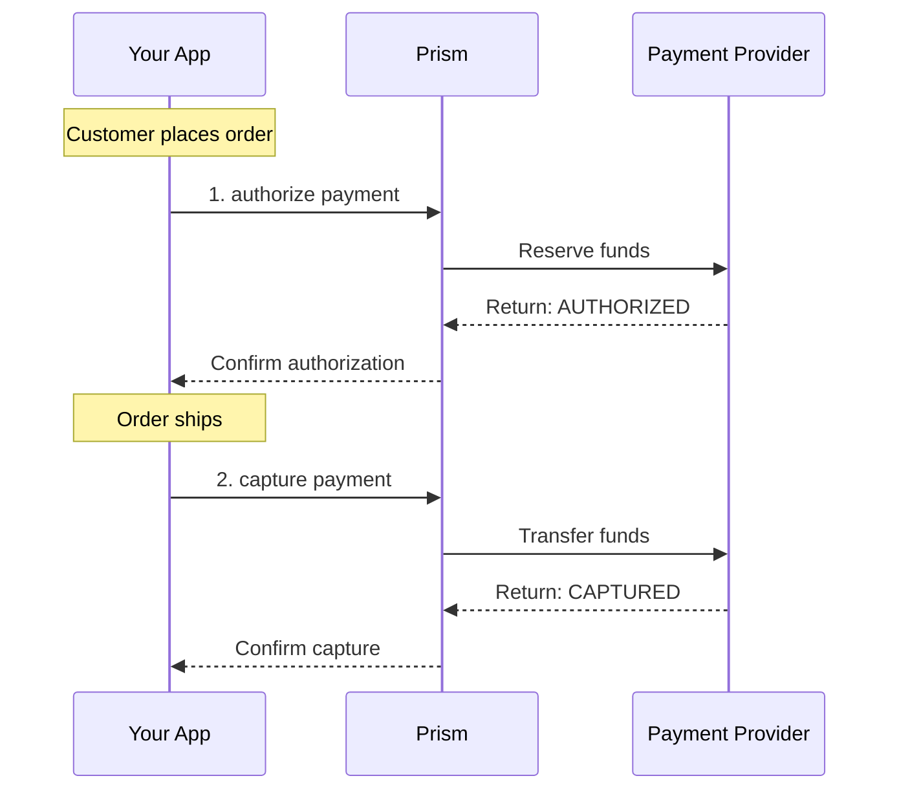

# capture Method

<!--
---
title: capture (Python SDK)
description: Finalize an authorized payment using the Python SDK - transfer reserved funds
last_updated: 2026-03-21
generated_from: backend/grpc-api-types/proto/services.proto
auto_generated: true
reviewed_by: ''
reviewed_at: ''
approved: false
sdk_language: python
---
-->

## Overview

The `capture` method finalizes an authorized payment by transferring the reserved funds from the customer's account to your merchant account. This completes the payment lifecycle after a successful authorization.

**Business Use Case:** An e-commerce order has shipped. The customer's payment was authorized at checkout, and now that the order is on its way, you capture the funds to complete the transaction.

## Purpose

**Why use capture?**

| Scenario | Benefit |
|----------|---------|
| **E-commerce fulfillment** | Charge customers only when orders ship |
| **Hotel checkout** | Capture final bill amount at check-out |
| **Service completion** | Bill after service is rendered |
| **Partial shipments** | Capture only what was actually shipped |

**Key outcomes:**
- Funds transfer from customer to merchant
- Payment reaches CAPTURED status
- Transaction proceeds to settlement

## Request Fields

| Field | Type | Required | Description |
|-------|------|----------|-------------|
| `merchant_transaction_id` | string | Yes | Your unique transaction reference |
| `connector_transaction_id` | string | Yes | The connector's transaction ID from authorize |
| `amount` | Money | No | Amount to capture (can be partial) |
| `description` | string | No | Description for customer's statement |
| `metadata` | dict | No | Additional data (max 20 keys) |

## Response Fields

| Field | Type | Description |
|-------|------|-------------|
| `merchant_transaction_id` | string | Your transaction reference (echoed back) |
| `connector_transaction_id` | string | Connector's transaction ID |
| `status` | PaymentStatus | Current status: CAPTURED, PENDING, FAILED |
| `captured_amount` | int64 | Amount captured in minor units |
| `error` | ErrorInfo | Error details if status is FAILED |
| `status_code` | int | HTTP-style status code (200, 402, etc.) |

## Example

### SDK Setup

```python
from hyperswitch_prism import PaymentClient

payment_client = PaymentClient(
    connector='stripe',
    api_key='YOUR_API_KEY',
    environment='SANDBOX'
)
```

### Request

```python
request = {
    "merchant_transaction_id": "txn_order_001",
    "connector_transaction_id": "pi_3Oxxx...",
    "amount": {
        "minor_amount": 1000,
        "currency": "USD"
    },
    "description": "Order shipment #12345"
}

response = await payment_client.capture(request)
```

### Response

```python
{
    "merchant_transaction_id": "txn_order_001",
    "connector_transaction_id": "pi_3Oxxx...",
    "status": "CAPTURED",
    "captured_amount": 1000,
    "status_code": 200
}
```

## Common Patterns

### Two-Step Payment Flow



**Flow Explanation:**

1. **Authorize** - Reserve funds at checkout to verify payment method.

2. **Fulfill** - Process and ship the order.

3. **Capture** - Transfer funds when order ships.

## Partial Capture

Capture less than the authorized amount:

```python
# Authorized for $100, capture only $75
request = {
    "merchant_transaction_id": "txn_order_001",
    "connector_transaction_id": "pi_3Oxxx...",
    "amount": {
        "minor_amount": 7500,  # $75.00
        "currency": "USD"
    }
}
```

The remaining $25 is automatically released back to the customer.

## Error Handling

| Error Code | Meaning | Action |
|------------|---------|--------|
| `402` | Capture failed | Authorization expired or insufficient funds |
| `404` | Transaction not found | Verify connector_transaction_id |
| `409` | Already captured | Idempotent - already captured successfully |

## Next Steps

- [authorize](./authorize.md) - Create initial authorization
- [void](./void.md) - Cancel authorization instead of capturing
- [refund](./refund.md) - Return funds after capture
