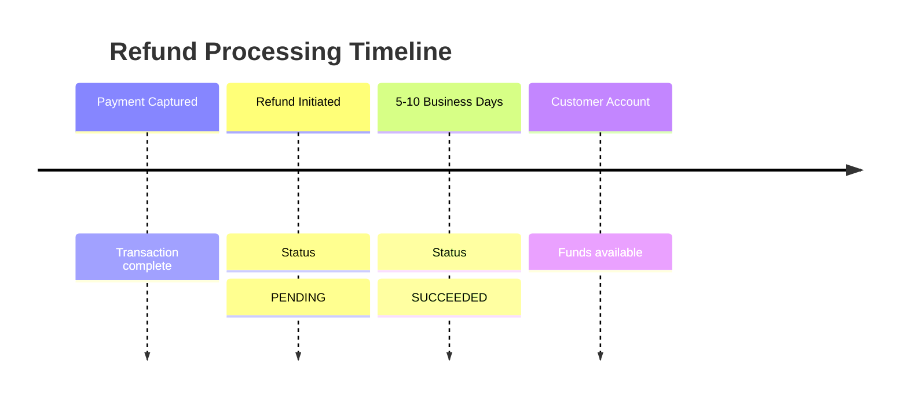

# refund Method

<!--
---
title: refund (Python SDK)
description: Issue a refund using the Python SDK - return funds to customer
last_updated: 2026-03-21
generated_from: backend/grpc-api-types/proto/services.proto
auto_generated: true
reviewed_by: ''
reviewed_at: ''
approved: false
sdk_language: python
---
-->

## Overview

The `refund` method returns funds to a customer's payment method after a successful payment. Use this for returns, cancellations after fulfillment, or goodwill adjustments.

**Business Use Case:** A customer returns an item they purchased. The original payment was already captured. You process a refund to return their money.

## Purpose

**Why use refund?**

| Scenario | Benefit |
|----------|---------|
| **Product returns** | Refund customers for returned merchandise |
| **Service cancellation** | Refund for unrendered services |
| **Goodwill gestures** | Partial refunds for service issues |
| **Duplicate charges** | Correct accidental charges |

**Key outcomes:**
- Funds returned to customer
- Refund record created
- Transaction reaches REFUNDED or PARTIALLY_REFUNDED status

## Request Fields

| Field | Type | Required | Description |
|-------|------|----------|-------------|
| `merchant_refund_id` | string | Yes | Your unique refund reference |
| `connector_transaction_id` | string | Yes | The connector's transaction ID from the payment |
| `amount` | Money | No* | Amount to refund (*ommit for full refund) |
| `reason` | string | No | Reason for refund |
| `metadata` | dict | No | Additional data (max 20 keys) |

## Response Fields

| Field | Type | Description |
|-------|------|-------------|
| `merchant_refund_id` | string | Your refund reference (echoed back) |
| `connector_refund_id` | string | Connector's refund ID (e.g., re_xxx) |
| `status` | RefundStatus | Current status: PENDING, SUCCEEDED, FAILED |
| `amount` | Money | Refund amount |
| `error` | ErrorInfo | Error details if status is FAILED |
| `status_code` | int | HTTP-style status code (200, 422, etc.) |

## Example

### SDK Setup

```python
from hyperswitch_prism import PaymentClient

payment_client = PaymentClient(
    connector='stripe',
    api_key='YOUR_API_KEY',
    environment='SANDBOX'
)
```

### Full Refund Request

```python
request = {
    "merchant_refund_id": "refund_001",
    "connector_transaction_id": "pi_3Oxxx...",
    "reason": "Customer returned item"
}

response = await payment_client.refund(request)
```

### Partial Refund Request

```python
request = {
    "merchant_refund_id": "refund_partial_001",
    "connector_transaction_id": "pi_3Oxxx...",
    "amount": {
        "minor_amount": 500,  # $5.00 of $10.00
        "currency": "USD"
    },
    "reason": "Discount applied"
}

response = await payment_client.refund(request)
```

### Response

```python
{
    "merchant_refund_id": "refund_001",
    "connector_refund_id": "re_3Oxxx...",
    "status": "PENDING",
    "amount": {
        "minor_amount": 1000,
        "currency": "USD"
    },
    "status_code": 200
}
```

## Refund Timeline



**Typical processing times:**
- **Credit cards:** 5-10 business days
- **Debit cards:** 5-10 business days
- **Digital wallets:** Instant to 24 hours

## Error Handling

| Error Code | Meaning | Action |
|------------|---------|--------|
| `402` | Refund failed | Payment not captured, already fully refunded, etc. |
| `404` | Transaction not found | Verify connector_transaction_id |
| `422` | Invalid amount | Partial refund exceeds available balance |

## Best Practices

- Always use unique `merchant_refund_id` for idempotency
- Store `connector_refund_id` for tracking
- Poll or handle webhooks for final status
- Partial refunds require explicit amount field

## Next Steps

- [get_refund](../refund-service/get.md) - Check refund status
- [capture](./capture.md) - Ensure payment is captured before refunding
- [Event Service](../event-service/README.md) - Handle refund webhooks
