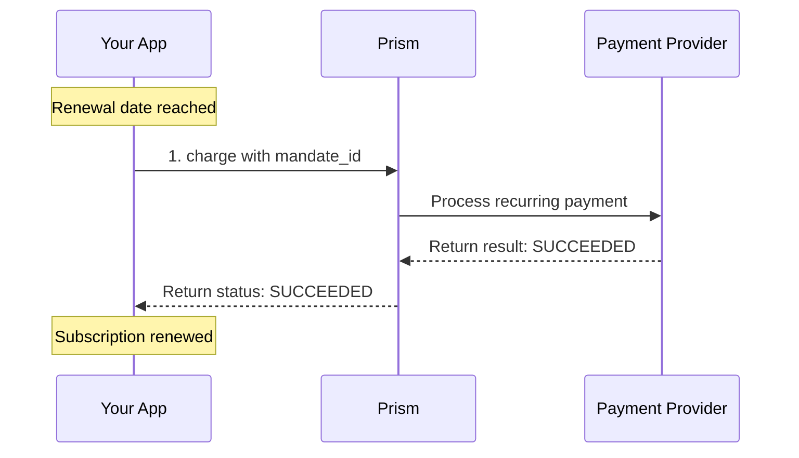

# charge Method

<!--
---
title: charge (Python SDK)
description: Process a recurring payment using an existing mandate using the Python SDK
last_updated: 2026-03-21
generated_from: backend/grpc-api-types/proto/services.proto
auto_generated: true
reviewed_by: ''
reviewed_at: ''
approved: false
sdk_language: python
---
-->

## Overview

The `charge` method processes a recurring payment using an existing mandate. Once a customer has authorized recurring billing, use this method to charge their stored payment method without requiring their interaction.

**Business Use Case:** Your SaaS subscription renews monthly. The customer already authorized recurring payments during signup. On the renewal date, you call `charge` to process their subscription payment automatically.

## Purpose

**Why use recurring payment charges?**

| Scenario | Benefit |
|----------|---------|
| **Subscription billing** | Automate monthly/yearly recurring charges |
| **Membership dues** | Process club/organization membership fees |
| **Installment plans** | Collect scheduled payments automatically |
| **Utility billing** | Automate recurring service payments |

**Key outcomes:**
- No customer interaction required for repeat payments
- Consistent cash flow for subscription businesses
- Reduced payment friction improves retention

## Request Fields

| Field | Type | Required | Description |
|-------|------|----------|-------------|
| `merchant_transaction_id` | string | Yes | Your unique transaction reference |
| `amount` | Money | Yes | Amount to charge in minor units (e.g., 1000 = $10.00) |
| `mandate_id` | string | Yes | The mandate ID from setup_recurring |
| `description` | string | No | Description shown on customer's statement |
| `metadata` | dict | No | Additional data (max 20 keys) |
| `webhook_url` | string | No | URL for async webhook notifications |

## Response Fields

| Field | Type | Description |
|-------|------|-------------|
| `merchant_transaction_id` | string | Your transaction reference (echoed back) |
| `connector_transaction_id` | string | Connector's transaction ID |
| `status` | PaymentStatus | Current status: SUCCEEDED, PENDING, FAILED |
| `error` | ErrorInfo | Error details if status is FAILED |
| `status_code` | int | HTTP-style status code (200, 402, etc.) |

## Example

### SDK Setup

```python
from hyperswitch_prism import RecurringPaymentClient

recurring_client = RecurringPaymentClient(
    connector='stripe',
    api_key='YOUR_API_KEY',
    environment='SANDBOX'
)
```

### Request

```python
request = {
    "merchant_transaction_id": "txn_sub_monthly_001",
    "amount": {
        "minor_amount": 2900,
        "currency": "USD"
    },
    "mandate_id": "mandate_xxx",
    "description": "Monthly Pro Plan Subscription"
}

response = await recurring_client.charge(request)
```

### Response

```python
{
    "merchant_transaction_id": "txn_sub_monthly_001",
    "connector_transaction_id": "pi_3Oxxx...",
    "status": "SUCCEEDED",
    "status_code": 200
}
```

## Common Patterns

### Subscription Renewal Flow



**Flow Explanation:**

1. **Check renewal** - On the scheduled date, call `charge` with the stored `mandate_id`.

2. **Process payment** - The charge is processed using the customer's stored payment method.

3. **Handle result** - If successful, extend the subscription period. If failed, initiate dunning workflow.

## Error Handling

| Error Code | Meaning | Action |
|------------|---------|--------|
| `402` | Payment failed | Insufficient funds, expired card, etc. |
| `404` | Mandate not found | Verify mandate_id is correct |
| `409` | Duplicate transaction | Use unique merchant_transaction_id |

## Best Practices

- Call `charge` on the expected renewal date
- Handle failures gracefully with retry logic
- Notify customers of failed payments with update payment method link
- Store successful transaction IDs for reporting

## Next Steps

- [setup_recurring](../payment-service/setup-recurring.md) - Create initial mandate
- [revoke](./revoke.md) - Cancel recurring payments
- [Payment Service](../payment-service/README.md) - Handle failed payment retries
