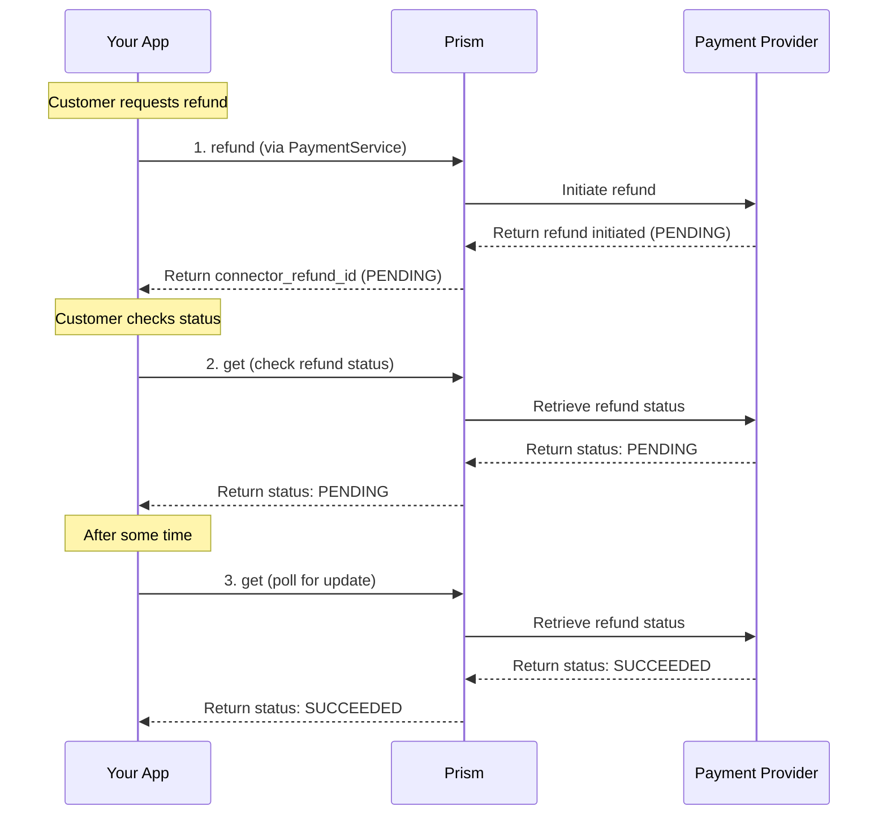

# Refund Service

<!--
---
title: Refund Service (Python SDK)
description: Retrieve and synchronize refund statuses using the Python SDK
last_updated: 2026-03-21
generated_from: backend/grpc-api-types/proto/services.proto
auto_generated: true
reviewed_by: ''
reviewed_at: ''
approved: false
sdk_language: python
---
-->

## Overview

The Refund Service helps you track and synchronize refund statuses across payment processors using the Python SDK. While the Payment Service handles initiating refunds, this service provides dedicated operations for retrieving refund information.

**Business Use Cases:**
- **Refund status tracking** - Check the current status of pending refunds to inform customers
- **Financial reconciliation** - Synchronize refund states with your internal accounting systems
- **Webhook processing** - Handle asynchronous refund notifications from payment processors
- **Customer service** - Provide accurate refund status information to support teams

## Operations

| Operation | Description | Use When |
|-----------|-------------|----------|
| [`get`](./get.md) | Retrieve refund status from the payment processor. Tracks refund progress through processor settlement for accurate customer communication. | Checking refund status, reconciling refund states, customer inquiries |

## SDK Setup

```python
from hyperswitch_prism import PaymentClient

payment_client = PaymentClient(
    connector='stripe',
    api_key='YOUR_API_KEY',
    environment='SANDBOX'
)
```

## Common Patterns

### Refund Status Tracking Flow



**Flow Explanation:**

1. **Initiate refund** - First, call the Payment Service's `refund` method to initiate the refund.

2. **Check status** - Call the Refund Service's `get` method with the `connector_refund_id`.

3. **Poll for updates** - For refunds that start as PENDING, periodically call `get` to check for status updates.

## Next Steps

- [Payment Service](../payment-service/README.md) - Initiate refunds and process payments
- [Dispute Service](../dispute-service/README.md) - Handle chargebacks that may result in refunds
- [Event Service](../event-service/README.md) - Process asynchronous refund notifications