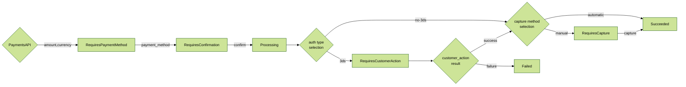
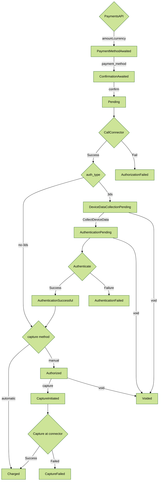

# 🌊 Payment flows


This chapter will cover the payment flows available with Hyperswitch. Please reach out to us to learn more about the payment flows supported!


## **Payments flow**

There are multiple stages in a Payment flow depending on the payment methods that are involved. Considering an one-time payment method where there was no redirection involved, the following stages form the Payment flow:

**a) Creating a Payment:** When your customer wants to checkout, create a payment by hitting the payments/create endpoint. Fetch and store the payment\_id and client\_secret

**b) Loading the SDK:** After your customer checks out, load the Hyperswitch SDK by initiating it with the client\_secret and publishable\_key

**c) SDK being rendered:** After you initiate the SDK, the SDK makes several API calls involving the /sessions and /payment\_methods endpoints to load relevant payment methods and any saved cards associated with the customer

**d) Customer enters the payment method data:** After the SDK is fully rendered, your customer would choose a payment method and enter the relevant information and click pay

**e) Confirming the payment:** After the customer clicks pay, the SDK calls the payments/confirm endpoint with the customer's payment method details and post response, it displays the payment status

<figure><figcaption></figcaption></figure>

Here's a more detailed version of the payment flow:

<figure><figcaption>
<strong>Payments Lifecycle</strong>
</figcaption></figure>

## **How does Payment flow vary across Payment methods?**

<table data-full-width="true"><thead><tr><th width="195">Customer Action</th><th width="194">Direct/Redirect flows</th><th width="285">Payment-  finalized immediately</th><th>Payment- finalized later</th></tr></thead><tbody><tr><td><strong>Customer action required before payments/confirm</strong></td><td><strong>Within Hyperswitch SDK</strong></td><td><ul><li>Non 3DS Cards</li></ul></td><td><ul><li>Bank Debits like ACH Debit, BACS Debit, SEPA Debit</li></ul></td></tr><tr><td><strong>Customer action required before payments/confirm</strong></td><td><strong>3rd party Redirect/SDK</strong></td><td><ul><li>Wallets like Apple Pay, Google pay, Paypal, AliPay</li><li>BNPL like Klarna, Afterpay, Affirm</li></ul></td><td> </td></tr><tr><td><strong>Customer action required after payments/confirm</strong></td><td><strong>3rd party Redirect</strong></td><td><ul><li>3DS cards</li><li>Bank Redirects like iDeal, giropay, eps</li></ul></td><td><ul><li>Bank Transfers like ACH Transfer, SEPA Transfer, BACS Transfer, Multibanco</li><li>Crypto wallets like Cryptopay</li></ul></td></tr></tbody></table>

## **Use-cases supported by Hyperswitch's Payments flow:**

<table data-view="cards"><thead><tr><th></th><th data-hidden align="center"></th><th data-hidden></th></tr></thead><tbody><tr><td>

Manage multiple payment gateways for your E-commerce website to enhance customer experience and reduce cart abandonment.
</td><td align="center"><em>Like Amazon, ebay, Walmart</em></td><td></td></tr><tr><td>

Place a hold on your customers’ cards by authorizing the transaction now and capturing the amount partially or fully later in one go or multiple times once you complete the shipment/service
</td><td align="center"><em>Hotels/Travel booking platforms like Booking.com, Ecommerce like Etsy, Event ticketing platforms like Ticketmaster</em></td><td></td></tr><tr><td>

Process payments and payouts for multiple sub-merchants on your platform by creating and managing multiple merchant_ids at Hyperswitch under your Org 
</td><td align="center"><em>Like Shopify, Woocommerce, Magneto</em></td><td></td></tr><tr><td>Manage payments for your multiple business units seamlessly under one Hyperswitch account by distributing them across different profiles under your Hyperswitch account</td><td align="center"><em>Like Uber_Eats, Uber_cabs, Uber_freight</em></td><td></td></tr><tr><td>

Coordinate payments across various channels, including in-store, online, and mobile, for a unified shopping experience.
</td><td align="center"><em>Like Walmart, Best Buy, Zara</em></td><td></td></tr><tr><td>Handle bookings, reservations, and payments across different platforms and currencies for hotels, airlines, and travel agencies</td><td align="center"><em>Like Expedia, Delta Airlines, Marriott</em></td><td></td></tr><tr><td>

Managing recurring payments for subscription-based businesses with various billing cycles.
</td><td align="center"><em>Like Netflix, Spotify, Blue Apron</em></td><td></td></tr><tr><td>

Facilitate secure and efficient transactions for healthcare services, insurance claims, and medical equipment purchases.
</td><td align="center"><em>Like UnitedHealth Group, Cigna, Metlife</em></td><td></td></tr><tr><td>

Handle microtransactions, in-game purchases, and virtual currency exchanges across gaming platforms with ease
</td><td align="center"><em>Like Epic Games (Fortnite), Nintendo, Activision Blizzard</em></td><td></td></tr><tr><td>

Manage tuition payments, course fees, and donations across different educational platforms.
</td><td align="center"><em>Like Coursera, Universities, schools</em></td><td></td></tr><tr><td>Coordinate payments for mobile plans, internet services, and device purchases across diverse markets.</td><td align="center"><em>Like Verizon, T-Mobile, Vodafone</em></td><td></td></tr><tr><td>

Facilitate donations and managing funds from various sources, including online platforms and traditional channels.
</td><td align="center"><em>Like World Wildlife Fund (WWF), Amnesty International, Oxfam</em></td><td></td></tr></tbody></table>

## **What are `PaymentIntent` and `PaymentAttempt` objects and how do they work in Hyperswitch?**

Hyperswitch uses the `PaymentIntent` object to track the status of a payment initiated by you. Since, Hyperswitch enables retrying a single payment multiple times across different processors until a successful transaction, we track each of these payment attempts through separate `PaymentAttempt` objects.

While `PaymentIntent` and `PaymentAttempt` have their own state machines, the various states in `PaymentAttempt` are also constrained by their respective mapping to the `PaymentIntent` statuses.

\
**PaymentIntent state machine:**&#x20;

The following is an abridged version of the `PaymentIntent` state machine flow that covers majority of the above payment use-cases.

**PaymentAttempt state machine:**

The following is an abridged version of the `PaymentAttempt` state machine flow that covers majority of the above payment use-cases.

