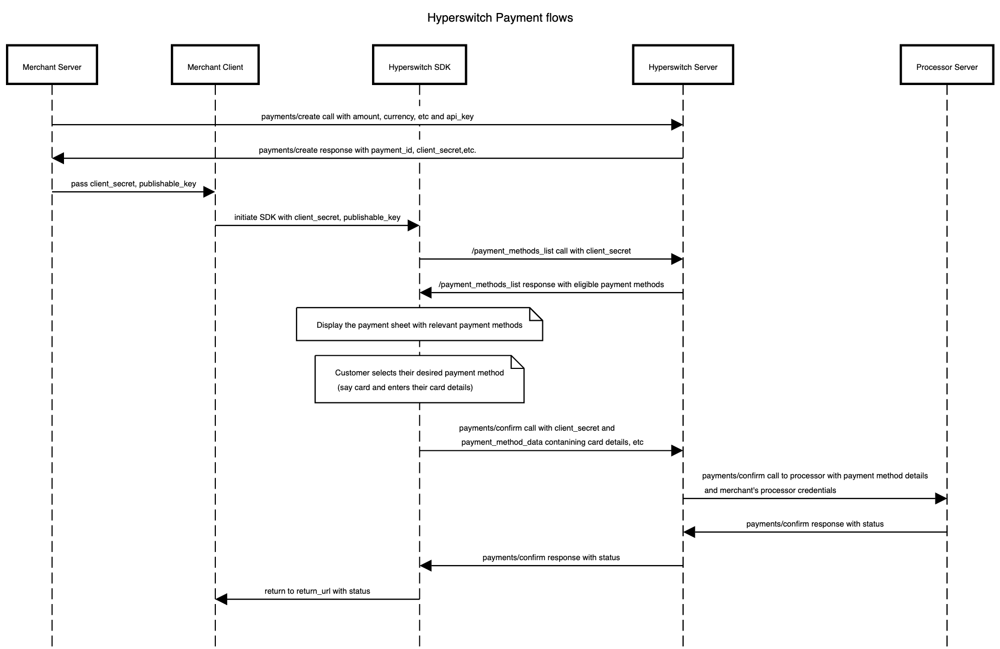
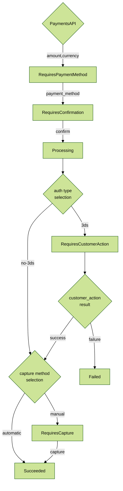
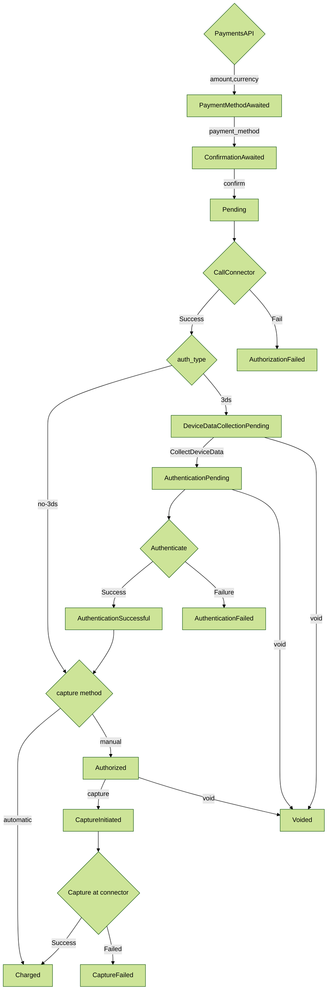

# 🌊 Payment flows


This chapter will cover the payment flows available with Hyperswitch. Please reach out to us to learn more about the payment flows supported!


## **Payments flow**

There are multiple stages in a Payment flow depending on the payment methods that are involved. Considering an one-time payment method where there was no redirection involved, the following stages form the Payment flow:

**a) Creating a Payment:** When your customer wants to checkout, create a payment by hitting the payments/create endpoint. Fetch and store the payment\_id and client\_secret

**b) Loading the SDK:** After your customer checks out, load the Hyperswitch SDK by initiating it with the client\_secret and publishable\_key

**c) SDK being rendered:** After you initiate the SDK, the SDK makes several API calls involving the /sessions and /payment\_methods endpoints to load relevant payment methods and any saved cards associated with the customer

**d) Customer enters the payment method data:** After the SDK is fully rendered, your customer would choose a payment method and enter the relevant information and click pay

**e) Confirming the payment:** After the customer clicks pay, the SDK calls the payments/confirm endpoint with the customer's payment method details and post response, it displays the payment status

<figure><figcaption></figcaption></figure>

Here's a more detailed version of the payment flow:

<figure><figcaption></figcaption></figure>

## **How does Payment flow vary across Payment methods?**

<table data-full-width="true"><thead><tr><th width="158">Customer Action</th><th width="152">Direct/Redirect flows</th><th width="199">Payment-  finalized immediately</th><th>Payment- finalized later</th></tr></thead><tbody><tr><td><strong>Customer action required before payments/ confirm</strong></td><td><strong>Within Hyperswitch SDK</strong></td><td><ul><li>Non 3DS Cards</li></ul></td><td><ul><li>Bank Debits like ACH Debit, BACS Debit, SEPA Debit</li></ul></td></tr><tr><td><strong>Customer action required before payments/ confirm</strong></td><td><strong>3rd party Redirect/SDK</strong></td><td><ul><li>Wallets like Apple Pay, Google pay, Paypal, AliPay</li><li>BNPL like Klarna, Afterpay, Affirm</li></ul></td><td> </td></tr><tr><td><strong>Customer action required after payments/ confirm</strong></td><td><strong>3rd party Redirect</strong></td><td><ul><li>3DS cards</li><li>Bank Redirects like iDeal, Giropay, eps</li></ul></td><td><ul><li>Bank Transfers like ACH Transfer, SEPA Transfer, BACS Transfer, Multibanco</li><li>Crypto wallets like Cryptopay</li></ul></td></tr></tbody></table>

## **Use-cases supported by Hyperswitch**

<table data-view="cards"><thead><tr><th></th><th></th><th></th><th data-hidden data-card-cover data-type="files"></th><th data-hidden data-card-target data-type="content-ref"></th></tr></thead><tbody><tr><td><strong>Accept online payments</strong></td><td>Get started with accepting one time payments globally on your online store</td><td></td><td><a href="../.gitbook/assets/onlinePayments.jpg">onlinePayments.jpg</a></td><td><a href="../hyperswitch-cloud/quickstart/">quickstart</a></td></tr><tr><td><strong>Setup mandates &#x26; recurring payments</strong></td><td>Setup payments for a future date or charge your customers on a recurring basis</td><td></td><td><a href="../.gitbook/assets/recurringPayments.jpg">recurringPayments.jpg</a></td><td><a href="../features/payment-flows-and-management/mandates-and-recurring-payments.md">mandates-and-recurring-payments.md</a></td></tr><tr><td><strong>Manage payouts</strong></td><td>Facilitate payouts for global network of partners and service providers</td><td></td><td><a href="../.gitbook/assets/Payment flow (1) (1).jpg">Payment flow (1) (1).jpg</a></td><td><a href="../features/payment-flows-and-management/payouts.md">payouts.md</a></td></tr><tr><td><strong>Save a card during payment</strong></td><td>Learn how you can save your customers' cards in a secure PCI compliant manner</td><td></td><td><a href="../.gitbook/assets/saveCard.jpg">saveCard.jpg</a></td><td><a href="../features/payment-flows-and-management/tokenization-and-saved-cards.md">tokenization-and-saved-cards.md</a></td></tr><tr><td><strong>Manage payments on your platform / marketplace</strong></td><td>Accept payments from your customers and process payouts to the sellers on your marketplace</td><td></td><td><a href="../.gitbook/assets/marketplace.jpg">marketplace.jpg</a></td><td><a href="../features/account-management/multiple-accounts-and-profiles.md">multiple-accounts-and-profiles.md</a></td></tr><tr><td><strong>Accept payments on your e-commerce platform</strong></td><td>Give your Wordpress store a lightweight and embedded payment experience with the Hyperswitch WooCommerce plugin</td><td></td><td><a href="../.gitbook/assets/WooComerce.jpg">WooComerce.jpg</a></td><td><a href="../features/e-commerce-platform-plugins/woocommerce-plugin/">woocommerce-plugin</a></td></tr><tr><td><strong>Create payment links</strong> </td><td>Accept payments for your products through reusable links without writing any code</td><td></td><td><a href="../.gitbook/assets/paymentLinks.jpg">paymentLinks.jpg</a></td><td><a href="../features/payment-flows-and-management/payment-links.md">payment-links.md</a></td></tr></tbody></table>

## **What are `PaymentIntent` and `PaymentAttempt` objects and how do they work in Hyperswitch?**

Hyperswitch uses the `PaymentIntent` object to track the status of a payment initiated by you. Since, Hyperswitch enables retrying a single payment multiple times across different processors until a successful transaction, we track each of these payment attempts through separate `PaymentAttempt` objects.

While `PaymentIntent` and `PaymentAttempt` have their own state machines, the various states in `PaymentAttempt` are also constrained by their respective mapping to the `PaymentIntent` statuses.

\
**PaymentIntent state machine:**&#x20;

The following is an abridged version of the `PaymentIntent` state machine flow that covers majority of the above payment use-cases.

**PaymentAttempt state machine:**

The following is an abridged version of the `PaymentAttempt` state machine flow that covers majority of the above payment use-cases.

