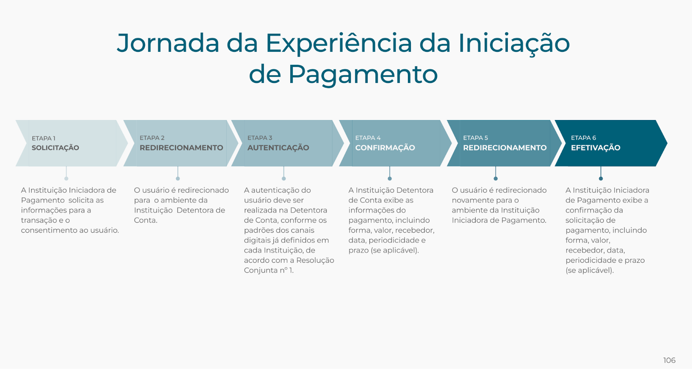

# PISP (Redirection)

* Pre-requisites:

1. BRCAC
2. BRSEAL
3. DCR done (per bank) → you have a client\_id, redirect URIs, and the bank’s discovery doc.
4. Fetch a list of all banks that support PISP payment flow. (refer section above): "ApiFamilyType": "payments-pix" (PISP)

\

High-level Flow:

* Pre-requisites:

1. BRCAC
2. BRSEAL
3. DCR done (per bank) → you have a client\_id, redirect URIs, and the bank’s discovery doc.
4. Fetch a list of all banks that support PISP payment flow. (refer section above): "ApiFamilyType": "payments-pix" (PISP)

\

High-level Flow:

.png>)

\

| User sees / does                                    | Your backend does                                           | Endpoint (per bank)                                                                     | Token                                          | mTLS | Body                                    |
| --------------------------------------------------- | ----------------------------------------------------------- | --------------------------------------------------------------------------------------- | ---------------------------------------------- | ---- | --------------------------------------- |
| 1. Choose bank from list                            | Fetch & cache bank catalog; show only those with Payments   | GET https://data.directory.../participants → filter for Payments (or fetch from config) | none                                           | —    | —                                       |
| 2. Enter Pix details (amount, recipient) → Continue | Create consent                                              | POST /open-banking/payments/v4/consents                                                 | Client-credentials payments                    | Yes  | JWS application/jwt (sign w/ BRSEAL)    |
| (no visible step)                                   | Create PKCE (code\_verifier + challenge)                    | local                                                                                   | —                                              | —    | —                                       |
| (no visible step)                                   | Build JAR (signed request object) + PAR                     | POST pushed\_authorization\_request\_endpoint (from discovery; use mtls alias)          | mTLS / (and usually private\_key\_jwt)         | Yes  | request=\<JAR> form-encoded             |
| 3. Continue to bank (redirect)                      | Redirect to authorization\_endpoint?request\_uri=…\&state=… | GET authorization\_endpoint                                                             | —                                              | No   | —                                       |
| 4. Approve inside bank app                          | (bank authenticates user & ties to your consent)            | —                                                                                       | —                                              | —    | —                                       |
| 5. Returning… (you land on your redirect URI)       | Validate JARM → exchange code→token                         | POST mtls\_aliases.token\_endpoint                                                      | mTLS / (private\_key\_jwt)                     | Yes  | grant\_type=authorization\_code (+PKCE) |
| (no visible step)                                   | Create payment                                              | POST /open-banking/payments/v4/pix/payments                                             | User token openid payments consent:{consentId} | Yes  | JWS application/jwt                     |
| 6. Show receipt / Pending                           | Poll status                                                 | GET /open-banking/payments/v4/pix/payments/{paymentId}                                  | Client-credentials payments or user token      | Yes  | —                                       |
| Cancel (if user requests)                           | Cancel one or all future by consent                         | PATCH .../pix/payments/{paymentId} or PATCH .../pix/payments/consents/{consentId}       | Client-credentials                             | Yes  | JWS application/jwt                     |

\

* What you call and where
* Public (front-channel)
* authorization\_endpoint → browser redirect
* jwks\_uri → to validate JARM (and OP keys)
* Back-channel (server↔server over mTLS with BRCAC)\
  Use the mTLS aliases advertised in discovery (mtls\_endpoint\_aliases.\*) for these:
* token\_endpoint → tokens (client creds + auth code + refresh)
* You need a token that represents your software (not the user) to do server-to-server operations:
* Create/read/cancel consents & payments before/after the user authorization, or when the user is offline.
* This is the client\_credentials grant (aka M2M).&#x20;
* pushed\_authorization\_request\_endpoint (PAR) → send your signed request (JAR)
* JAR = JWT-Secured Authorization Request: you sign the /authorize request parameters so the bank knows they weren’t tampered with (scopes, redirect\_uri, consentId)
* PAR = Pushed Authorization Request: you POST that signed request to the bank before the browser redirect, so sensitive stuff doesn’t ride the front-channel URL. Bank replies with a request\_uri you reference in the redirect.
* registration\_endpoint (DCR) → did this already
* introspection, revocation, etc (if present)

\

.png>)

\
\

Scopes & security per Payments v4:

• /consents → client\_credentials + payments scope

• /pix/payments → authorization\_code + openid payments consent:{consentId} scope (or NonRedirect variant)

• GET/PATCH on payments → client\_credentials + payments scope

Bodies for consent and payment are JWS signed and Content-Type: application/jwt; token calls are application/x-www-form-urlencoded.&#x20;

\
\

* Step 1: Fetch the cached params from discovery:
* authorization\_endpoint,&#x20;
* jwks\_uri,&#x20;
* pushed\_authorization\_request\_endpoint,&#x20;
* token\_endpoint,&#x20;
* and (often) mtls\_endpoint\_aliases.token\_endpoint, mtls\_endpoint\_aliases.registration\_endpoint,

\

* Step 2: Get M2M token (client-credentials) for /consents\
  You need a token that represents your software (not the user) to do server-to-server operations:
* Create/read/cancel consents & payments before/after the user authorization, or when the user is offline.
* This is the client\_credentials grant (aka M2M).&#x20;
* mTLS to the mtls token endpoint; auth method per FAPI-BR (many require private\_key\_jwt even with mTLS).

Request:

TOKEN\_URL="https://mtls.aspsp.example.com/oauth/token"  # from mtls\_endpoint\_aliases

ASSERTION=$(./sign-client-assertion.sh \\

&#x20; \--kid \<your-kid> --iss \<client\_id> --sub \<client\_id> \\

&#x20; \--aud "$TOKEN\_URL" --exp +300s --key brseal-or-client-auth.key)  # typically BRSEAL key if using private\_key\_jwt

\

curl --cert BRCAC.pem --key BRCAC.key \\

&#x20; -H "Content-Type: application/x-www-form-urlencoded" \\

&#x20; -d "grant\_type=client\_credentials" \\

&#x20; -d "scope=payments" \\

&#x20; -d "client\_id=\<your\_client\_id>" \\

&#x20; -d "client\_assertion\_type=urn:ietf:params:oauth:client-assertion-type:jwt-bearer" \\

&#x20; -d "client\_assertion=$ASSERTION" \\

&#x20; "$TOKEN\_URL"

\
\

Response:

\

{

&#x20; "access\_token": "eyJhbGciOi...orOpaque...",

&#x20; "token\_type": "Bearer",

&#x20; "expires\_in": 300,

&#x20; "scope": "payments"

}

\

* Step 3: Create a Consent\
  /consents requires client\_credentials token + payments scope; payloads must be signed; headers include x-fapi-\* and x-idempotency-key.
* HTTP mTLS using BRCAC
* Authorization: Bearer M2M token
* Content-Type: application/jwt
* Body: JWS compact signed with BRSEAL (alg=PS256), containing the consent object as JWT claims. The Payments v4 spec explicitly requires signed payloads and lists the headers: x-fapi-\*, x-customer-user-agent, x-idempotency-key.

\

Request:

{

&#x20; "iss": "\<your\_software\_id or client\_id>",

&#x20; "aud": "https://api.bank.com.br/open-banking/payments/v4/consents",

&#x20; "iat": 1732449600,

&#x20; "jti": "f1a3a630-ea3a-4a9f-9f67-2a1d4c5249b7",

\

&#x20; "data": {

&#x20;   "permissions": \["PAYMENT\_INITIATION"],&#x20;

&#x20;   "debtorAccount": {

&#x20;     "ispb": "12345678",

&#x20;     "number": "1234567890",

&#x20;     "accountType": "CACC",

&#x20;     "branchCode": "0001"

&#x20;   },

&#x20;   "creditor": {

&#x20;     "personType": "NATURAL",

&#x20;     "cpfCnpj": "12345678901",

&#x20;     "name": "Loja Exemplo"

&#x20;   },

&#x20;   "payment": {

&#x20;     "type": "PIX",

&#x20;     "localInstrument": "DICT",      // or QRES for QR Code estático

&#x20;     "amount": { "currency": "BRL", "amount": "10.00" },

&#x20;     "pix": {

&#x20;       "key": "loja@example.com"    // if localInstrument=DICT

&#x20;     }

&#x20;   },

&#x20;   "readConsentExpirationDateTime": "2025-09-30T23:59:59Z"

&#x20; }

}

\
\

Response:

\

{

&#x20; "data": {

&#x20;   "consentId": "urn:bancoex:C1DD33123",

&#x20;   "status": "AWAITING\_AUTHORISATION",

&#x20;   "creationDateTime": "2025-09-24T12:30:10Z"

&#x20; },

&#x20; "links": { "self": "..." }

}

\
\

* Step 4: Create the Authorization request\
  FAPI-BR requires PAR with a JAR (JWT Secured Authorization Request) signed by BRSEAL. The PAR returns a request\_uri you use in the browser redirect.
* Make PKCE
* code\_verifier = 43-128 chars
* code\_challenge = BASE64URL(SHA256(code\_verifier))
* Build JAR claims and sign with BRSEAL:
* Some banks might not support PAR call no PAR&#x20;

Request:

{

&#x20; "iss": "\<client\_id>",

&#x20; "aud": "\<authorization\_server\_issuer\_or\_authz\_endpoint>",

&#x20; "response\_type": "code",

&#x20; "client\_id": "\<client\_id>",

&#x20; "redirect\_uri": "https://rp.example.com/callback",

&#x20; "scope": "openid payments consent:urn:bancoex:C1DD33123",

&#x20; "state": "a8b1...e3",

&#x20; "nonce": "n-0S6\_...H-120",

&#x20; "code\_challenge": "\<base64url\_sha256(verifier)>",

&#x20; "code\_challenge\_method": "S256",

\

&#x20; "claims": {

&#x20;   "id\_token": { "acr": { "essential": true, "values": \["urn:brasil:openbanking:loa2","urn:brasil:openbanking:loa3"] } }

&#x20; }

}

\
\

* Push it to PAR (mTLS):\
  Response:

{ "request\_uri": "urn:ietf:params:oauth:request\_uri:abc123", "expires\_in": 90 }

Step 5 - Use authorization\_endpoint (non-mTLS) for the browser redirect, but mtls\_endpoint\_aliases for PAR & token.&#x20;

\
\

* Step 6: Redirect the user (front-channel)

The bank completes SCA/MFA; it will send back a JARM (a JWT authorization response) to your redirect\_uri. Validate the JARM with jwks\_uri, check state and nonce, and extract the authorization code. (FAPI-BR mandates JARM.)

JARM = JWT-Secured Authorization Response Mode: instead of giving you a naked ?code=…\&state= in the URL, the bank returns a signed JWT to your redirect URI. You validate the signature (bank jwks\_uri), then read the code. This prevents tampering on the front-channel.&#x20;

Query param, ? #, Fragment, there is a param for mock bank but it doesn’t work/supported by all banks

\
\

* Step 6: Exchange code → tokens
* Endpoint: mtls\_endpoint\_aliases.token\_endpoint
* Auth: often private\_key\_jwt (FAPI-BR), plus mTLS at TLS layer
* PKCE: include code\_verifier
* PKCE protects the authorization code from being stolen/replayed. You create a random code\_verifier, hash it to a code\_challenge, and send the challenge in the auth request. Later, you must prove possession by sending the verifier at the token step.

Code = per auth per user one time from bank ; returns an auth code : Token BankAS - payment access token

Request

curl --cert BRCAC.pem --key BRCAC.key \\

&#x20; -H "Content-Type: application/x-www-form-urlencoded" \\

&#x20; -d "grant\_type=authorization\_code" \\

&#x20; -d "code=$CODE" \\

&#x20; -d "redirect\_uri=https://rp.example.com/callback" \\

&#x20; -d "client\_id=\<client\_id>" \\

&#x20; -d "code\_verifier=$CODE\_VERIFIER" \\

&#x20; -d "client\_assertion\_type=urn:ietf:params:oauth:client-assertion-type:jwt-bearer" \\

&#x20; -d "client\_assertion=$ASSERTION" \\

&#x20; "$TOKEN\_URL"

\
\
\

Response:

\

{

&#x20; "access\_token": "eyJhbGciOi...orOpaque...",

&#x20; "token\_type": "Bearer",

&#x20; "expires\_in": 300,

&#x20; "scope": "openid payments consent:urn:bancoex:C1DD33123",

&#x20; "id\_token": "eyJhbGciOi...JARM/ID token...",

&#x20; "refresh\_token": "def50200..."   // if issued; tied to consent per FAPI-BR

}

\
\

* Step 7: Create a Pix payment
* Endpoint: POST /open-banking/payments/v4/pix/payments
* Auth: user-bound access token (from auth code flow)
* Transport: mTLS with BRCAC
* Body: JWS compact, Content-Type: application/jwt, signed with BRSEAL
* Headers include x-idempotency-key, x-fapi-interaction-id, x-fapi-auth-date, x-fapi-customer-ip-address, x-customer-user-agent. (Shown in OpenAPI).

\

Request:

{

&#x20; "iss": "\<your\_software\_id or client\_id>",

&#x20; "aud": "https://api.bank.com.br/open-banking/payments/v4/pix/payments",

&#x20; "iat": 1732449900,

&#x20; "jti": "a2b0b3d5-9b3e-43f2-a4b7-ec02b4d6c2b2",

\

&#x20; "data": {

&#x20;   "consentId": "urn:bancoex:C1DD33123",

&#x20;   "payment": {

&#x20;     "type": "PIX",

&#x20;     "localInstrument": "DICT",                 // or QRES for QR static, etc.

&#x20;     "amount": { "currency": "BRL", "amount": "10.00" },

&#x20;     "creditorAccount": {

&#x20;       "ispb": "12345678",

&#x20;       "number": "87654321",

&#x20;       "accountType": "CACC",

&#x20;       "branchCode": "0001"

&#x20;     },

&#x20;     "pix": { "key": "loja@example.com" }      // or {"qrCode":"payload copia-e-cola..."}

&#x20;   },

&#x20;   "endToEndId": "E1234567820250924ABCDEF1234567890"  // generated per SPI rules if required by bank

&#x20; }

}

\
\

Response:

\

{

&#x20; "data": {

&#x20;   "paymentId": "urn:bancoex:P9DD8899",

&#x20;   "status": "RCVD",   // or PDNG (held) or SCHD (scheduled) etc.

&#x20;   "creationDateTime": "2025-09-24T12:36:07Z"

&#x20; },

&#x20; "links": { "self": "..." }

}

\
\

The OpenAPI confirms POST /pix/payments uses application/jwt, requires idempotency header, and is secured by Authorization Code flow with the openid payments consent:{consentId} scopes.

\

* Step 8: Poll the payment
* Use M2M (client-credentials) + payments to poll and to cancel.
* Endpoint: GET /pix/payments/{paymentId} (mTLS)
* Sample states: RCVD (received), PDNG (pending/held), SCHD (scheduled), ACSC/ACCP (completed/accepted variants), RJCT (rejected), CANC (cancelled). (Status names & rejection reasons enumerated in spec.)

\

| User sees / does                                    | Your backend does                                           | Endpoint (per bank)                                                                     | Token                                          | mTLS | Body                                    |
| --------------------------------------------------- | ----------------------------------------------------------- | --------------------------------------------------------------------------------------- | ---------------------------------------------- | ---- | --------------------------------------- |
| 1. Choose bank from list                            | Fetch & cache bank catalog; show only those with Payments   | GET https://data.directory.../participants → filter for Payments (or fetch from config) | none                                           | —    | —                                       |
| 2. Enter Pix details (amount, recipient) → Continue | Create consent                                              | POST /open-banking/payments/v4/consents                                                 | Client-credentials payments                    | Yes  | JWS application/jwt (sign w/ BRSEAL)    |
| (no visible step)                                   | Create PKCE (code\_verifier + challenge)                    | local                                                                                   | —                                              | —    | —                                       |
| (no visible step)                                   | Build JAR (signed request object) + PAR                     | POST pushed\_authorization\_request\_endpoint (from discovery; use mtls alias)          | mTLS / (and usually private\_key\_jwt)         | Yes  | request=\<JAR> form-encoded             |
| 3. Continue to bank (redirect)                      | Redirect to authorization\_endpoint?request\_uri=…\&state=… | GET authorization\_endpoint                                                             | —                                              | No   | —                                       |
| 4. Approve inside bank app                          | (bank authenticates user & ties to your consent)            | —                                                                                       | —                                              | —    | —                                       |
| 5. Returning… (you land on your redirect URI)       | Validate JARM → exchange code→token                         | POST mtls\_aliases.token\_endpoint                                                      | mTLS / (private\_key\_jwt)                     | Yes  | grant\_type=authorization\_code (+PKCE) |
| (no visible step)                                   | Create payment                                              | POST /open-banking/payments/v4/pix/payments                                             | User token openid payments consent:{consentId} | Yes  | JWS application/jwt                     |
| 6. Show receipt / Pending                           | Poll status                                                 | GET /open-banking/payments/v4/pix/payments/{paymentId}                                  | Client-credentials payments or user token      | Yes  | —                                       |
| Cancel (if user requests)                           | Cancel one or all future by consent                         | PATCH .../pix/payments/{paymentId} or PATCH .../pix/payments/consents/{consentId}       | Client-credentials                             | Yes  | JWS application/jwt                     |

\

* What you call and where
* Public (front-channel)
* authorization\_endpoint → browser redirect
* jwks\_uri → to validate JARM (and OP keys)
* Back-channel (server↔server over mTLS with BRCAC)\
  Use the mTLS aliases advertised in discovery (mtls\_endpoint\_aliases.\*) for these:
* token\_endpoint → tokens (client creds + auth code + refresh)
* You need a token that represents your software (not the user) to do server-to-server operations:
* Create/read/cancel consents & payments before/after the user authorization, or when the user is offline.
* This is the client\_credentials grant (aka M2M).&#x20;
* pushed\_authorization\_request\_endpoint (PAR) → send your signed request (JAR)
* JAR = JWT-Secured Authorization Request: you sign the /authorize request parameters so the bank knows they weren’t tampered with (scopes, redirect\_uri, consentId)
* PAR = Pushed Authorization Request: you POST that signed request to the bank before the browser redirect, so sensitive stuff doesn’t ride the front-channel URL. Bank replies with a request\_uri you reference in the redirect.
* registration\_endpoint (DCR) → did this already
* introspection, revocation, etc (if present)

\

.png>)

\
\

Scopes & security per Payments v4:

• /consents → client\_credentials + payments scope

• /pix/payments → authorization\_code + openid payments consent:{consentId} scope (or NonRedirect variant)

• GET/PATCH on payments → client\_credentials + payments scope

Bodies for consent and payment are JWS signed and Content-Type: application/jwt; token calls are application/x-www-form-urlencoded.&#x20;

\
\

* Step 1: Fetch the cached params from discovery:
* authorization\_endpoint,&#x20;
* jwks\_uri,&#x20;
* pushed\_authorization\_request\_endpoint,&#x20;
* token\_endpoint,&#x20;
* and (often) mtls\_endpoint\_aliases.token\_endpoint, mtls\_endpoint\_aliases.registration\_endpoint,

\

* Step 2: Get M2M token (client-credentials) for /consents\
  You need a token that represents your software (not the user) to do server-to-server operations:
* Create/read/cancel consents & payments before/after the user authorization, or when the user is offline.
* This is the client\_credentials grant (aka M2M).&#x20;
* mTLS to the mtls token endpoint; auth method per FAPI-BR (many require private\_key\_jwt even with mTLS).

Request:

TOKEN\_URL="https://mtls.aspsp.example.com/oauth/token"  # from mtls\_endpoint\_aliases

ASSERTION=$(./sign-client-assertion.sh \\

&#x20; \--kid \<your-kid> --iss \<client\_id> --sub \<client\_id> \\

&#x20; \--aud "$TOKEN\_URL" --exp +300s --key brseal-or-client-auth.key)  # typically BRSEAL key if using private\_key\_jwt

\

curl --cert BRCAC.pem --key BRCAC.key \\

&#x20; -H "Content-Type: application/x-www-form-urlencoded" \\

&#x20; -d "grant\_type=client\_credentials" \\

&#x20; -d "scope=payments" \\

&#x20; -d "client\_id=\<your\_client\_id>" \\

&#x20; -d "client\_assertion\_type=urn:ietf:params:oauth:client-assertion-type:jwt-bearer" \\

&#x20; -d "client\_assertion=$ASSERTION" \\

&#x20; "$TOKEN\_URL"

\
\

Response:

\

{

&#x20; "access\_token": "eyJhbGciOi...orOpaque...",

&#x20; "token\_type": "Bearer",

&#x20; "expires\_in": 300,

&#x20; "scope": "payments"

}

\

* Step 3: Create a Consent\
  /consents requires client\_credentials token + payments scope; payloads must be signed; headers include x-fapi-\* and x-idempotency-key.
* HTTP mTLS using BRCAC
* Authorization: Bearer M2M token
* Content-Type: application/jwt
* Body: JWS compact signed with BRSEAL (alg=PS256), containing the consent object as JWT claims. The Payments v4 spec explicitly requires signed payloads and lists the headers: x-fapi-\*, x-customer-user-agent, x-idempotency-key.

\

Request:

{

&#x20; "iss": "\<your\_software\_id or client\_id>",

&#x20; "aud": "https://api.bank.com.br/open-banking/payments/v4/consents",

&#x20; "iat": 1732449600,

&#x20; "jti": "f1a3a630-ea3a-4a9f-9f67-2a1d4c5249b7",

\

&#x20; "data": {

&#x20;   "permissions": \["PAYMENT\_INITIATION"],&#x20;

&#x20;   "debtorAccount": {

&#x20;     "ispb": "12345678",

&#x20;     "number": "1234567890",

&#x20;     "accountType": "CACC",

&#x20;     "branchCode": "0001"

&#x20;   },

&#x20;   "creditor": {

&#x20;     "personType": "NATURAL",

&#x20;     "cpfCnpj": "12345678901",

&#x20;     "name": "Loja Exemplo"

&#x20;   },

&#x20;   "payment": {

&#x20;     "type": "PIX",

&#x20;     "localInstrument": "DICT",      // or QRES for QR Code estático

&#x20;     "amount": { "currency": "BRL", "amount": "10.00" },

&#x20;     "pix": {

&#x20;       "key": "loja@example.com"    // if localInstrument=DICT

&#x20;     }

&#x20;   },

&#x20;   "readConsentExpirationDateTime": "2025-09-30T23:59:59Z"

&#x20; }

}

\
\

Response:

\

{

&#x20; "data": {

&#x20;   "consentId": "urn:bancoex:C1DD33123",

&#x20;   "status": "AWAITING\_AUTHORISATION",

&#x20;   "creationDateTime": "2025-09-24T12:30:10Z"

&#x20; },

&#x20; "links": { "self": "..." }

}

\
\

* Step 4: Create the Authorization request\
  FAPI-BR requires PAR with a JAR (JWT Secured Authorization Request) signed by BRSEAL. The PAR returns a request\_uri you use in the browser redirect.
* Make PKCE
* code\_verifier = 43-128 chars
* code\_challenge = BASE64URL(SHA256(code\_verifier))
* Build JAR claims and sign with BRSEAL:
* Some banks might not support PAR call no PAR&#x20;

Request:

{

&#x20; "iss": "\<client\_id>",

&#x20; "aud": "\<authorization\_server\_issuer\_or\_authz\_endpoint>",

&#x20; "response\_type": "code",

&#x20; "client\_id": "\<client\_id>",

&#x20; "redirect\_uri": "https://rp.example.com/callback",

&#x20; "scope": "openid payments consent:urn:bancoex:C1DD33123",

&#x20; "state": "a8b1...e3",

&#x20; "nonce": "n-0S6\_...H-120",

&#x20; "code\_challenge": "\<base64url\_sha256(verifier)>",

&#x20; "code\_challenge\_method": "S256",

\

&#x20; "claims": {

&#x20;   "id\_token": { "acr": { "essential": true, "values": \["urn:brasil:openbanking:loa2","urn:brasil:openbanking:loa3"] } }

&#x20; }

}

\
\

* Push it to PAR (mTLS):\
  Response:

{ "request\_uri": "urn:ietf:params:oauth:request\_uri:abc123", "expires\_in": 90 }

Step 5 - Use authorization\_endpoint (non-mTLS) for the browser redirect, but mtls\_endpoint\_aliases for PAR & token.&#x20;

\
\

* Step 6: Redirect the user (front-channel)

The bank completes SCA/MFA; it will send back a JARM (a JWT authorization response) to your redirect\_uri. Validate the JARM with jwks\_uri, check state and nonce, and extract the authorization code. (FAPI-BR mandates JARM.)

JARM = JWT-Secured Authorization Response Mode: instead of giving you a naked ?code=…\&state= in the URL, the bank returns a signed JWT to your redirect URI. You validate the signature (bank jwks\_uri), then read the code. This prevents tampering on the front-channel.&#x20;

Query param, ? #, Fragment, there is a param for mock bank but it doesn’t work/supported by all banks

\
\

* Step 6: Exchange code → tokens
* Endpoint: mtls\_endpoint\_aliases.token\_endpoint
* Auth: often private\_key\_jwt (FAPI-BR), plus mTLS at TLS layer
* PKCE: include code\_verifier
* PKCE protects the authorization code from being stolen/replayed. You create a random code\_verifier, hash it to a code\_challenge, and send the challenge in the auth request. Later, you must prove possession by sending the verifier at the token step.

Code = per auth per user one time from bank ; returns an auth code : Token BankAS - payment access token

Request

curl --cert BRCAC.pem --key BRCAC.key \\

&#x20; -H "Content-Type: application/x-www-form-urlencoded" \\

&#x20; -d "grant\_type=authorization\_code" \\

&#x20; -d "code=$CODE" \\

&#x20; -d "redirect\_uri=https://rp.example.com/callback" \\

&#x20; -d "client\_id=\<client\_id>" \\

&#x20; -d "code\_verifier=$CODE\_VERIFIER" \\

&#x20; -d "client\_assertion\_type=urn:ietf:params:oauth:client-assertion-type:jwt-bearer" \\

&#x20; -d "client\_assertion=$ASSERTION" \\

&#x20; "$TOKEN\_URL"

\
\
\

Response:

\

{

&#x20; "access\_token": "eyJhbGciOi...orOpaque...",

&#x20; "token\_type": "Bearer",

&#x20; "expires\_in": 300,

&#x20; "scope": "openid payments consent:urn:bancoex:C1DD33123",

&#x20; "id\_token": "eyJhbGciOi...JARM/ID token...",

&#x20; "refresh\_token": "def50200..."   // if issued; tied to consent per FAPI-BR

}

\
\

* Step 7: Create a Pix payment
* Endpoint: POST /open-banking/payments/v4/pix/payments
* Auth: user-bound access token (from auth code flow)
* Transport: mTLS with BRCAC
* Body: JWS compact, Content-Type: application/jwt, signed with BRSEAL
* Headers include x-idempotency-key, x-fapi-interaction-id, x-fapi-auth-date, x-fapi-customer-ip-address, x-customer-user-agent. (Shown in OpenAPI).

\

Request:

{

&#x20; "iss": "\<your\_software\_id or client\_id>",

&#x20; "aud": "https://api.bank.com.br/open-banking/payments/v4/pix/payments",

&#x20; "iat": 1732449900,

&#x20; "jti": "a2b0b3d5-9b3e-43f2-a4b7-ec02b4d6c2b2",

\

&#x20; "data": {

&#x20;   "consentId": "urn:bancoex:C1DD33123",

&#x20;   "payment": {

&#x20;     "type": "PIX",

&#x20;     "localInstrument": "DICT",                 // or QRES for QR static, etc.

&#x20;     "amount": { "currency": "BRL", "amount": "10.00" },

&#x20;     "creditorAccount": {

&#x20;       "ispb": "12345678",

&#x20;       "number": "87654321",

&#x20;       "accountType": "CACC",

&#x20;       "branchCode": "0001"

&#x20;     },

&#x20;     "pix": { "key": "loja@example.com" }      // or {"qrCode":"payload copia-e-cola..."}

&#x20;   },

&#x20;   "endToEndId": "E1234567820250924ABCDEF1234567890"  // generated per SPI rules if required by bank

&#x20; }

}

\
\

Response:

\

{

&#x20; "data": {

&#x20;   "paymentId": "urn:bancoex:P9DD8899",

&#x20;   "status": "RCVD",   // or PDNG (held) or SCHD (scheduled) etc.

&#x20;   "creationDateTime": "2025-09-24T12:36:07Z"

&#x20; },

&#x20; "links": { "self": "..." }

}

\
\

The OpenAPI confirms POST /pix/payments uses application/jwt, requires idempotency header, and is secured by Authorization Code flow with the openid payments consent:{consentId} scopes.

\

* Step 8: Poll the payment
* Use M2M (client-credentials) + payments to poll and to cancel.
* Endpoint: GET /pix/payments/{paymentId} (mTLS)
* Sample states: RCVD (received), PDNG (pending/held), SCHD (scheduled), ACSC/ACCP (completed/accepted variants), RJCT (rejected), CANC (cancelled). (Status names & rejection reasons enumerated in spec.)
