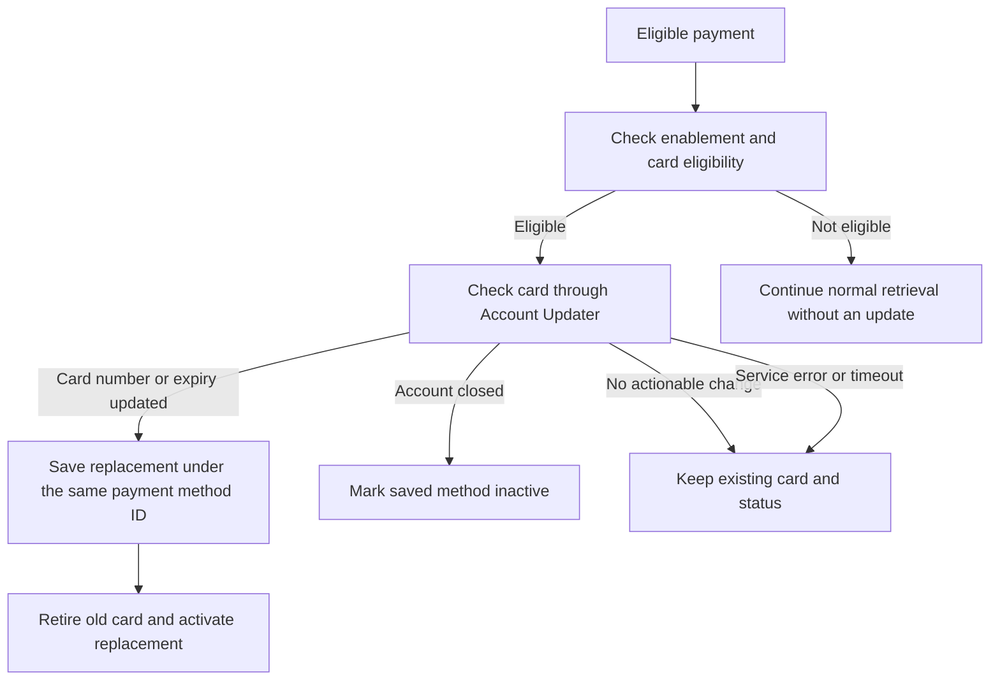

# Account Updater

Hyperswitch Account Updater helps keep your customers’ saved cards up to date when a card expires, is replaced, or is reissued. It connects to our **Account Updater service**, which supports Visa and Mastercard, to check for changes to the card number, expiry, or account status.

For eligible merchant-initiated payments, Hyperswitch checks the saved card before attempting authorization. When updated card details are available, it saves them under the **same payment method ID**. Your integration can continue using the reference it already holds, without asking the customer to enter the replacement card.

#### What does Account Updater handle?

For example, a customer saves a card for a subscription. Their bank later issues a replacement with a new expiry date. Before the next eligible subscription payment, Hyperswitch checks for an update, saves the replacement details, and makes them available to the payment flow.

Account Updater can:

* **Refresh the card number and expiry** when updated details are returned.
* **Mark a saved payment method inactive** when the service reports that the account is closed.
* **Keep the existing card unchanged** when there is no actionable update.

Throughout this page, `active`, `inactive`, `new`, and `redacted` describe the **saved payment method**, not the payment transaction. Updating a card does not itself authorize a payment or guarantee that the issuer will approve it.

#### How does it work?

#### What happens for each result?

| Result from Account Updater                 | What Hyperswitch does                                                                                                      | Saved payment method status                                 |
| ------------------------------------------- | -------------------------------------------------------------------------------------------------------------------------- | ----------------------------------------------------------- |
| **Account updated**                         | Saves the returned card number and expiry under the existing payment method ID.                                            | Replacement becomes `active` after the old card is retired. |
| **Expiry updated**                          | Saves the returned card details with the updated expiry under the existing ID.                                             | Replacement becomes `active` after the old card is retired. |
| **Account closed**                          | Marks the current saved method unavailable for subsequent retrievals. This action does not delete the card from the vault. | Current method becomes `inactive`.                          |
| **No change**                               | Keeps the existing card.                                                                                                   | Remains `active`.                                           |
| **Not found**                               | Keeps the existing card; absence of an update is not treated as account closure.                                           | Remains `active`.                                           |
| **Contact issuer**                          | Keeps the existing card. Hyperswitch does not automatically contact the issuer or deactivate the method.                   | Remains `active`.                                           |
| **Unspecified result**                      | Keeps the existing card.                                                                                                   | Remains `active`.                                           |
| **Reported update matches the stored card** | Detects that it already holds the same card details and skips the replacement.                                             | Remains `active`.                                           |

#### FAQs

**Does my payment method ID change when the card changes?**\
No. Hyperswitch keeps the ID and replaces the card details behind it.

**Does “not found” mean the card is invalid?**\
No. It means the service did not return an update for that card. Hyperswitch retains the saved details and status; payment authorization remains a separate decision.

**Will an inactive card become active on the next refresh?**\
No. Inactive methods are rejected before refresh. Activation during Account Updater applies to a newly stored replacement for an eligible active card.

**Are processor tokens and mandates refreshed too?**\
This flow refreshes the saved card. It does not update processor tokens or recreate processor mandates; connector mandate details are not copied to the replacement record. Existing network-token data is carried forward without being refreshed by Account Updater.
