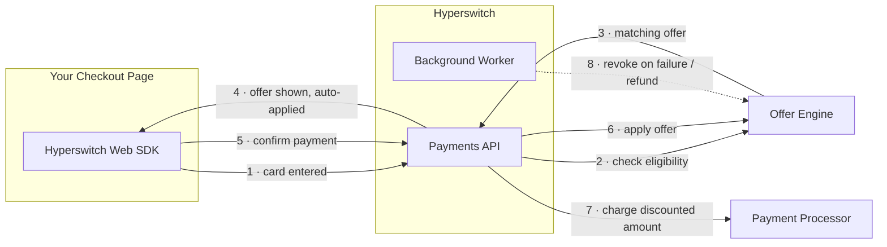
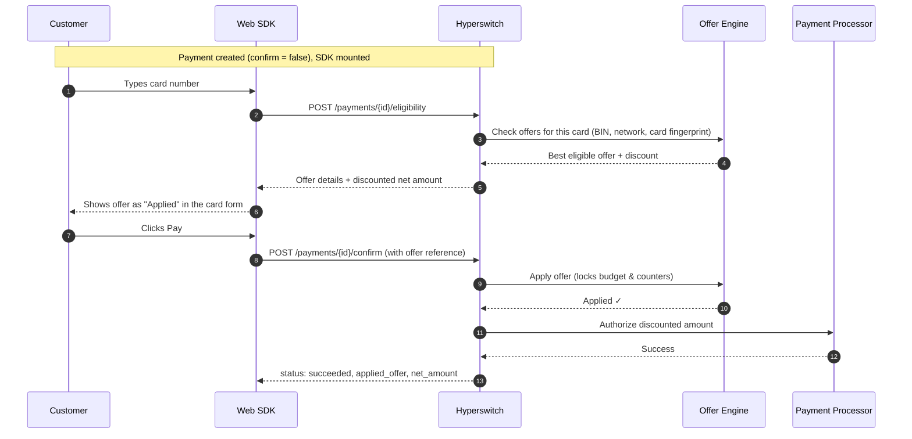

# Offer Engine

Hyperswitch Offers lets you run card-based promotions — instant discounts tied to card BINs directly inside your existing checkout. Offers are powered by the **Offer Engine**, a dedicated service that evaluates eligibility, enforces budgets and velocity limits (like "once per card"), and tracks redemptions.

The best part: if you already use the Hyperswitch Web SDK, offers appear in your checkout **with zero frontend changes**. The SDK detects the card, fetches the matching offer, displays it as applied, and attaches it to the payment — all automatically.

### What is an Offer?

An offer is a promotion configured against card attributes — for example, _"10% off (up to $20) on all Amex credit cards, valid till month end, once per card."_ When a customer enters an eligible card at checkout:

* The discount is calculated and shown to the customer before they pay
* The customer is charged the **discounted amount** at the payment processor
* Budgets and redemption counters are tracked centrally, so an offer can never be over-redeemed
* If the payment fails or is refunded, the redemption is automatically rolled back

### How does it work?

The full journey of a payment with an offer:

Key behaviors:

| Behavior                                        | Detail                                                                                                                                   |
| ----------------------------------------------- | ---------------------------------------------------------------------------------------------------------------------------------------- |
| Payment methods                                 | Cards only (new cards, saved cards)                                                                                                      |
| Offers per payment                              | One                                                                                                                                      |
| Amounts in the payment response                 | `amount` stays the full order amount; `net_amount` and `amount_received` reflect the discount; `applied_offer` carries the offer details |
| Offer Engine unavailable at eligibility         | Checkout continues with no offer — payments are **never blocked** by the offers system                                                   |
| Offer selected but cannot be applied at confirm | The confirm fails (error `IR_16`) — a customer is never silently charged full price after seeing a discount                              |
| Payment fails or is refunded                    | The redemption is revoked automatically in the background; budgets and per-card counters roll back                                       |
| Once-per-card limits                            | Enforced via a PAN-free card fingerprint — the same card cannot reuse an offer even across different customer accounts                   |

### Getting started


Offers require onboarding with the Hyperswitch team. **Reach out to your Hyperswitch point of contact** to get:

1. An **Offer Engine merchant account** created for you in sandbox
2. Your **Offer Engine API key** and **merchant ID**
3. The **Offer Engine base URL** for your environment (sandbox / production)
4. Your first offers configured (BINs, discount value, validity, velocity rules)


Then follow the setup guide for your deployment model:

* **Hyperswitch Cloud** — the Hyperswitch team enables the feature for your merchant account; you only verify and go live.
* **Self-hosted** — you add the Offer Engine configuration to your own Hyperswitch stack (config, migrations, feature flags, scheduler).

### Dive deeper

### FAQs

1. **Do I need to build any UI for offers?**\
   No. The Web SDK renders the offer inside the card form automatically. If you want to also reflect the discount in your own order summary (outside the SDK), subscribe to the `appliedOffersInfo` event — see How the SDK works.
2. **Can a customer choose between multiple offers?**\
   Not currently. The best eligible offer is selected and auto-applied. One offer per payment.
3. **What happens to the offer if the payment fails?**\
   Hyperswitch notifies the Offer Engine in the background and the redemption is revoked — the customer's card can use the offer again, and the budget is restored.
4. **Does this work for wallets / bank transfers?**\
   No. Offers are currently supported for card payments only.
5. **Is the card number shared with the Offer Engine?**\
   No. Only the card BIN (first 6 digits), network metadata, and a PAN-free fingerprint (`card_alias`) are sent — never the full card number.
