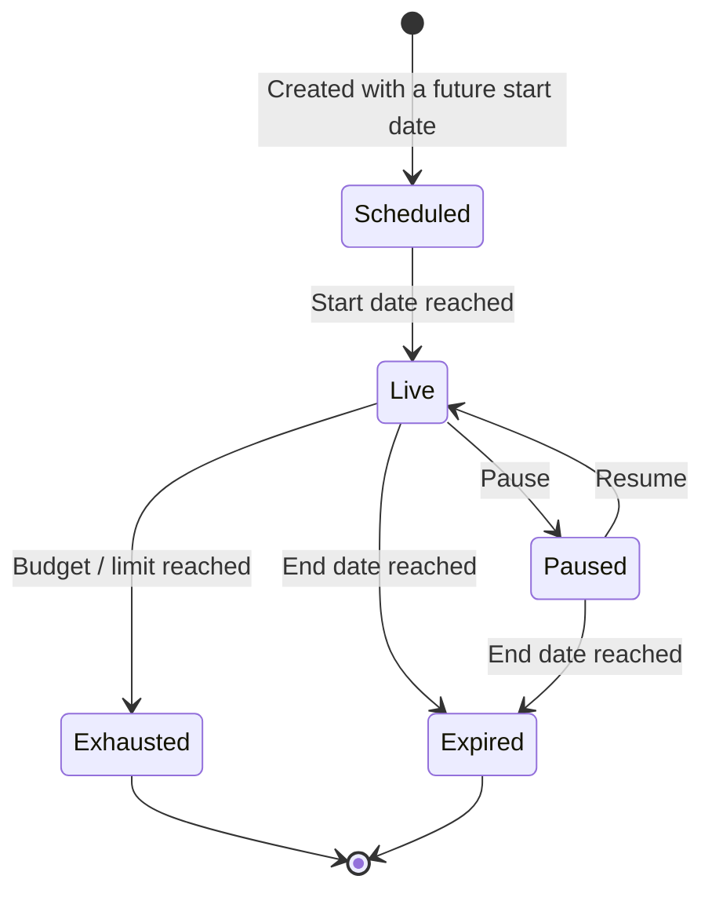

# Configuring an Offer

Every offer is defined by the fields below. Offer creation and changes are done together with the Hyperswitch team today — share the values with your point of contact. (A self-serve configuration UI is on the roadmap.)

### Identity & display

| Field             | What it controls                                            | Example                                          |
| ----------------- | ----------------------------------------------------------- | ------------------------------------------------ |
| **Code**          | The offer's unique code, shown as a chip in the checkout UI | `WELCOME10`                                      |
| **Title**         | Primary line shown to the customer                          | "10% off on your first card payment"             |
| **Display title** | Optional short label                                        | `WELCOME10`                                      |
| **Description**   | Supporting line shown under the title                       | "Instant discount on eligible Amex credit cards" |

### Discount

| Field                    | What it controls                                 | Example       |
| ------------------------ | ------------------------------------------------ | ------------- |
| **Discount type**        | Percentage of the order amount, or a flat amount | 10% · $5 flat |
| **Maximum discount cap** | Upper bound for percentage discounts             | 10% up to $20 |
| **Currency**             | The currency the offer applies in                | `USD`         |

### Targeting

| Field                       | What it controls                                  | Example          |
| --------------------------- | ------------------------------------------------- | ---------------- |
| **Card BINs**               | Which cards are eligible — uploaded as a BIN list | Amex credit BINs |
| **Order amount conditions** | Minimum order value for the offer to apply        | Orders above $50 |

### Validity & limits

| Field                            | What it controls                                                                                                                         | Example                            |
| -------------------------------- | ---------------------------------------------------------------------------------------------------------------------------------------- | ---------------------------------- |
| **Validity period**              | Start date and end date; the offer stops matching automatically after expiry                                                             | Sep 1 – Sep 30                     |
| **Maximum offer limit (budget)** | Total redemption budget — as a redemption **count**, a total **discount amount**, or both. Once exhausted, the offer stops being offered | 1,000 redemptions or $10,000 total |
| **Velocity rules**               | Per-card usage limits, e.g. once per card — enforced by card fingerprint, not customer ID                                                | Once per card                      |

### Lifecycle operations

| Operation          | Supported | How                                                                                                          |
| ------------------ | --------- | ------------------------------------------------------------------------------------------------------------ |
| Create             | ✅         | With the Hyperswitch team during/after onboarding                                                            |
| Update             | ✅         | Any field — discount, validity, BIN list, limits — via your Hyperswitch contact                              |
| **Pause / resume** | ✅         | Temporarily stop an offer from being offered without deleting it; already-applied redemptions are unaffected |
| Delete / end       | ✅         | Permanently retire an offer; expiry via the validity period is usually preferable                            |


An offer that is paused, exhausted, or expired simply stops appearing at eligibility — checkout continues normally at full price. In-flight payments that already applied the offer are never affected by a configuration change.

