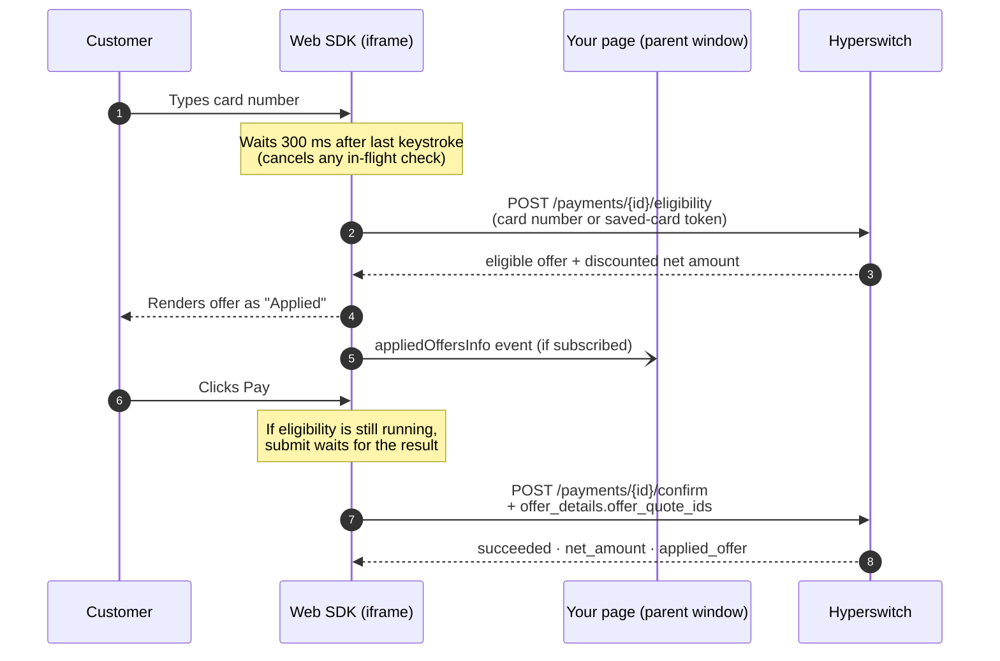

# How the SDK works



If you use the Hyperswitch Web SDK (unified checkout or the card element), offers work **without any frontend changes**. This page explains what the SDK does under the hood, and the one optional hook you can use to mirror the discount in your own UI.


### The experience

As the customer types their card number, the SDK checks eligibility in the background. If an offer matches, it appears inside the card form — already applied, read-only:

* A shimmer/skeleton shows while the check is running
* The offer renders with its title, offer code chip, description, and an "Applied ✓" state
* If the card isn't eligible (or the offer was already used on that card), nothing is shown and checkout continues normally at full price

The same happens when a customer selects a **saved card** or pays via **Click to Pay**.

### What happens under the hood



Step by step:

1. **Trigger** — the SDK runs the check only when the payment-methods list response tells it to (`sdk_next_action: eligibility_check`). This is controlled server-side per merchant; there is no SDK flag to set.
2. **Debounce** — eligibility fires 300 ms after the customer stops typing a valid card number; further typing aborts the in-flight request.
3. **Eligibility call** — the SDK calls `POST /payments/{payment_id}/eligibility` with the card number (or, for saved cards, the payment token). The response contains the eligible offer, its quote reference, and the discounted `net_amount`.
4. **Display** — the first eligible offer is rendered auto-applied inside the card form.
5. **Confirm** — on pay, the SDK automatically attaches `offer_details: { offer_quote_ids: [...] }` to the confirm call. This works across all card paths: new card, standalone card element, saved card + CVC, and Click to Pay.
6. **Result** — the payment response carries `net_amount`, `amount_received` (discounted), and `applied_offer` (offer ID, amount, currency).

### Showing the discount in your own order summary (optional)

The SDK renders the offer inside the payment element. If you also want your surrounding page — cart total, order summary — to reflect the discount, subscribe to the `appliedOffersInfo` event.

**1. Opt in via the element options:**



```js
const widgets = hyper.widgets({ clientSecret, appearance });

const unifiedCheckout = widgets.create("payment", {
  subscriptionEvents: ["appliedOffersInfo"],
  // ...your other options
});

unifiedCheckout.mount("#unified-checkout");
```



```jsx
<PaymentElement
  options={{
    subscriptionEvents: ["appliedOffersInfo"],
    // ...your other options
  }}
/>
```



**2. Listen for the event:**

```js
window.addEventListener("message", (ev) => {
  const data = typeof ev.data === "string" ? JSON.parse(ev.data) : ev.data;
  if (data?.eventName === "appliedOffersInfo") {
    const offer = data.payload.offers[0]; // the single applied offer
    // offer.offerAmount  → discount in minor units (e.g. 2000 = $20.00)
    // offer.code         → "WELCOME10"
    // offer.title        → "10% off on your first card payment"
    // offer.currency     → "USD"
    updateOrderSummary(offer);
  }
});
```

The event fires whenever the applied offer changes — including when it clears (customer switches to an ineligible card). The payload always contains at most one offer.


After confirm, always treat the **payment response** as the source of truth for amounts: `net_amount`, `amount_received`, and `applied_offer`. The event is for display while the customer is still on the page.


### Styling

The offer notice uses your existing SDK theme. The success accent (checkmark, "Applied" label) comes from the `colorSuccess` appearance variable:

```js
const appearance = {
  variables: {
    colorSuccess: "#16875B", // default
  },
};
```

All offer strings (e.g. "Card offer", "Applied", "Checking eligible offers…") are localized in every SDK locale.

### Scope and limitations

| Supported      | Not supported                                           |
| -------------- | ------------------------------------------------------- |
| New card entry | Vault tokenized card collection                         |
| Saved cards    | Non-card payment methods                                |
| Click to Pay   | Multiple selectable offers (best offer is auto-applied) |

### FAQs

1. **Does the eligibility check slow down checkout?**\
   No. It runs in parallel while the customer finishes the form, debounced to one request. If it is still running when the customer hits Pay, submit waits briefly for the result.
2. **What does the customer see if the Offer Engine is down?**\
   Nothing — no offer is shown and checkout proceeds normally at full price. Payments are never blocked by the offers system.
3. **Can the customer remove the offer?**\
   The offer is auto-applied and read-only in the current version.
