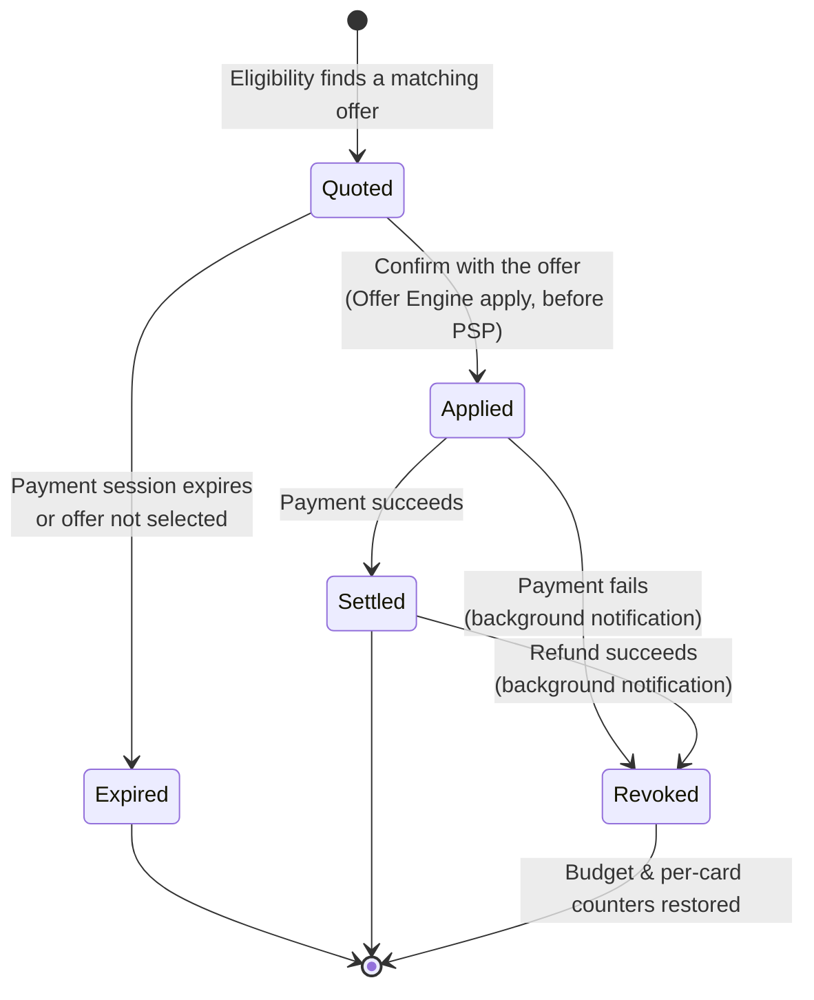
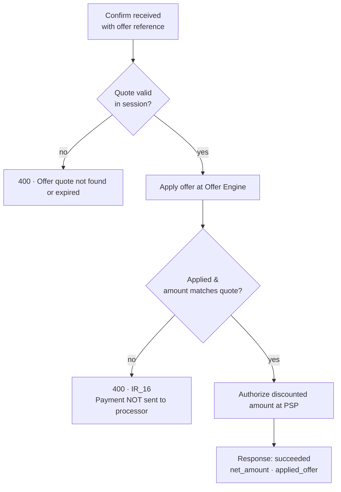
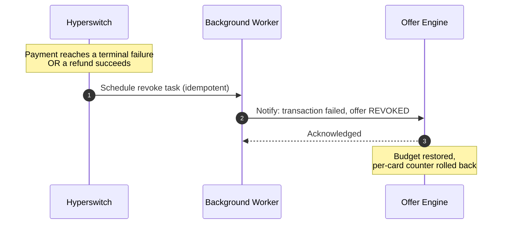
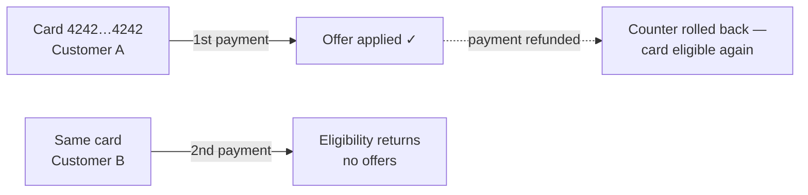

# Offer Payment Lifecycle

This page explains what happens to an offer at each stage of a payment — including the guarantees around failures, refunds, and once-per-card limits.

### Lifecycle at a glance



| State       | Meaning                                                                                                                                     |
| ----------- | ------------------------------------------------------------------------------------------------------------------------------------------- |
| **Quoted**  | Eligibility returned an offer; a quote is held against the payment session. Nothing is consumed yet.                                        |
| **Applied** | The offer was applied at confirm; the Offer Engine has locked its budget and counters, and the processor was charged the discounted amount. |
| **Settled** | The payment succeeded. The redemption stands. No further action needed.                                                                     |
| **Revoked** | The payment failed or was refunded; the redemption was rolled back automatically. The card can use the offer again.                         |
| **Expired** | The quote lapsed with the payment session, or the payment was confirmed without the offer. Nothing was consumed.                            |

### Stage 1 — Eligibility

When the eligibility API runs for a card (triggered by the SDK, or called directly), Hyperswitch asks the Offer Engine for matching offers using the card BIN, network, card type, and a PAN-free card fingerprint. If an offer matches:

* A quote is created and held against the payment session
* The response carries the offer (`offer_details`) and the discounted total (`amount_details.net_amount`)

```json
{
  "amount_details": { "total_amount": 100000, "net_amount": 98000, "currency": "USD" },
  "offer_details": {
    "uplifted_offer_quote_ids": ["offer_quote_..."],
    "eligible_offers": [
      {
        "offer_quote_id": "offer_quote_...",
        "offer_amount": 2000,
        "currency": "USD",
        "code": "WELCOME10",
        "title": "10% off on your first card payment"
      }
    ]
  }
}
```


**Fail-open by design.** If the Offer Engine is unreachable, or the card doesn't match any offer, eligibility returns normally with no offers and checkout continues at full price. The offers system can never block a payment.


### Stage 2 — Confirm

Offers are **opt-in at confirm**: the confirm call must reference the quote (`offer_details.offer_quote_ids` — the SDK does this automatically). Hyperswitch then, in order and _before_ contacting the payment processor:

1. Re-validates the quote against the payment session
2. Applies the offer at the Offer Engine (this locks the offer's budget and increments velocity counters)
3. Verifies the applied discount exactly matches the quoted discount
4. Sends the **discounted amount** to the payment processor




**Fail-closed by design.** Once a customer has selected an offer, Hyperswitch will never charge them full price silently. If the offer cannot be applied at confirm — engine down, quote expired, discount mismatch — the confirm fails with `IR_16` and no charge is made. Recover by re-running eligibility (fresh quote) or confirming without the offer.


A successful response:

```json
{
  "status": "succeeded",
  "amount": 100000,
  "net_amount": 98000,
  "amount_received": 98000,
  "applied_offer": {
    "offer_engine_merchant_id": "...",
    "offer_engine_txn_id": "...",
    "offer_id": "...",
    "offer_amount": 2000,
    "currency": "USD"
  }
}
```

The applied offer is persisted on the payment and remains visible on payment retrieval forever. Automatic retries carry the offer and discounted amount onto the new attempt.

### Stage 3 — Failure & refund handling (automatic)

Nothing to build here — Hyperswitch handles reversal in the background:



* Triggers: terminal payment failure (authorization/capture failure, void, expiry) or a **successful refund**
* Delivery is retried automatically and never affects the payment or refund result
* Successful payments need no notification — the redemption from apply simply stands

### Once-per-card velocity

Offers can be limited to once per card. Enforcement uses a stable, PAN-free **card fingerprint** — not the customer ID — so the limit holds even if the same card is used across different customer accounts, and works identically for typed and saved cards.



A card that has exhausted its limit simply gets no offer at eligibility — checkout continues normally at full price.

### Error reference

| Error                                             | Where   | What it means                                                   | What to do                                                         |
| ------------------------------------------------- | ------- | --------------------------------------------------------------- | ------------------------------------------------------------------ |
| `IR_16`                                           | Confirm | Offer could not be applied (engine unavailable, quote mismatch) | Re-run eligibility for a fresh quote, or confirm without the offer |
| "Offer quote not found or expired"                | Confirm | The payment session expired between eligibility and confirm     | Create a fresh payment                                             |
| "Only a single offer can be applied to a payment" | Confirm | More than one quote ID was sent                                 | Send exactly one                                                   |
| `403` on offer endpoints                          | Any     | Offers not enabled for this merchant                            | Complete the setup guide                                           |
