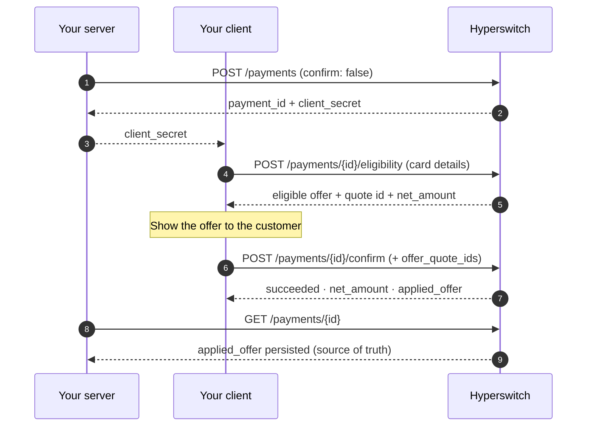

# Offers API Reference


With the Hyperswitch Web SDK, you don't need to call these APIs yourself — the SDK does. Use this reference for custom/headless checkouts, mobile integrations, or to build an "available offers" page. All amounts are in **minor units** (cents/paise).


### Endpoints at a glance

| Endpoint                          | Auth                                                          | Purpose                                                |
| --------------------------------- | ------------------------------------------------------------- | ------------------------------------------------------ |
| `POST /payments/{id}/eligibility` | Publishable key + `client_secret` (client-side) or secret key | Get eligible offers for a payment + card               |
| `POST /payments/{id}/confirm`     | Same as regular confirm                                       | Confirm with an offer applied                          |
| `POST /offer_engine/offers/list`  | Merchant secret key                                           | Browse all currently active offers (no payment needed) |

***

### Check eligibility

Returns the best eligible offer for a card on an existing payment (created with `confirm: false`). Call it with raw card details, or with a saved-card `payment_token`.



```bash
curl -X POST "https://sandbox.hyperswitch.io/payments/{payment_id}/eligibility" \
  -H "api-key: <publishable-key>" \
  -H "Content-Type: application/json" \
  -d '{
    "client_secret": "<client_secret>",
    "payment_method_type": "card",
    "payment_method_data": {
      "card": {
        "card_number": "4242424242424242",
        "card_exp_month": "12",
        "card_exp_year": "2030",
        "card_cvc": "123"
      }
    }
  }'
```



```bash
curl -X POST "https://sandbox.hyperswitch.io/payments/{payment_id}/eligibility" \
  -H "api-key: <publishable-key>" \
  -H "Content-Type: application/json" \
  -d '{
    "client_secret": "<client_secret>",
    "payment_method_type": "card",
    "payment_token": "<payment_token>"
  }'
```

Get the `payment_token` from `GET /customers/payment_methods?client_secret=...`.



**Response:**

```json
{
  "payment_id": "pay_...",
  "amount_details": {
    "total_amount": 100000,
    "net_amount": 98000,
    "currency": "USD"
  },
  "offer_details": {
    "uplifted_offer_quote_ids": ["offer_quote_..."],
    "eligible_offers": [
      {
        "offer_quote_id": "offer_quote_...",
        "offer_amount": 2000,
        "currency": "USD",
        "code": "WELCOME10",
        "title": "10% off on your first card payment",
        "description": "Instant discount on eligible cards"
      }
    ]
  }
}
```

| Field                       | Meaning                                                                                       |
| --------------------------- | --------------------------------------------------------------------------------------------- |
| `offer_details` absent      | Offers not enabled / non-card method / engine unavailable — proceed normally                  |
| `eligible_offers: []`       | Engine consulted, nothing eligible (e.g. once-per-card limit reached) — proceed at full price |
| `uplifted_offer_quote_ids`  | The quote reference(s) to send back at confirm                                                |
| `amount_details.net_amount` | `total_amount − offer_amount`                                                                 |


Quotes are held against the payment session and expire with it. Show the offer, then confirm within the same session.


***

### Confirm with an offer

Offers are **opt-in**: pass the quote reference in the confirm body. Omitting `offer_details` confirms at full price even if eligibility returned an offer. Exactly **one** quote ID is allowed.

```bash
curl -X POST "https://sandbox.hyperswitch.io/payments/{payment_id}/confirm" \
  -H "api-key: <publishable-key>" \
  -H "Content-Type: application/json" \
  -d '{
    "client_secret": "<client_secret>",
    "payment_method": "card",
    "payment_method_data": {
      "card": {
        "card_number": "4242424242424242",
        "card_exp_month": "12",
        "card_exp_year": "2030",
        "card_cvc": "123"
      }
    },
    "offer_details": {
      "offer_quote_ids": ["offer_quote_..."]
    }
  }'
```

**Response (success):**

```json
{
  "payment_id": "pay_...",
  "status": "succeeded",
  "amount": 100000,
  "net_amount": 98000,
  "amount_received": 98000,
  "currency": "USD",
  "applied_offer": {
    "offer_engine_merchant_id": "...",
    "offer_engine_txn_id": "...",
    "offer_id": "...",
    "offer_amount": 2000,
    "currency": "USD"
  }
}
```

`applied_offer` is persisted and returned on every subsequent `GET /payments/{id}`.

**Errors:**

| HTTP | Error                                                  | Cause                                                                                                       |
| ---- | ------------------------------------------------------ | ----------------------------------------------------------------------------------------------------------- |
| 400  | `IR_16` — offer apply failed or didn't match the quote | Engine unavailable, or the discount changed since quoting. Re-run eligibility or confirm without the offer. |
| 400  | Offer quote not found or expired                       | Payment session expired. Create a fresh payment.                                                            |
| 400  | Only a single offer can be applied to a payment        | More than one quote ID sent.                                                                                |

***

### Browse active offers

Lists your currently active, eligible offers without a payment — for an "available offers" strip on your storefront. Uses your **merchant secret key** (server-side only).

```bash
curl -X POST "https://sandbox.hyperswitch.io/offer_engine/offers/list" \
  -H "api-key: <merchant-secret-key>" \
  -H "Content-Type: application/json" \
  -d '{"offer_payment_info": {"currency": "USD"}}'
```

`offer_payment_info` is optional — omit it to browse without a currency filter.

**Response:**

```json
{
  "offers": [
    {
      "code": "WELCOME10",
      "title": "10% off on your first card payment",
      "display_title": "WELCOME10",
      "description": "Instant discount on eligible cards",
      "currency": "USD",
      "valid_till": "2026-12-31T18:29:59.000Z"
    }
  ]
}
```

A `403` means offers are not enabled for your merchant — see the setup guide.

***

### Headless flow summary


