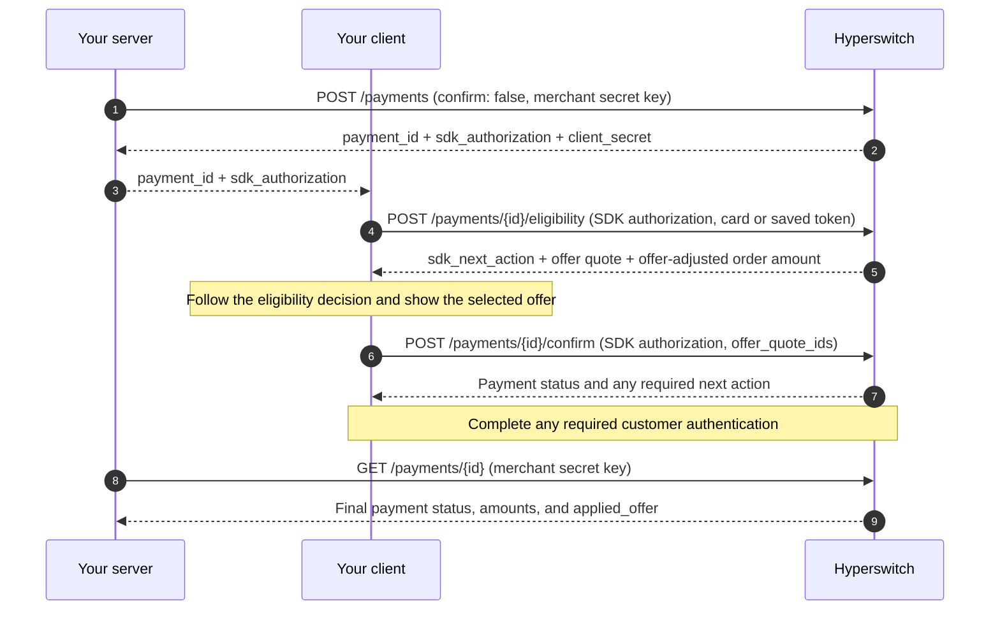

# Offers API Reference


Use this reference for custom or headless checkouts, mobile integrations, or an available-offers page. With the Hyperswitch Web SDK and Offers enabled, the SDK handles payment eligibility and offer selection at confirm. The browse endpoint is available separately for your own interface.

This page describes the v1 payment integration. All monetary amounts in these Hyperswitch API requests and responses are in **minor units** (for example, cents for USD).


### Endpoints at a glance

| Endpoint                          | Auth                                                                                                         | Purpose                                                        |
| --------------------------------- | ------------------------------------------------------------------------------------------------------------ | -------------------------------------------------------------- |
| `POST /payments/{id}/eligibility` | SDK authorization; publishable key + `client_secret` (client-side); or merchant secret API key (server-side) | Check payment eligibility and obtain an offer quote for a card |
| `POST /payments/{id}/confirm`     | SDK authorization; publishable key + `client_secret` (client-side); or merchant secret API key (server-side) | Confirm a payment with a selected offer quote                  |
| `POST /offer_engine/offers/list`  | Merchant secret API key (server-side)                                                                        | Browse offers without creating a payment                       |

#### Authentication for eligibility and confirm

Use one of the following authentication methods:

| Method                  | Header                               | Request body                                                         |
| ----------------------- | ------------------------------------ | -------------------------------------------------------------------- |
| SDK authorization       | `Authorization: <sdk_authorization>` | A separate `client_secret` is not required                           |
| Publishable key         | `api-key: <publishable-key>`         | Include `client_secret` for the payment                              |
| Merchant secret API key | `api-key: <merchant-secret-key>`     | Omit `client_secret`; it is rejected with this authentication method |

For SDK authorization, use the `sdk_authorization` value returned by Hyperswitch for the payment. Send it directly in the `Authorization` header, without a `Bearer` prefix. It contains the client secret, so a separate `api-key` header is not required.

The examples below demonstrate both SDK authorization and publishable-key authentication. To adapt an example to merchant secret-key authentication, use the merchant secret key in the `api-key` header and omit both the `Authorization` header and `client_secret` body field.

***

### Check eligibility

Create a payment with `confirm: false`, then call eligibility for that payment using a new card or a saved-card `payment_token`. The Offers integration returns **at most one selected offer** for the current payment and card.

For a new card, only `card_number` is required in the eligibility card object. Expiry and CVC are optional at this stage; confirmation has its own payment-method requirements.



```bash
curl -X POST "https://sandbox.hyperswitch.io/payments/{payment_id}/eligibility" \
  -H "Authorization: <sdk_authorization>" \
  -H "Content-Type: application/json" \
  -d '{
    "payment_method_type": "card",
    "payment_method_data": {
      "card": {
        "card_number": "4242424242424242"
      }
    }
  }'
```



```bash
curl -X POST "https://sandbox.hyperswitch.io/payments/{payment_id}/eligibility" \
  -H "api-key: <publishable-key>" \
  -H "Content-Type: application/json" \
  -d '{
    "client_secret": "<client_secret>",
    "payment_method_type": "card",
    "payment_method_data": {
      "card": {
        "card_number": "4242424242424242"
      }
    }
  }'
```



```bash
curl -X POST "https://sandbox.hyperswitch.io/payments/{payment_id}/eligibility" \
  -H "api-key: <publishable-key>" \
  -H "Content-Type: application/json" \
  -d '{
    "client_secret": "<client_secret>",
    "payment_method_type": "card",
    "payment_token": "<payment_token>"
  }'
```

Create the payment for the customer who owns the saved card. Obtain its `payment_token` from the customer's saved payment methods, for example using `GET /customers/payment_methods?client_secret=<client_secret>` with the publishable key.

SDK authorization can also be used for saved-card eligibility: replace the `api-key` header with `Authorization: <sdk_authorization>` and omit `client_secret` from the body.



#### Eligibility response

Example response with a selected offer and a decision allowing confirmation:

```json
{
  "payment_id": "pay_...",
  "sdk_next_action": {
    "next_action": "confirm",
    "should_block_confirm": null
  },
  "surcharge_details": null,
  "amount_details": {
    "total_amount": 100000,
    "net_amount": 98000,
    "currency": "USD"
  },
  "offer_details": {
    "uplifted_offer_quote_ids": ["offer_quote_..."],
    "eligible_offers": [
      {
        "offer_quote_id": "offer_quote_...",
        "offer_amount": 2000,
        "currency": "USD",
        "code": "SAVE2",
        "title": "2% off on eligible card payments",
        "description": "Instant discount on eligible cards"
      }
    ]
  }
}
```

| Field or result                                          | Meaning                                                                                                                                                                                                              |
| -------------------------------------------------------- | -------------------------------------------------------------------------------------------------------------------------------------------------------------------------------------------------------------------- |
| `sdk_next_action`                                        | The next payment action. Follow this decision before confirming; a denial must not be treated as permission to pay without an offer.                                                                                 |
| `offer_details` and `amount_details` absent              | Offer evaluation was skipped or unavailable. Possible reasons include disabled Offers, an unsupported payment method, missing configuration, unavailable card fingerprint, or a denied payment eligibility decision. |
| `eligible_offers: []` and `uplifted_offer_quote_ids: []` | No supported offer was selected, or the Offer Engine lookup failed. The returned offer-related amount remains unchanged.                                                                                             |
| `uplifted_offer_quote_ids`                               | The selected quote reference to send at confirm. Currently contains zero or one ID.                                                                                                                                  |
| `eligible_offers`                                        | Details of the selected offer, if any. Currently contains zero or one entry.                                                                                                                                         |
| `amount_details.total_amount`                            | The order amount used for offer evaluation.                                                                                                                                                                          |
| `amount_details.net_amount`                              | The order amount minus the selected offer discount. Equals `total_amount` when no offer is selected.                                                                                                                 |
| `surcharge_details`                                      | Surcharge information, when applicable, returned separately from offer amounts.                                                                                                                                      |

Offer titles and descriptions are optional and may be omitted.


**Offer lookup failures are handled without an offer discount.** If the Offer Engine list call fails, eligibility can still return successfully with empty offer arrays and unchanged offer-related amounts. Continue only as permitted by `sdk_next_action`.

This behavior applies to the offer lookup. Authentication failures, invalid requests, and other eligibility errors must still be handled normally.



**Eligibility amounts are not necessarily the final payment total.** Shipping, taxes, surcharge, or other applicable charges can affect the final total. Use the confirm or retrieve response for the payment's actual amounts.


#### Quote lifetime

Offer quotes are stored in the payment's client session. Keep client sessions enabled and use the quote with the same payment that produced it.

* Use the latest selected quote returned by eligibility. When a later eligibility call stores a new quote, it replaces the previously stored quote.
* Generating a new quote does not extend the existing session's expiry.
* Send the `offer_quote_id`, not the offer code or the Offer Engine's `offer_id`, when confirming.
* A quote does not guarantee successful application. Offer Engine revalidates the offer at confirm.

***

### Confirm with an offer

Offers are **opt-in at confirm**: pass the selected quote in `offer_details.offer_quote_ids`. To apply an offer, send exactly **one** quote ID.

On an attempt with no offer already applied, omitting `offer_details` or sending an empty `offer_quote_ids` array confirms without an offer discount. Omitting the field **does not remove an offer already applied** to that attempt. Requesting the same applied quote again does not reapply it; requesting a different quote on that attempt is rejected.

Hyperswitch applies and validates the selected offer before contacting the payment processor. If the offer cannot be applied or does not match the quote, confirmation fails instead of silently charging an undiscounted amount.



```bash
curl -X POST "https://sandbox.hyperswitch.io/payments/{payment_id}/confirm" \
  -H "api-key: <publishable-key>" \
  -H "Content-Type: application/json" \
  -d '{
    "client_secret": "<client_secret>",
    "payment_method": "card",
    "payment_method_data": {
      "card": {
        "card_number": "4242424242424242",
        "card_exp_month": "12",
        "card_exp_year": "2030",
        "card_cvc": "123"
      }
    },
    "offer_details": {
      "offer_quote_ids": ["offer_quote_..."]
    }
  }'
```

To use SDK authorization for this request, replace the `api-key` header with `Authorization: <sdk_authorization>` and omit `client_secret` from the body.



```bash
curl -X POST "https://sandbox.hyperswitch.io/payments/{payment_id}/confirm" \
  -H "Authorization: <sdk_authorization>" \
  -H "Content-Type: application/json" \
  -d '{
    "payment_method": "card",
    "payment_token": "<payment_token>",
    "payment_method_data": {
      "card_token": {
        "card_cvc": "123"
      }
    },
    "offer_details": {
      "offer_quote_ids": ["offer_quote_..."]
    }
  }'
```

Use the saved card and quote from the eligibility call for this payment. Hyperswitch resolves the saved-card token before applying the offer.



Include any additional fields required by your normal payment integration, such as billing information, browser information, or customer acceptance when applicable.

#### Payment response

The following is a **shortened example of a successfully captured payment**, with no additional charges:

```json
{
  "payment_id": "pay_...",
  "status": "succeeded",
  "amount": 100000,
  "net_amount": 98000,
  "amount_received": 98000,
  "currency": "USD",
  "applied_offer": {
    "offer_engine_merchant_id": "...",
    "offer_engine_txn_id": "...",
    "offer_id": "...",
    "offer_amount": 2000,
    "currency": "USD"
  }
}
```

| Field                        | Meaning                                                                                               |
| ---------------------------- | ----------------------------------------------------------------------------------------------------- |
| `amount`                     | The original order amount.                                                                            |
| `net_amount`                 | The payment total after applicable additional charges and the offer discount.                         |
| `amount_received`            | The captured amount, when available. Do not assume it equals `net_amount` before capture completes.   |
| `applied_offer`              | The offer applied to the payment attempt, or `null` when none is recorded.                            |
| `applied_offer.offer_id`     | The Offer Engine's identifier for the applied offer; distinct from the quote ID submitted at confirm. |
| `applied_offer.offer_amount` | The instant discount in minor units.                                                                  |

Applied-offer details are persisted on the payment attempt and exposed through payment responses. `GET /payments/{id}` normally reflects the active attempt.

Confirmation may require further customer authentication or return a pending or failed payment. Handle the returned payment `status` and any required next action using your normal payment flow. An applied offer alone does not establish payment success.

`applied_offer` records the applied discount; it is not a live redemption-status field. Successful full or partial refunds trigger background revocation of the entire offer redemption.&#x20;

#### Common offer-validation errors

The errors below use **HTTP `400` and code `IR_16`**, with different messages. Other request, authentication, payment-state, and processor errors can also occur.

| Message                                                             | Meaning                                                                                                                                                   | Recovery                                                                                                                                                                                                           |
| ------------------------------------------------------------------- | --------------------------------------------------------------------------------------------------------------------------------------------------------- | ------------------------------------------------------------------------------------------------------------------------------------------------------------------------------------------------------------------ |
| `Offer Engine /apply failed or did not match the eligibility quote` | The apply call failed, the offer was rejected, or the applied result did not match the quote.                                                             | Check the payment state. Refresh eligibility when the payment and session allow it, and show the customer the updated result before confirming again.                                                              |
| `Offer quote not found or expired`                                  | The quote is absent from the payment's session. It may be incorrect, replaced by a later quote, or missing because the session is unavailable or expired. | Use the latest quote for this payment. If the session remains valid, obtain a fresh quote; otherwise restart checkout with a valid payment session. A fresh payment is not required for every missing-quote error. |
| `Only a single offer can be applied to a payment`                   | More than one quote ID was submitted.                                                                                                                     | Send only the selected quote ID.                                                                                                                                                                                   |
| `Offer Engine is not available for this offer selection`            | Offers is disabled or its configuration cannot be resolved for the payment.                                                                               | Check the merchant's setup and enablement before retrying with an offer.                                                                                                                                           |
| `Cannot apply offer: card velocity key unavailable`                 | The card fingerprint needed for usage-limit checks could not be generated.                                                                                | Resolve the fingerprint-generation failure before retrying with an offer.                                                                                                                                          |
| `A different offer is already applied to this payment attempt`      | This attempt already has another applied quote.                                                                                                           | Do not replace it on the same attempt. Retrieve the payment and follow the appropriate payment retry or restart flow.                                                                                              |


Continuing without an offer is an explicit customer choice, not an automatic fallback after an offer-validation error. Show the revised amount and check the payment state before proceeding. Omitting `offer_details` does not remove an offer already applied to an attempt.


***

### Browse available offers

Use this endpoint for an available-offers strip or page on your storefront. It uses your **merchant secret API key**, so call it from your server.

The response includes offers that Offer Engine marks eligible for the supplied browse context. This request contains no card, customer, or payment amount, so the result does **not** establish eligibility for a particular payment. It also does not return a quote that can be submitted at confirm.

```bash
curl -X POST "https://sandbox.hyperswitch.io/offer_engine/offers/list" \
  -H "api-key: <merchant-secret-key>" \
  -H "Content-Type: application/json" \
  -d '{"offer_payment_info": {"currency": "USD"}}'
```

`offer_payment_info` is optional. Send `{}` to browse without specifying a currency. If `offer_payment_info` is included, its `currency` field is required.

Example response:

```json
{
  "offers": [
    {
      "code": "SAVE2",
      "title": "2% off on eligible card payments",
      "display_title": "SAVE2",
      "description": "Instant discount on eligible cards",
      "currency": "USD",
      "valid_till": "2026-12-31T18:29:59.000Z"
    }
  ]
}
```

The display fields `title`, `display_title`, `description`, `currency`, and `valid_till` may be `null`. Handle an empty `offers` array as a valid result.

| Result                      | Meaning                                                                                                                                                                                                        |
| --------------------------- | -------------------------------------------------------------------------------------------------------------------------------------------------------------------------------------------------------------- |
| `200` with offers           | Offers are available for the browse context. Run payment eligibility to obtain a quote for the customer's card.                                                                                                |
| `200` with `{"offers": []}` | No offers were returned as eligible for the browse context.                                                                                                                                                    |
| `403`                       | Offers may be disabled, or the required merchant credentials or service configuration cannot be resolved. Check the Setup Guide.                                                                               |
| `500`                       | An upstream Offer Engine request or response-processing error may have occurred. Check the service logs. Browse failures return an error; they do not use the payment eligibility flow's empty-offer fallback. |

***

### Headless flow summary

This diagram shows one successful payment path using SDK authorization:



For publishable-key authentication, pass the payment's `client_secret` to the client and use it in the eligibility and confirm bodies with the publishable key. For a server-to-server integration, use the merchant secret API key and omit `client_secret` from those requests.

In every flow, use the payment response to determine the payment outcome and charged amount. An eligibility quote is a preview, not confirmation that the offer or payment succeeded.


