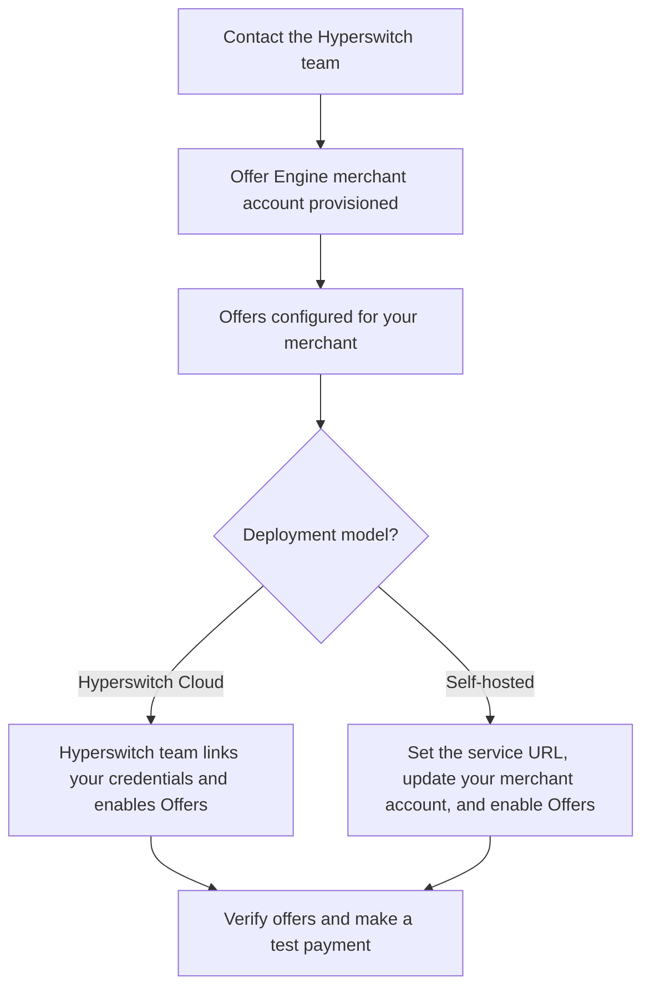

# Setup Guide


This guide covers enabling Offers for your merchant account on Hyperswitch Cloud or an existing self-hosted Hyperswitch deployment. Each merchant's Offer Engine credentials are stored against their Hyperswitch merchant account.


### Before you start — onboarding with Hyperswitch

Offers are evaluated by the **Offer Engine**, an external service. Reach out to your Hyperswitch point of contact to get your merchant onboarded and your first offers configured.

| What you need                     | Used for                                                                                                                           |
| --------------------------------- | ---------------------------------------------------------------------------------------------------------------------------------- |
| **Offer Engine merchant account** | Your merchant's identity in the Offer Engine                                                                                       |
| **Offer Engine API key**          | Authenticates requests to the Offer Engine for your merchant                                                                       |
| **Offer Engine merchant ID**      | Identifies your merchant in Offer Engine requests                                                                                  |
| **Offer Engine base URL**         | The service endpoint for your environment; required when configuring a self-hosted deployment                                      |
| **Offer configuration**           | BIN lists, validity dates, discount value, offer code, title, description, currency, and per-card usage limits(via control center) |


Your **Hyperswitch merchant ID** identifies the account you update in Hyperswitch. Your **Offer Engine merchant ID** is supplied during onboarding and stored inside that account's `offer_engine_config`.




### Path A — Hyperswitch Cloud

#### Step 1 — Enable Offers for your merchant

Once your Offer Engine account is provisioned, the Hyperswitch team stores your Offer Engine API key and merchant ID against your Hyperswitch merchant account and enables the required feature flags.

#### Step 2 — Verify your setup

Use your **Hyperswitch merchant secret API key** to browse offers:

```bash
curl -X POST "https://sandbox.hyperswitch.io/offer_engine/offers/list" \
  -H "api-key: <hyperswitch-merchant-secret-key>" \
  -H "Content-Type: application/json" \
  -d '{"offer_payment_info": {"currency": "USD"}}'
```

An example response:

```json
{
  "offers": [
    {
      "code": "WELCOME10",
      "title": "10% off on eligible card payments",
      "display_title": "WELCOME10",
      "description": "Instant discount on eligible cards",
      "currency": "USD",
      "valid_till": "2026-12-31T18:29:59.000Z"
    }
  ]
}
```

Use the currency configured for your offers. This API lists offers available for browsing; eligibility for a particular card is checked during the payment flow.


A `403` response can mean Offers is not enabled for your merchant or the required configuration is missing or invalid. Contact your Hyperswitch point of contact to check the setup.


#### Step 3 — Make a test payment

Make a payment with an eligible test card through your checkout. With the Hyperswitch Web SDK, the offer should appear in the card form and be included when you confirm the payment.

Verify that the successful payment response includes `applied_offer` and the expected discounted amount. Continue to How the SDK works, or use the Offers API Reference for a custom checkout.

### Path B — Self-hosted Hyperswitch

These steps assume your Hyperswitch deployment is already running with support for merchant-level Offers. You will need access to the deployment configuration, dynamic configuration, and a Hyperswitch admin API key.

In the examples below, `$BASE_URL` is the base URL of your **Hyperswitch API**.

#### Step 1 — Configure the Offer Engine service URL

Set the Offer Engine base URL provided during onboarding in your deployment's router and scheduler configuration:

```toml
[offer_engine]
base_url = "<offer-engine-base-url>/"
```

Alternatively, set the environment variable:

```bash
ROUTER__OFFER_ENGINE__BASE_URL="<offer-engine-base-url>/"
```

The URL must end with a trailing slash. Ensure that the router and scheduler can reach this endpoint.

#### Step 2 — Store credentials on your merchant account

Call the **Update Merchant API** to save your merchant's Offer Engine API key and merchant ID:

```bash
curl -X POST "$BASE_URL/accounts/<hyperswitch-merchant-id>" \
  -H "api-key: <hyperswitch-admin-api-key>" \
  -H "Content-Type: application/json" \
  -d '{
    "merchant_id": "<hyperswitch-merchant-id>",
    "offer_engine_config": {
      "api_key": "<offer-engine-api-key>",
      "merchant_id": "<offer-engine-merchant-id>"
    }
  }'
```

Use the same Hyperswitch merchant ID in the URL and the top-level `merchant_id`. Inside `offer_engine_config`, use the credentials supplied for that merchant during Offer Engine onboarding.

These credentials are encrypted at rest using the merchant key store. Repeat this step for each merchant you want to enable.

#### Step 3 — Enable the feature flags

Offers are **off by default**. Set the following dynamic configuration values in Superposition for your target merchant:

| Key                                   | Value        | Purpose                                                                     |
| ------------------------------------- | ------------ | --------------------------------------------------------------------------- |
| `offer_engine.enabled`                | `true`       | Enables Offers                                                              |
| `offer_engine.credential_source`      | `"merchant"` | Reads Offer Engine credentials from the merchant account updated in Step 2  |
| `payments.should_perform_eligibility` | `true`       | Tells the Web SDK to perform eligibility checks before confirming a payment |


Keep **client sessions** enabled(client\_session\_validation\_enabled = true). Offer quotes are stored in the client session between eligibility and confirm; a selected offer cannot be applied without its stored quote.


#### Step 4 — Verify your setup

Browse offers using the **Hyperswitch merchant secret API key** for the account you configured:

```bash
curl -X POST "$BASE_URL/offer_engine/offers/list" \
  -H "api-key: <hyperswitch-merchant-secret-key>" \
  -H "Content-Type: application/json" \
  -d '{"offer_payment_info": {"currency": "USD"}}'
```

Use the currency configured for your offers. The response has the same structure as the Cloud example above.

| Result           | What to check                                                                                                          |
| ---------------- | ---------------------------------------------------------------------------------------------------------------------- |
| Offers returned  | Make a test payment to verify card eligibility and offer application                                                   |
| `{"offers": []}` | Check the configured offers, currency, validity period, and eligibility rules                                          |
| `403`            | Check the merchant's feature flags and `offer_engine_config`, and confirm that the Offer Engine base URL is configured |
| `500`            | Check router logs for an upstream Offer Engine error, including connectivity or authentication failures                |

Then make a payment with an eligible test card. Confirm that the offer appears in checkout and that the successful payment response includes `applied_offer` and the expected discounted amount.

### FAQs

#### Which environment should I start with?

Start with sandbox. Work with the Hyperswitch team to configure test offers and eligible test cards before enabling Offers in production.

#### How do I turn Offers off?

On Hyperswitch Cloud, ask your Hyperswitch contact to disable Offers for your merchant. On a self-hosted deployment, set `offer_engine.enabled` to `false` for the relevant scope.

Keep `offer_engine.credential_source` set to `"merchant"` and retain the merchant's credentials so background revocations for previously applied offers can continue.
