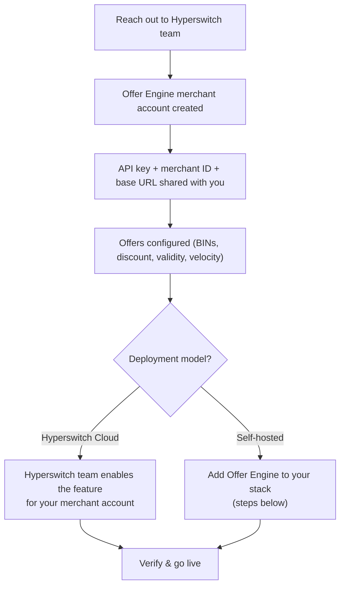
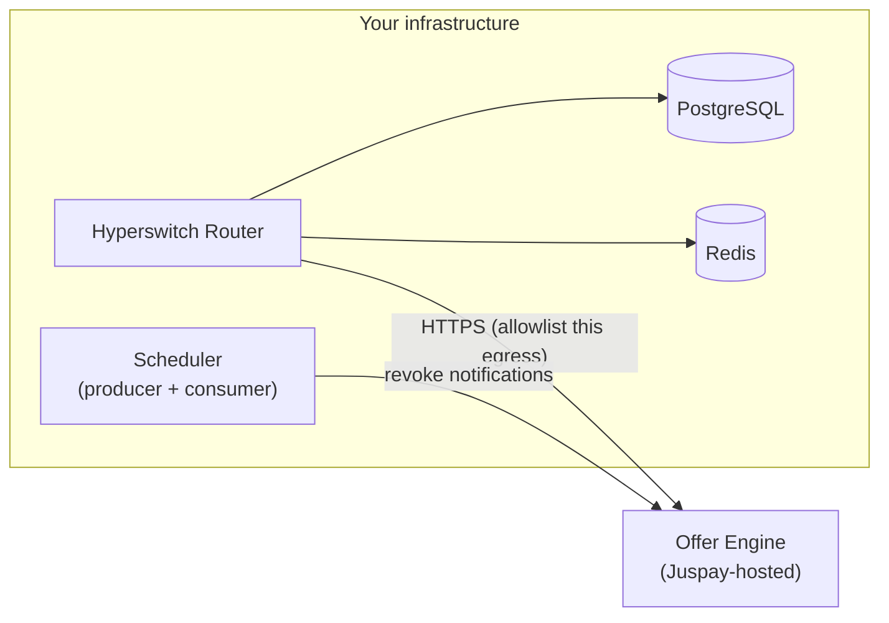

# Setup  Guide

## Offers Setup Guide


This section covers everything needed to enable Offers, for both Hyperswitch Cloud and self-hosted deployments.


### Before you start — onboarding with Hyperswitch

Offers are evaluated by the **Offer Engine**, an external service. Regardless of how you deploy Hyperswitch, the following are provisioned by the Hyperswitch team — **reach out to your Hyperswitch point of contact** to get them:

| What you get                      | Used for                                                                                                                                                                                                   |
| --------------------------------- | ---------------------------------------------------------------------------------------------------------------------------------------------------------------------------------------------------------- |
| Offer Engine **merchant account** | Your identity in the Offer Engine                                                                                                                                                                          |
| Offer Engine **API key**          | Authenticates your Hyperswitch deployment to the Offer Engine                                                                                                                                              |
| Offer Engine **merchant ID**      | Sent with every offer request                                                                                                                                                                              |
| Offer Engine **base URL**         | Sandbox and production endpoints                                                                                                                                                                           |
| **Offer configuration**           | Done together with the Hyperswitch team: BIN upload, start/end dates, discount value (percentage or flat amount), offer code / title / description, currency, and card-velocity rules (e.g. once per card) |



***

### Path A — Hyperswitch Cloud

On Hyperswitch Cloud there is nothing to deploy. Once your Offer Engine account exists:

**Step 1:** The Hyperswitch team stores your Offer Engine credentials against your merchant account and enables the feature flags for you.

**Step 2:** Verify offers are live for your merchant by listing them with your merchant API key:

```bash
curl -X POST "https://sandbox.hyperswitch.io/offer_engine/offers/list" \
  -H "api-key: <your-merchant-api-key>" \
  -H "Content-Type: application/json" \
  -d '{"offer_payment_info": {"currency": "USD"}}'
```

A successful response lists your currently active offers:

```json
{
  "offers": [
    {
      "code": "WELCOME10",
      "title": "10% off on your first card payment",
      "display_title": "WELCOME10",
      "description": "Instant discount on eligible cards",
      "currency": "USD",
      "valid_till": "2026-12-31T18:29:59.000Z"
    }
  ]
}
```


A `403` response means the feature is not yet enabled for your merchant account — check with your Hyperswitch point of contact.


**Step 3:** Make a test payment through your checkout with an eligible test card. The offer should appear in the card form automatically. You are done — continue to How the SDK works.

***

### Path B — Self-hosted Hyperswitch

If you run Hyperswitch in your own infrastructure, the Offer Engine integration ships with the router — you enable it in your stack. Minimum version: release `2026.09.02.0`.



#### Step 1 — Update and migrate

Pull a router build at `2026.09.02.0` or later and run the pending database migrations (standard `diesel migration run` / your deploy pipeline). Offers adds two columns:

```sql
ALTER TABLE payment_attempt ADD COLUMN IF NOT EXISTS applied_offer_details JSONB;
ALTER TABLE merchant_account ADD COLUMN IF NOT EXISTS offer_engine_config BYTEA;
```

#### Step 2 — Add the Offer Engine configuration

Add the `[offer_engine]` section to your router configuration, using the values shared during onboarding:

```toml
[offer_engine]
base_url = "<offer-engine-base-url>"       # must end with a trailing slash
api_key = "<offer-engine-api-key>"
merchant_id = "<offer-engine-merchant-id>"
```

Or as environment variables:

```bash
ROUTER__OFFER_ENGINE__BASE_URL=<offer-engine-base-url>
ROUTER__OFFER_ENGINE__API_KEY=<offer-engine-api-key>      # KMS-compatible secret
ROUTER__OFFER_ENGINE__MERCHANT_ID=<offer-engine-merchant-id>
```


**Credential modes.** The above stores one set of credentials at the application level (credential source `application`) — right for a single-merchant deployment. Multi-merchant deployments can instead store credentials per merchant account (credential source `merchant`): only `base_url` stays in the app config, and each merchant's credentials are set via the admin API:

```bash
curl -X POST "$BASE_URL/accounts/<merchant_id>" \
  -H "api-key: <admin-api-key>" -H "Content-Type: application/json" \
  -d '{
    "merchant_id": "<merchant_id>",
    "offer_engine_config": {
      "api_key": "<offer-engine-api-key>",
      "merchant_id": "<offer-engine-merchant-id>"
    }
  }'
```

The credentials are encrypted at rest with the merchant key store.


Also make sure your network egress rules allow the router (and scheduler) to reach the Offer Engine base URL.

#### Step 3 — Enable the feature flags

Offers are **off by default** and controlled by dynamic configuration (Superposition). Set the following for your target merchant scope (defaults are seeded in `config/superposition_seed.toml`):

| Key                              | Value                       | Purpose                                                          |
| -------------------------------- | --------------------------- | ---------------------------------------------------------------- |
| `offer_engine.enabled`           | `true`                      | Master switch (default `false`)                                  |
| `offer_engine.credential_source` | `application` or `merchant` | Where credentials are read from (default `none`)                 |
| `should_perform_eligibility`     | enabled for your merchant   | Tells the Web SDK to run the eligibility check during card entry |

Flags resolve per request against merchant / organization / profile dimensions, so you can enable offers for a single merchant while the global default stays off.


Keep **client sessions** enabled (they are on by default). Offer quotes are held in the client session between eligibility and confirm — disabling client sessions for a merchant breaks offer application.


#### Step 4 — Run the scheduler

Automatic offer revocation (on payment failure or refund) runs through the Process Tracker. Both scheduler roles must be running:

```bash
SCHEDULER_FLOW=producer ./scheduler
SCHEDULER_FLOW=consumer ./scheduler
```

Without the scheduler, payments still work — but failed/refunded payments would leave redemptions counted at the Offer Engine until reconciled.

#### Step 5 — Verify

**Connectivity probe** (admin API key) — confirms configuration and network reachability:

```bash
curl -X POST "$BASE_URL/offer_engine/connectivity" \
  -H "api-key: <admin-api-key>" -H "Content-Type: application/json"
```

| Response                                    | Meaning                                                                 |
| ------------------------------------------- | ----------------------------------------------------------------------- |
| `{"enabled": true, "reachable": true, ...}` | Ready to go                                                             |
| `"enabled": false`                          | Feature flags from Step 3 not set for this scope                        |
| `"reachable": false`                        | Network path to the Offer Engine is blocked — check egress allowlisting |
| `"...authentication failed"`                | Reached the engine but the API key is wrong                             |

**Browse offers** (merchant API key) — confirms the merchant end to end:

```bash
curl -X POST "$BASE_URL/offer_engine/offers/list" \
  -H "api-key: <merchant-api-key>" -H "Content-Type: application/json" \
  -d '{"offer_payment_info": {"currency": "USD"}}'
```

Then make a test payment with an eligible card through your checkout. Done — continue to How the SDK works.

***

### FAQs

1. **Which environment should I start with?**\
   Sandbox. Your onboarding includes a sandbox Offer Engine account; test cards and test offers are configured there before production credentials are issued.
2. **Can I update or add offers myself?**\
   Offer configuration (BINs, discounts, validity, velocity) is currently done together with the Hyperswitch team. Reach out to your point of contact with the changes.
3. **We have multiple business profiles — can offers be enabled for just one?**\
   Yes. The feature flags resolve at merchant / organization / profile scope, so enablement can be as narrow as a single profile.
4. **How do I turn offers off quickly?**\
   Cloud: ask your Hyperswitch contact to flip the master switch. Self-hosted: set `offer_engine.enabled` to `false`. In-flight revocations continue to work as long as the credential source stays configured.&#x20;
