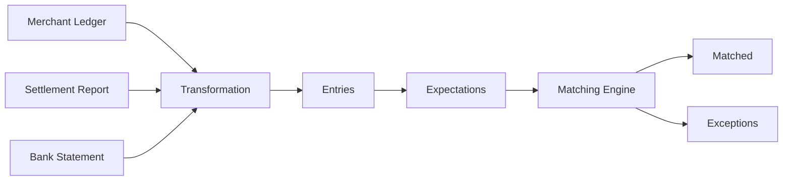
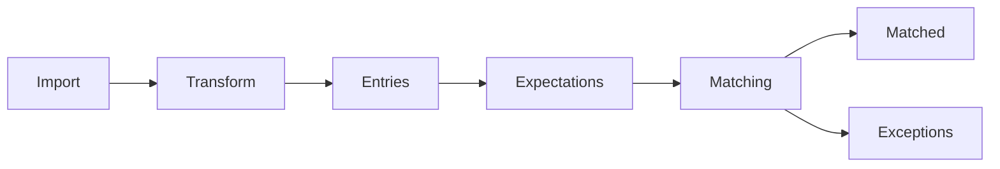

# Core Concepts

## Core Concepts

The Hyperswitch Reconciliation Product enables businesses to reconcile financial records across multiple systems, such as merchant ledgers, payment gateways, settlement reports, banks, and ERP systems.

Rather than comparing files directly, the reconciliation engine transforms data from different sources into a common model, generates reconciliation expectations, and automatically identifies matching records and discrepancies.

Every reconciliation workflow is built on the same set of core concepts.

***

### Reconciliation at a glance

A typical reconciliation workflow looks like this:

The reconciliation engine processes every data source through the same pipeline, regardless of the payment provider or financial institution.

***

### Why reconciliation?

A single payment is recorded by multiple systems throughout its lifecycle.

For example:

> **Payment Flow**
>
> Customer → Merchant → Payment Gateway → Settlement → Bank

Each system maintains its own copy of the transaction, often with different identifiers, timestamps, or metadata.

The goal of reconciliation is to verify that every system represents the same financial outcome.

***

## Core Concepts

The reconciliation engine is built around six fundamental concepts.

| Concept         | Description                                                         |
| --------------- | ------------------------------------------------------------------- |
| **Account**     | A financial system that owns transaction data.                      |
| **Entry**       | A normalized financial record imported into an account.             |
| **Transaction** | A business event composed of one or more related entries.           |
| **Rule**        | Defines how reconciliation should be performed.                     |
| **Expectation** | Represents a financial record that should exist.                    |
| **Exception**   | Indicates that reconciliation could not be completed automatically. |

The following sections describe each concept in detail.

***

### Account

An **Account** represents a logical financial system.

Accounts are the sources and destinations used during reconciliation.

Examples include:

* Merchant Ledger
* Stripe
* Bank Statement
* ERP

Each imported record belongs to exactly one account.

> **Note**
>
> An Account represents a source of financial records, not a bank account.

***

### Entry

An **Entry** is the smallest unit processed by the reconciliation engine.

Every imported record is transformed into one or more entries.

Typical entry types include:

* Payment
* Refund
* Settlement
* Chargeback
* Fee
* Adjustment

An entry contains normalized information such as:

* Amount
* Currency
* Timestamp
* Event Type
* Identifiers
* Metadata

Entries are immutable and form the foundation of reconciliation.

***

### Transaction

A **Transaction** groups together multiple related entries that belong to the same business event.

For example, a customer payment may generate entries in several systems.

> **Payment Lifecycle**
>
> Merchant Order → Gateway Payment → Settlement → Bank Credit

Although these records originate from different systems, they all represent the same payment transaction.

Grouping entries into transactions enables end-to-end reconciliation across the payment lifecycle.

***

### Rule

A **Rule** defines how reconciliation should be performed.

Each rule specifies:

* The accounts to reconcile
* The records to compare
* The identifiers used for matching
* The conditions that determine a successful reconciliation

For example:

> Every successful payment in the Merchant Ledger should have a corresponding successful payment in Stripe.

Rules make reconciliation configurable without requiring application code changes.

***

### Expectation

An **Expectation** represents a financial record that is expected to exist in another account.

These expectations drive the reconciliation process.

If the expected record is found, reconciliation proceeds.

If not, an exception is created.

***

### Matching

The Matching Engine compares expected records with actual records available in the target account.

Matching is performed using configurable identifiers such as:

* Payment ID
* Order ID
* Gateway Transaction ID
* Settlement ID
* Reference Number

Depending on the reconciliation workflow, matching supports:

* One-to-One
* One-to-Many
* Many-to-One
* Many-to-Many

***

### Exception

An **Exception** is created when reconciliation cannot be completed automatically.

Common examples include:

* Missing settlements
* Missing payments
* Amount mismatches
* Currency mismatches
* Duplicate records

Exceptions are tracked separately so they can be investigated and resolved without interrupting the reconciliation workflow.

Learn more in the **Exception Handling** section.

***

## Summary

The following diagram summarizes the reconciliation lifecycle.

Every feature of the reconciliation engine builds upon these concepts.

Continue to **How Reconciliation Works** to learn how the engine processes financial data from ingestion to reconciliation.
