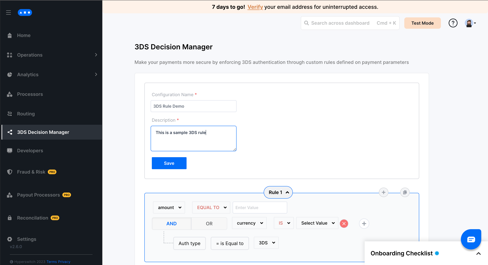

# 📋 3DS decision manager

Hyperswitch 3DS Decision Manager allows the merchant to configure advanced rules using various payment parameters such as amount, currency etc., to enforce 3D Secure authentication for card payments to reduce fraudulent transactions.

## How does it work?

* Hyperswitch supports 3D Secure card payments via multiple payment processors
* The [3DS Decision Manager](https://app.hyperswitch.io/3ds) on the Hyperswitch Control Center allows you to configure advanced rules based on payment parameters to decide when to enforce 3DS on card payments for supported processors
* For example, if you want to enforce 3DS authentication for all payments of value greater than $100 then you could setup the following rule on the 3DS Decision Manager and all the payment requests conforming to that rule would have `authentication_type` set as `three_ds`

<figure><figcaption></figcaption></figure>

**Note:** If an explicit value is passed on `/payments` request using the `authentication_type` parameter it will override the 3DS Decision Manager - [API Reference](https://api-reference.hyperswitch.io/api-reference/payments/payments--create)

Some payment processors mandate a 3D Secure authentication for all payments which will be enforced regardless of the `authentication_type` in `/payments` request

## How to configure a rule on 3DS Decision Manager?

**Step 1:** Go to 3DS Decision Manager tab on the Hyperswitch Control Center

**Step 2:** Click on create new rule&#x20;

<figure><figcaption></figcaption></figure>

**Step 3:** Save the rule name and description&#x20;

<figure><figcaption></figcaption></figure>

**Step 4:** Configure your desired rule by selecting the operators and values for the various fields&#x20;

<figure><figcaption></figcaption></figure>

**Step 5:** Add more rules using the plus icon on the top right of the current rule panel&#x20;

<figure><figcaption></figcaption></figure>

**Step 6:** Click save to configure and activate the rule&#x20;

<figure><figcaption></figcaption></figure>

**Step 7:** Your rule is now successfully configured and 3D Secure authentication would be enforced all payments conforming to this rule

**Note:** 3DS decision manager supports only one active configuration at a time. Multiple rules can be combined into a single configuration as shown in the example



### FAQs

What are the parameters that I can use to configure 3DS rules?

* amount - set rules for a specific value or a range of values for the transaction amount
* currency - select the currency of transaction
* card\_type - choose between credit and debit cards
* card\_network - choose between card networks like visa, mastercard etc.
* billing\_country - to select the billing\_country

2. How do I update the current configuration?\
   Click on Create New and configure a new rule that would replace the existing configuration
3. What happens if I set `authentication_type` as `no_three_ds` in `/payments` request?\
   3D Secure will be enforced even if the payment request parameters conform to any one of the rules in the active 3DS Decision Manager
