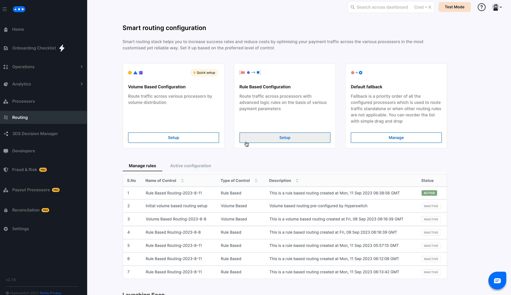
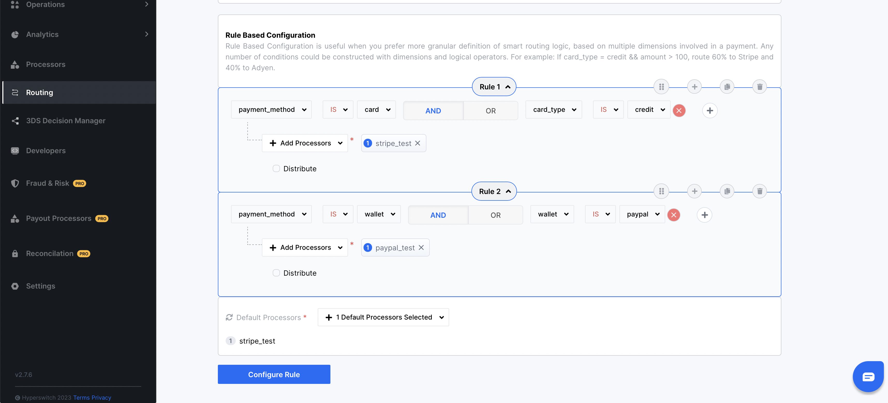
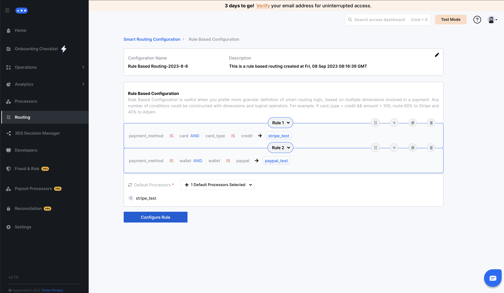
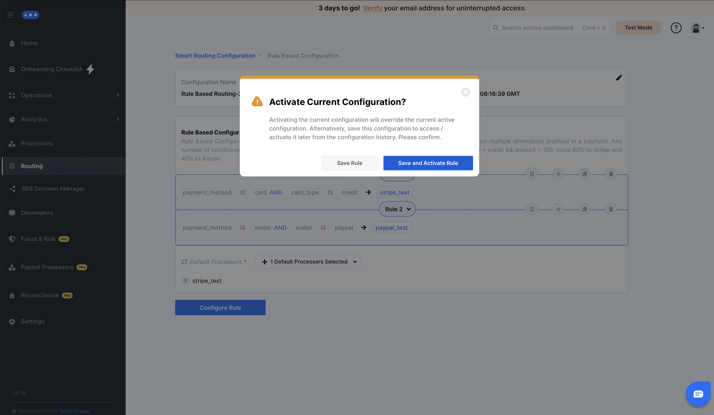
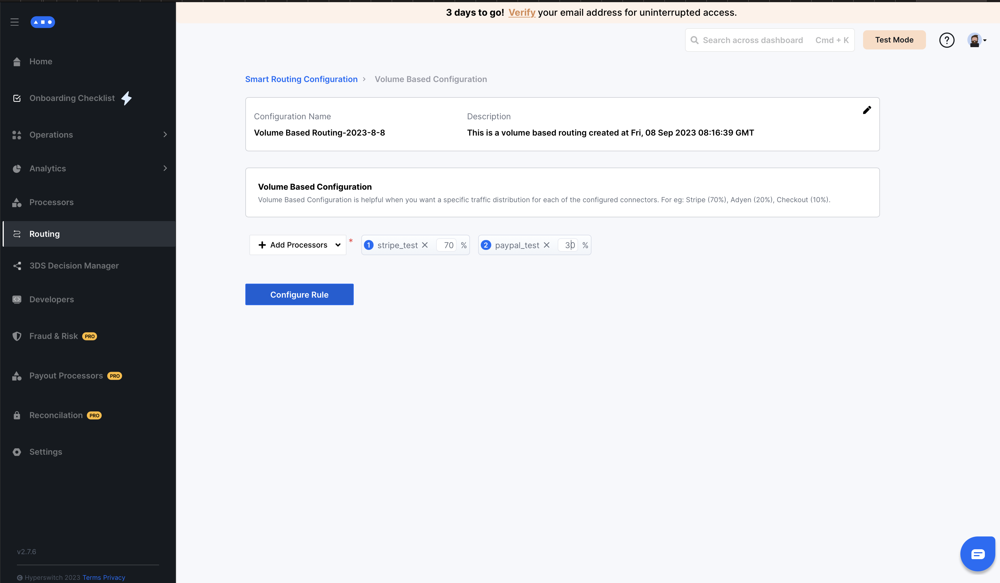

# 🛣 Smart router

## Infinite control over managing your payments

<figure><figcaption></figcaption></figure>

## No-code payments routing

While channelling payments across multiple processors on a daily basis is cumbersome, it could be vital to optimizing your payment processing costs as your business needs evolve constantly or as new payment processors provide competitive pricing and so on. Hence, Hyperswitch’s Smart Router is designed as a no-code tool to provide complete control and transparency in creating and modifying payment routing rules. Hyperswitch supports below formats of Smart Routing.

**Volume Based Configuration:** Define volume distribution among multiple payment processors using percentages.

**Rule Based Configuration:** More granular control which allows to define custom routing logics based on different parameters of payment.

**Default Fallback Routing :** If the active routing rules are not applicable, the priority order of all configured payment processors is used to route payments. This priority order is configurable from the Dashboard.

**Cost Based Configuration (coming soon):** Automatically routes transaction to the payment processor charging the least MDR (merchant discount rate) for the opted payment method.

## How does the Smart Router work?

Hyperswitch Smart Router Engine evaluates every payment request against your predefined routing logic and makes a decision on the best payment processor for the payment, and executes the transaction. If the payment fails or if the payment processor is down, the payment is automatically retried through a different processor.

## How to configure the Smart Router?

[Hyperswitch dashboard](https://app.hyperswitch.io/routing) provides a simple, intuitive UI to configure multiple Routing rules on your dashboard under the **Routing** tab. There are three routing rule formats that Hyperswitch currently supports.

## Steps to configure Rule Based Configuration in Smart Router:

A Rule-based Routing Configuration comprises of one or more rules with each rule having a routing processor preference and a set of conditions associated with it. The implication being that if one of the conditions matches, the associated processor preference is considered for the ongoing payment. The order in which rules and conditions are evaluated is sequential from top to bottom as presented in the UI, with preference given to the first condition (and the associated preference) that's fulfilled by the current payment. Additionally, a default preference may be specified which is taken as the result if no conditions in any rule are fulfilled by the ongoing payment.

**Condition:** A condition is constructed with dimensions and logical operators. Routing rules can be pivoted upon numerous dimensions which include payment method, amount of payment, currency, etc. Also, there are six logical operators - equal to, greater than, lesser than, is, is not, contains, not contains, which are used to evaluate the condition.

**Processor Preference:** Every rule has an associated Processor Preference which dictates the processor(s) to route the ongoing payment through if the rule is fulfilled. A Processor Preference can be one of the following types:

1. **Single choice of processor:** Only a single processor should be targeted for a specific condition Eg: (Stripe)
2. **Split payments across processors:** The payment volume could be distributed across more than one processor. Eg: (Stripe: 70%, Paypal: 30%)
3. **Single choice of processor with fallback:** A single processor should be targeted for a specific condition with an option of one or more fallback processors to automatically retry the transaction through if the initial processor fails to process the payment. Eg: (Stripe, Paypal)

_**Step 1:**_ Click on `Setup` for Rule Based Configuration

<figure><figcaption></figcaption></figure>

_**Step 2:**_ Save the rule name and description

<figure><figcaption></figcaption></figure>

_**Step 3:**_ Use the no-code UI to configure your desired rules as per your business logic (an instance for configuring rule is displayed)

<figure><figcaption></figcaption></figure>

_**Step 4:**_ Select your default preferred processors and click on Configure Rule

<figure><figcaption></figcaption></figure>

_**Step 5:**_ In the popup, select the appropriate action based on whether you want to simply `save the rule`, or `save and also activate` it for all payments henceforth

<figure><figcaption></figcaption></figure>

_**Step 6:**_ You can view your active routing algorithm as well as all previously configured algorithms on the [Hyperswitch Dashboard](https://app.hyperswitch.io/routing)

<figure><figcaption></figcaption></figure>

## Get started with Rule Based Routing



## Steps to configure Volume Based Configuration in Smart Router:

_**Step 1:**_ Click on `Setup` for Volume Based Configuration

<figure><figcaption></figcaption></figure>

_**Step 2:**_ Save the name and description

<figure><figcaption></figcaption></figure>

_**Step 3:**_ Configure your desired Volume distribution among multiple payment processors using percentages

<figure><figcaption></figcaption></figure>

_**Step 4:**_ In the popup, select the appropriate action based on whether you want to simply `save the rule`, or `save and also activate` it for all payments henceforth

<figure><figcaption></figcaption></figure>

_**Step 5:**_ You can view your active routing algorithm as well as all previously configured algorithms on the [Hyperswitch Dashboard](https://app.hyperswitch.io/routing)

<figure><figcaption></figcaption></figure>

## Get started with Volume Based Routing

### Steps to configure Default fallback Configuration in Smart Router:

_**Step 1:**_ Click on `Manage` for configuring Default fallback

<figure><figcaption></figcaption></figure>

**Step 2:** You will see a list of all of your configured processors. This list can be reordered based on what you want your default processor priority to be when either :-

* You have no routing algorithm active
* The payment method for the current payment is not enabled for the processor(s) returned by the active routing algorithm

<figure><figcaption></figcaption></figure>

## How to update the Smart Router?


