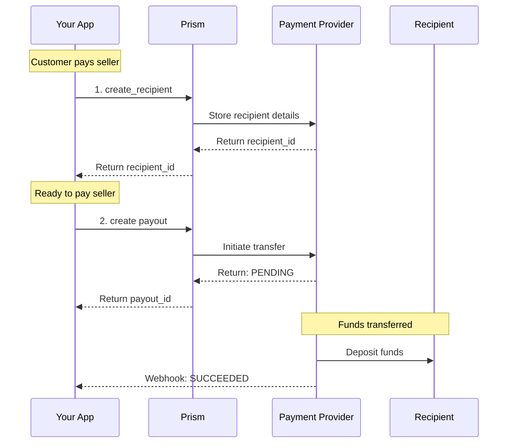

# Payout Service Overview

## Overview

The Payout Service enables you to send funds to recipients using the Python SDK. Use this for marketplace payouts, refunds to bank accounts, supplier payments, and other fund disbursement needs.

**Business Use Cases:**

* **Marketplace payouts** - Pay sellers/merchants on your platform
* **Supplier payments** - Disburse funds to vendors and suppliers
* **Payroll** - Employee and contractor payments
* **Instant payouts** - Same-day transfers to connected accounts

## Operations

| Operation                                                                                | Description                                                                | Use When                               |
| ---------------------------------------------------------------------------------------- | -------------------------------------------------------------------------- | -------------------------------------- |
| [`create`](prism/sdks/python/payout-service/create.md)                                   | Create a payout. Initiates fund transfer to recipient.                     | Sending money to a recipient           |
| [`transfer`](prism/sdks/python/payout-service/transfer.md)                               | Create a payout fund transfer. Move funds between accounts.                | Transferring between internal accounts |
| [`get`](prism/sdks/python/payout-service/get.md)                                         | Retrieve payout details. Check status and tracking.                        | Monitoring payout progress             |
| [`void`](prism/sdks/python/payout-service/void.md)                                       | Cancel a pending payout. Stop before processing.                           | Aborting an incorrect payout           |
| [`stage`](prism/sdks/python/payout-service/stage.md)                                     | Stage a payout for later processing. Prepare without sending.              | Delayed payouts, batch processing      |
| [`create_link`](prism/sdks/python/payout-service/create-link.md)                         | Create link between recipient and payout. Associate payout with recipient. | Setting up recipient relationships     |
| [`create_recipient`](prism/sdks/python/payout-service/create-recipient.md)               | Create payout recipient. Store recipient bank/payment details.             | First time paying a new recipient      |
| [`enroll_disburse_account`](prism/sdks/python/payout-service/enroll-disburse-account.md) | Enroll disburse account. Set up account for payouts.                       | Onboarding new payout accounts         |

## SDK Setup

```python
from hyperswitch_prism import PayoutClient

payout_client = PayoutClient(
    connector='stripe',
    api_key='YOUR_API_KEY',
    environment='SANDBOX'
)
```

## Common Patterns

### Marketplace Payout Flow



**Flow Explanation:**

1. **Create recipient** - Store seller's payout details (bank account, etc.).
2. **Create payout** - Initiate the fund transfer to the seller.
3. **Monitor status** - Track payout status until funds arrive.

## Payout Methods

| Method               | Speed             | Typical Use                         |
| -------------------- | ----------------- | ----------------------------------- |
| **Bank transfer**    | 1-3 business days | Standard payouts, large amounts     |
| **Instant transfer** | Minutes           | Same-day needs, existing recipients |
| **Card payout**      | Instant           | Prepaid cards, debit cards          |

## Next Steps

* [create\_recipient](prism/sdks/python/payout-service/create-recipient.md) - Set up your first recipient
* [create](prism/sdks/python/payout-service/create.md) - Send your first payout
* [Event Service](prism/sdks/python/event-service/) - Handle payout webhooks
