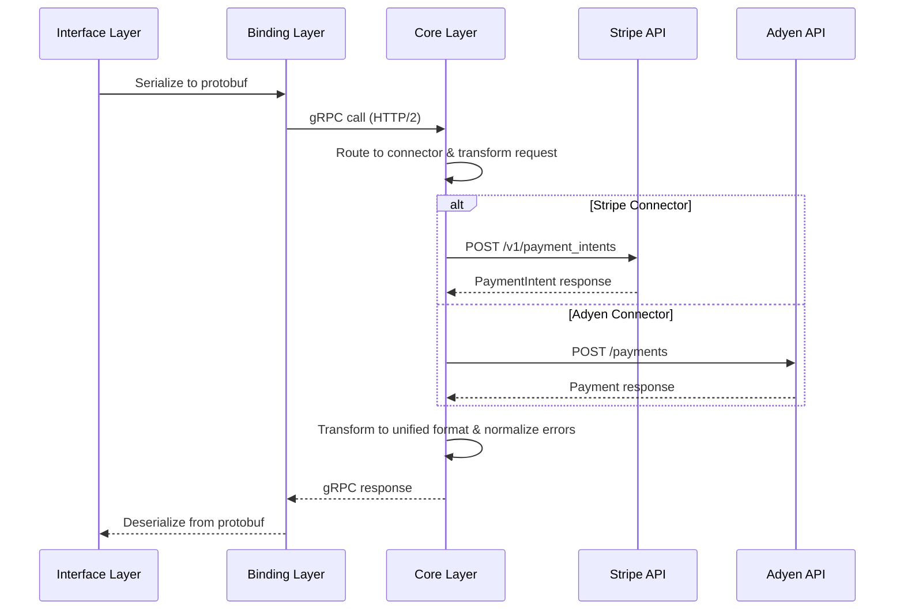

# Architecture Overview

### Architecture Overview

If you've integrated multiple payment providers, you know the pain:

* Stripe uses PaymentIntents
* Adyen uses payments
* PayPal uses orders

All of them do the same job, but each has different field names, different status enums, different error formats.

This problem exists in other domains too, but solved with well maintained developer centric libraries, open source and free from vendor lock-in.

| Domain            | Unified Interface                             | What It Solves                                    |
| ----------------- | --------------------------------------------- | ------------------------------------------------- |
| **LLMs**          | [LiteLLM](https://github.com/BerriAI/litellm) | One interface for OpenAI, Anthropic, Google, etc. |
| **Databases**     | [Prisma](https://www.prisma.io/)              | One ORM for PostgreSQL, MySQL, MongoDB, etc.      |
| **Cloud Storage** | [Rclone](https://rclone.org/)                 | One CLI for S3, GCS, Azure Blob, etc.             |

**But for payments, no such equivalent exists for developers.**

Prism is the unified abstraction layer for payment processors—giving you one API, one set of types, and one mental model for 100+ payment connectors.

### Architecture Components

The Prism supports a three layered architecture, each solving a purpose. The architecture prioritizes:

1. **Consistency**: Same types, patterns, and errors across all connectors
2. **Extensibility**: Add connectors without SDK changes
3. **Developer Experience**: Idiomatic payments interface with multi language SDKs

```
┌─────────────────────────────────────────────────────────────────────────────┐
│                           PRISM - INTERFACE LAYER                           │
│  ┌───────────┐ ┌───────────┐ ┌───────────┐ ┌───────────┐ ┌───────────┐      │
│  │  Node.js  │ │  Python   │ │   Java    │ │   .NET    │ │    Go     │ ...  │
│  │    SDK    │ │    SDK    │ │    SDK    │ │    SDK    │ │    SDK    │      │
│  └─────┬─────┘ └─────┬─────┘ └─────┬─────┘ └─────┬─────┘ └─────┬─────┘      │
└────────┼─────────────┼─────────────┼─────────────┼─────────────┼────────────┘
         │             │             │             │             │
         ▼             ▼             ▼             ▼             ▼
┌──────────────────────────────────────────────────────────────────────────────┐
│                          PRISM - BINDING LAYER                               │
│  ┌────────────────────────────────────────────────────────────────────────┐  │
│  │  Native gRPC Clients (tonic, grpcio, grpc-dotnet, go-grpc, etc.)       │  │
│  └────────────────────────────────────────────────────────────────────────┘  │
└──────────────────────────────────────────────────────────────────────────────┘
                                    │
                                    ▼
┌────────────────────────────────────────────────────────────────────────────┐
│                             PRISM - CORE                                   │
│                                                                            │
│  ┌────────────────────────────────────┐    ┌────────────────────────────┐  │
│  │           gRPC Server              │    │    Connector Adapters      │  │
│  │                                    │    │    (100+ connectors)       │  │
│  │  ┌─────────┐ ┌─────────┐           │    │                            │  │
│  │  │ Payment │ │ Refund  │           │───▶│  ┌─────────┐  ┌─────────┐  │  │
│  │  │ Service │ │ Service │           │    │  │ Stripe  │  │  Adyen  │  │  │
│  │  └─────────┘ └─────────┘           │    │  │ Adapter │  │ Adapter │  │  │
│  │                                    │    │  └─────────┘  └─────────┘  │  │
│  │  ┌─────────┐ ┌─────────┐           │    │                            │  │
│  │  │ Dispute │ │  Event  │           │    │  ┌─────────┐  ┌─────────┐  │  │
│  │  │ Service │ │ Service │           │    │  │ PayPal  │  │   +     │  │  │
│  │  └─────────┘ └─────────┘           │    │  │ Adapter │  │  more   │  │  │
│  │                                    │    │  └─────────┘  └─────────┘  │  │
│  │  • Unified protobuf types          │    │                            │  │
│  │  • Request routing                 │    └──────────────┼─────────────┘  │
│  │  • Error normalization             │                   │                │
│  └────────────────────────────────────┘                   ▼                │
│                                                ┌─────────┐ ┌─────────┐     │
│                                                │ Stripe  │ │  Adyen  │     │
│                                                │   API   │ │   API   │     │
│                                                └─────────┘ └─────────┘     │
│                                                ┌─────────┐ ┌─────────┐     │
│                                                │ Stripe  │ │    +    │     │
│                                                │   API   │ │   more  │     │
│                                                └─────────┘ └─────────┘     │
└────────────────────────────────────────────────────────────────────────────┘
```

#### Component Descriptions

| Component           | Problem It Solves                                                                                                                                                                                                                                  | Technologies                             |
| ------------------- | -------------------------------------------------------------------------------------------------------------------------------------------------------------------------------------------------------------------------------------------------- | ---------------------------------------- |
| **Interface Layer** | Developers can think in their language's patterns while using the unified payments grammar. You use `client.payments.authorize()` with idiomatic types in your codebase                                                                            | Node.js, Python, Java, .NET, Go, Haskell |
| **Binding Layer**   | Each language needs native-performance gRPC with seamless transport without language bridges; handles serialization                                                                                                                                | tonic, grpcio, grpc-dotnet, go-grpc      |
| **Core Layer**      | Single source of truth for payment logic with freedom to use Prism as a separate microservice. One implementation serves all languages; also include connector adapters maintaining the request response mapping to 100+ processors from the Proto | Rust, tonic, protocol buffers            |

#### Data Flow



#### Connector Transformation

The core value of the Prism is transformation from a single unified interface into multiple processor patterns. For easier understanding, a simple example of how a Stripe Authorize Request and an Adyen Authorize Request is mapped against the Unified interface.

**Authorization Mapping:**

| Unified Field                     | Stripe Request                 | Adyen Request           |
| --------------------------------- | ------------------------------ | ----------------------- |
| `amount.currency`                 | `currency`                     | `amount.currency`       |
| `amount.amount`                   | `amount` (cents)               | `value` (cents)         |
| `payment_method.card.card_number` | `payment_method[card][number]` | `paymentMethod[number]` |
| `connector_metadata`              | `metadata`                     | `additionalData`        |

This transformation happens server-side, so SDKs remain unchanged when adding new connectors.

#### Connector Adapter Pattern

Adding new connectors into PRism should also be easy and declarative. It is simplified with a standard interface for the ConnectorAdapter trait.

```rust
trait ConnectorAdapter {
    async fn authorize(&self, request: AuthorizeRequest) -> Result<AuthorizeResponse>;
    async fn capture(&self, request: CaptureRequest) -> Result<CaptureResponse>;
    async fn void(&self, request: VoidRequest) -> Result<VoidResponse>;
    async fn refund(&self, request: RefundRequest) -> Result<RefundResponse>;
    // ... 20+ operations
}
```

Adding new connectors only need an adapter implementation. SDKs require zero changes.
