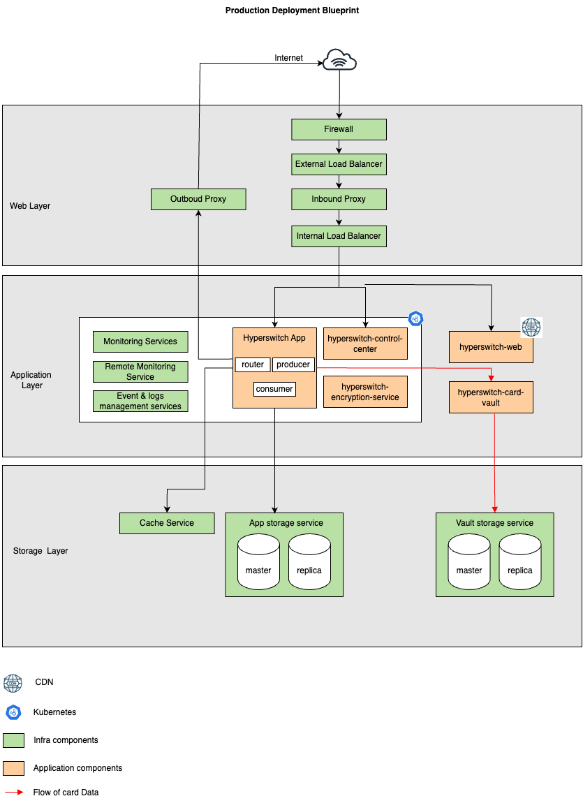

# Architecture Overview

### Core Components

Hyperswitch uses the following components to deploy and manage a payment stack:

#### Hyperswitch App&#x20;

The Hyperswitch App Server is the core engine for processing payments. It offers full support for various payment flows, including:

1. Core Operations: Authorization, authentication, voids, captures, refunds, and chargeback handling.
2. Post-Payment Management: Robust handling of disputes and reconciliations.
3. Routing Flexibility:
   1. Success-rate-based routing
   2. Rule-based routing
   3. Volume distribution
   4. Fallback strategies
   5. Intelligent retries using error-code-specific flows
4. Extensibility: Connects with external fraud risk management (FRM) tools, 3DS authentication providers and queuing of refunds, webhooks and recurring payments.&#x20;

The hyperswitch-app is dockerized with two sub-components -&#x20;

**i) hyperswitch-router -**&#x20;

Responsible for managing and coordinating different aspects of the payment processing system. When a payment request is received, it goes through the Router, which handles important processing and routing tasks.

**(ii) hyperswitch-scheduler -**&#x20;

Automates periodic deletion of card information and notifies merchants of API key expiry. Consists of two sub-components -&#x20;

* Hyperswitch-producer - Retrieves tasks scheduled by the router and batches them together in a job queue
* hyperswitch-consumer - Retrieves task batches from the queue and executes them

#### Hyperswitch Web

1. A JavaScript based frontend SDK for inclusive, consistent and customizable payment experience, unifying checkout experience across platforms:
2. Platform Support: Available for[ Web](https://docs.hyperswitch.io/explore-hyperswitch/merchant-controls/integration-guide/web),[ Android, and iOS](https://github.com/juspay/hyperswitch-client-core).
3. Multi-Method Support: Handles cards, wallets, BNPL, bank transfers, and more.
4. Flow Adaptability: Supports the nuances of different PSPs’ payment flows.
5. Saved Payment Methods: When integrated with the locker, the SDK automatically displays stored cards or other saved instruments for returning users.

#### Hyperswitch Card Vault

1. A PCI-compliant Vault SDK to collect and store card data securely, ensuring sensitive information never touches your systems -&#x20;
2. Tokenizes cards across multiple payment processors through a single unified API.
3. Generates Network Tokens to optimize payment operations and reduce costs with automatic network token creation and updates, powered by Juspay’s certified Network Token Requestor capabilities.

#### Hyperswitch Control Center

The Control Center is a no-code interface to manage and monitor your entire payment stack:

1. Workflow Management: Configure smart routing, retries, 3DS invocation, fraud checks, and surcharge logic through a visual interface.
2. Operational Controls:
3. Trigger and track refunds and chargebacks
4. View PSP-agnostic transaction logs for quick debugging
5. Insights and Analytics: Access detailed reports and metrics on success rates, payment drop-offs, retry performance, and more.

#### **Optional (For PCI-SSS):**

#### Hyperswitch Encryption Service

A lightweight performant service to encrypt/ decrypt data, key management and manage key rotation.&#x20;

### Production Deployment Blueprint

A typical production deployment blueprint of Hyperswitch looks like the following diagram.&#x20;

It includes the 5 critical application components mentioned above along with non-functional services such as monitoring services, event and log management service, storage service and encryption service.  

<figure><figcaption></figcaption></figure>

The next sections talk about the setup and deployment of the requisite infrastructure and platform to deploy Hyperswitch.&#x20;
