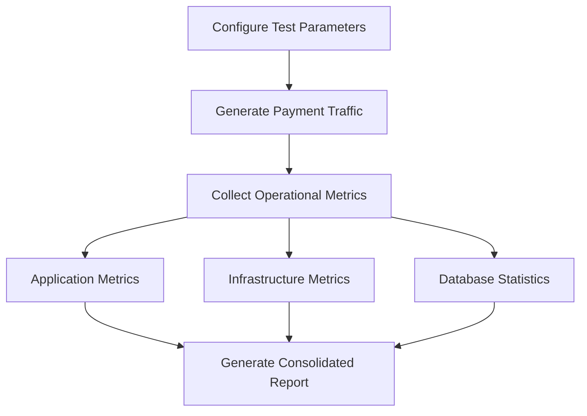

# Load Testing

## Load Testing Hyperswitch

### Overview

Load testing is a critical part of validating a production deployment before it begins processing live payment traffic. It helps determine whether the infrastructure can sustain expected transaction volumes while maintaining acceptable latency, throughput, and resource utilization.

Unlike many web applications, payment systems operate under strict availability and performance requirements. Sudden traffic spikes during flash sales, seasonal events, subscription renewals, or marketing campaigns can significantly increase transaction volumes within a short period. Any degradation in performance can directly impact authorization rates, checkout completion, and customer experience.

The Hyperswitch Suite includes a load testing utility that enables merchants to generate sustained payment traffic against a running Hyperswitch deployment while collecting operational metrics from the application and supporting infrastructure. The resulting report provides a consolidated view of system behavior under load and can be used to validate deployment sizing, identify bottlenecks, and establish performance baselines.

***

## Why Load Testing is Important

Load testing should be performed before a production rollout, after major infrastructure changes, and whenever capacity requirements increase.

A well-executed load test helps answer questions such as:

* Can the deployment sustain the expected transaction throughput?
* How does request latency change as traffic increases?
* Are compute, memory, database, or cache resources approaching capacity?
* Is the current deployment appropriately sized for anticipated business growth?
* Are there any infrastructure bottlenecks that should be addressed before production?

Running these tests proactively enables teams to validate scaling assumptions, tune infrastructure resources, and reduce operational risk before processing live payment traffic.

***

## How the Load Test Works

The Hyperswitch load testing utility generates payment traffic against a running Hyperswitch deployment while collecting application, infrastructure, and database metrics throughout the test.

Rather than measuring isolated API performance, the tool exercises the deployed payment platform under sustained load and captures operational metrics that provide visibility into overall system performance.

The high-level workflow is shown below.

***

## Prerequisites

Before running the load test, ensure the following prerequisites are met.

### Infrastructure

* A running Hyperswitch deployment
* Configured payment connectors using test or sandbox credentials
* Administrative access to the deployment
* Sufficient infrastructure resources for the expected test load

### Software Requirements

Install the following components.

| <h4><strong>Component</strong></h4> | <h4><strong>Minimum Version</strong></h4> |
| ----------------------------------- | ----------------------------------------- |
| Python                              | 3.7+                                      |
| pip                                 | Latest                                    |
| PostgreSQL Client                   | 13+                                       |

Verify the installed versions:

python3 --version

pip3 --version

psql --version

***

## Monitoring Recommendations

Although optional, enabling monitoring significantly improves the usefulness of the generated report.

The recommended monitoring stack includes:

* Grafana
* Prometheus
* PostgreSQL

Grafana provides visibility into:

* CPU utilization
* Memory utilization
* Request throughput
* Request latency
* Error rates
* Service health

PostgreSQL metrics help evaluate storage utilization during the test.

***

## Assumptions

The load testing utility assumes that:

* Hyperswitch has already been deployed and is operational.
* Payment connectors have been configured using valid test credentials.
* The deployment is healthy before testing begins.
* Grafana is available if application and infrastructure metrics are required.
* PostgreSQL is accessible if storage metrics are to be collected.
* The objective is to evaluate sustained system performance under realistic traffic patterns rather than burst traffic.

***

## Load Test Workflow

### 1. Environment Validation

Before generating traffic, the tool validates that the configured services are reachable.

Depending on the supplied configuration, this may include:

* Hyperswitch
* Grafana
* PostgreSQL

This validation helps ensure that traffic generation and metric collection can proceed successfully.

***

### 2. Configuration Collection

The tool prompts for the information required to execute the test.

Required configuration includes:

* Hyperswitch Server URL
* Admin API Key

Optional configuration includes:

* Grafana URL
* Grafana Service Token
* Grafana Username
* Grafana Password
* PostgreSQL Host
* PostgreSQL Port
* PostgreSQL Database
* PostgreSQL Username
* PostgreSQL Password

***

### 3. Payment Traffic Generation

Once configured, the tool generates sustained payment traffic against the running Hyperswitch deployment.

This enables teams to observe how the deployment behaves as transaction volume increases and to evaluate overall system stability under sustained load.

***

### 4. Operational Metric Collection

During the test, the tool collects operational metrics from Grafana when monitoring has been configured.

Typical metrics include:

* CPU utilization
* Memory utilization
* Request throughput
* Request latency
* Error rates
* Service health

Collecting these metrics alongside transaction traffic provides insight into infrastructure utilization and helps identify capacity bottlenecks.

***

### 5. Database Statistics Collection (Optional)

If PostgreSQL credentials are provided, the tool also collects database statistics to help evaluate storage utilization.

If direct database access is unavailable, the tool generates an equivalent SQL query that can be executed manually after the load test.

***

### 6. Report Generation

After the test completes, the tool generates a consolidated report summarizing the observed system behavior.

The report includes:

* Load test configuration
* Application performance
* Infrastructure utilization
* Database statistics (if collected)

These reports can be retained as performance baselines and compared across infrastructure changes or future software releases.

***

## Running the Load Test

### Step 1: Download the Load Test Utility

Clone the Hyperswitch Suite repository and navigate to the load-test directory.

`https://github.com/juspay/hyperswitch-suite/tree/main/load-test`

`cd load-test`

***

### Step 2: Install Dependencies

Run the setup script.

`bash setup.sh`

The setup script installs all required Python dependencies.

***

### Step 3: Start the Load Test

Execute the load testing utility.

`python3 script.py`

The tool will prompt for the required configuration.

***

### Step 4: Configure Hyperswitch

Provide:

* Hyperswitch Server URL
* Admin API Key

These credentials are used to authenticate requests against the running deployment.

***

### Step 5: Configure Monitoring (Recommended)

To include application and infrastructure metrics in the report, provide:

* Grafana URL
* Service Token
* Username
* Password

For the default Grafana deployment:

Username: admin

Password: admin

If monitoring is skipped, the load test will still execute but the resulting report will contain fewer operational insights.

***

### Step 6: Configure Database Monitoring (Optional)

To include database statistics in the report, provide:

* PostgreSQL Host
* Port
* Database Name
* Username
* Password

If database credentials are not supplied, the tool generates a SQL query that can be executed manually after the test.

***

### Step 7: Review the Report

After the load test completes, the generated report is available at:

output/report.pdf

The report provides a consolidated view of:

* Transaction traffic
* Application performance
* Infrastructure utilization
* Database statistics (if collected)

This report can be used to validate deployment sizing, identify performance bottlenecks, and establish baseline performance metrics for future comparisons.

***

## Best Practices

To obtain representative and repeatable results, consider the following recommendations:

* Run load tests against a production-like environment with representative infrastructure sizing.
* Use sandbox or test payment connectors to avoid processing live transactions.
* Enable Grafana monitoring to capture infrastructure and application metrics.
* Execute multiple test runs using gradually increasing traffic levels rather than a single peak load.
* Record infrastructure sizing, software versions, and test parameters alongside each report to enable meaningful comparisons over time.
* Repeat load testing after major application upgrades, infrastructure changes, or significant increases in expected transaction volume.

***

## Next Steps

After completing the load test:

1. Review the generated report for resource utilization and latency trends.
2. Identify any infrastructure bottlenecks before moving to production.
3. Scale compute, database, or cache resources as required.
4. Repeat the test until the deployment consistently meets your target performance objectives under sustained load.

Regular load testing helps ensure that a Hyperswitch deployment continues to meet performance and reliability expectations as transaction volumes and infrastructure evolve.

\
 
